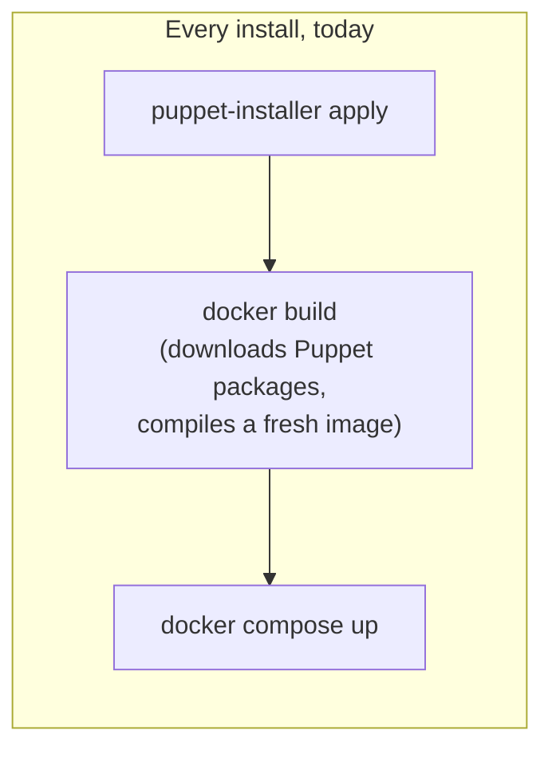
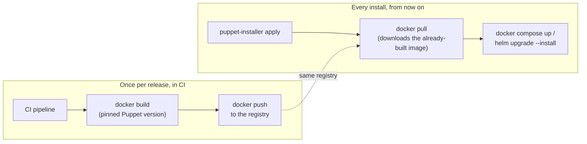
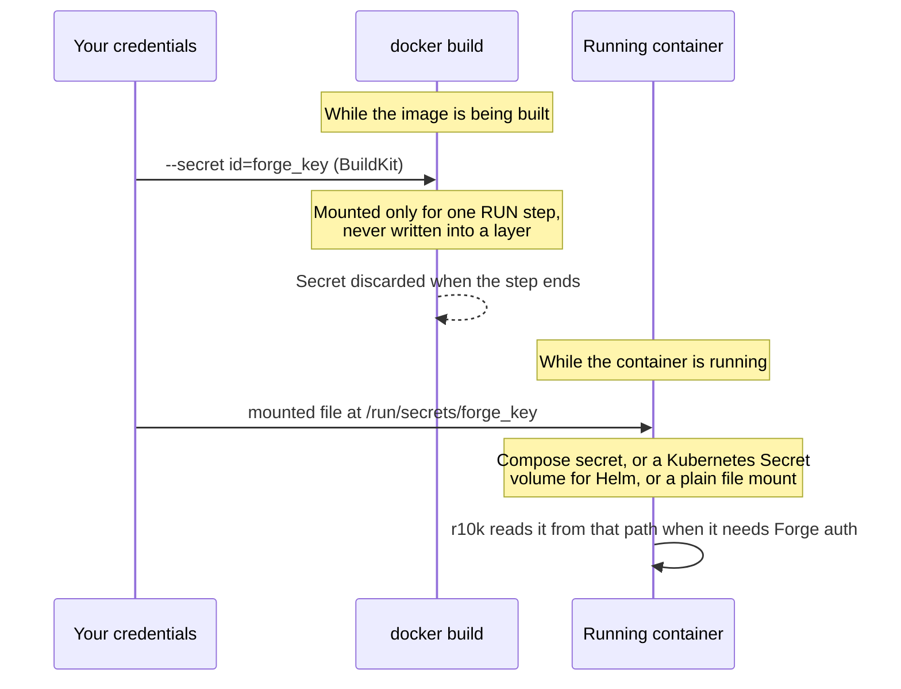
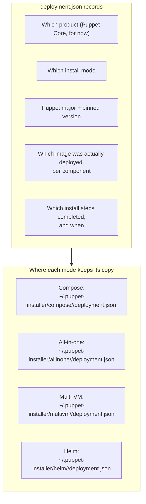

This explains two related pieces of work that change how Compose and Helm
installs get their Puppet Core images, and what record is kept of what got
deployed. Registry-hosted container distribution (Parts 1 and 2 below) is
shipped today and describes what's already running. The deployment state
manifest (Part 3 below) is a separate, planned addition; it documents the
approved design so it's readable before that code lands.

## Why This Exists

Today, a Compose install **builds its own container images from scratch,
every single time**. `puppet-installer apply` runs `docker build`, which
downloads Puppet's packages from the internet and compiles a fresh
`puppetserver`/`puppetdb` image on your machine. Do that ten times and
you've downloaded and rebuilt the same thing ten times.

The fix: **build once, in CI, and let every install just download
("pull") the already-built image.** This is exactly how most modern
software gets to your laptop; you don't compile Chrome from source, you
download a pre-built copy. This work makes Puppet Core images work the same
way, and gives every install mode a record of exactly what it downloaded and
deployed.

Two new terms, defined once so the rest of this guide can use them freely:

- **Registry**: a server that stores container images, the same way a
  package repository (apt/yum) stores installable packages. `docker pull
myregistry.example.com/puppetserver:9.1.0` downloads an image from one.
- **Image tag**: the version label on an image, like `9.1.0` or `latest`.
  `puppetserver:9.1.0` and `puppetserver:latest` can be two completely
  different images with the same name but different tags.

## Part 1: Where Images Come From Now

### The Old Way: Build Locally, Every Time

Slow, and two installs on two different days can end up with two subtly
different images, because "latest" isn't pinned to anything.

### The New Way: Build Once in CI, Pull Everywhere

The image is built exactly once, with an exact Puppet version "pinned" to
it (no more guessing what "latest" means today vs. next week). Every
install after that just downloads it, faster, and every install gets the
byte-for-byte same image.

**What actually changes for you:** the change is different for each mode,
because they didn't start from the same place.

- **Compose** could always build its own images locally, and still can. If
  you set `puppetserverImage` / `puppetdbImage` (and optionally `registry`)
  in your install request, Compose switches from "build it myself" to "pull
  the pre-built one." Leave those fields blank and Compose still builds
  locally, exactly like today; nothing breaks if you don't opt in.
- **Helm never built images itself.** `Plan()` has always hard-required
  `puppetserverImage`/`puppetdbImage` to be set (it errors out with "helm mode
  needs puppetserverImage and puppetdbImage" if they're empty), and that
  hasn't changed. What's new for Helm is that CI now builds and pushes those
  images automatically, so you're pointing at an image that was already
  published for you instead of building and pushing it by hand. Helm also
  gained two related conveniences: it falls back to `PuppetVersion` for the
  image tag when you don't set one explicitly, and a `RegistryAuth` override
  for registries that won't accept the Puppet Core forge-key credential.

**Where do the images live for now?** In your own registry (a GCP Artifact
Registry project, for the moment), not a Puppet-owned one yet. That's a
planned follow-up once an official Puppet registry exists; nothing about how
you configure this will need to change when it does, since everything is
written against "a registry" generically, not that specific GCP project.

## Part 2: How a Private Credential Gets Into a Running Container

Here's how a Forge credential reaches a running container, in diagram form.
The problem: r10k (the tool that pulls your Puppet code into the running
container) sometimes needs to authenticate to Puppet's Forge to download
entitled modules. That credential can't be baked into the image, because anyone who
ever pulls the image could read it back out. So it's handed to the container
at the last possible moment, two different ways depending on whether the
image is being **built** or **run**:

The important part: **the same file path, `/run/secrets/forge_key`, is used
whether the image was built locally or pulled from a registry.** Switching
to registry-pulled images doesn't change this at all; the image itself
doesn't know or care where it came from, it just expects that file to be
there if it needs it. That's also why this design works for Helm: Compose
already does this for its own local containers, and the plan adds the exact
same secret-file mechanism to the Helm chart (a Kubernetes `Secret` mounted
into the pod at the same path), so r10k works identically in both places.

## Part 3: The Deployment Record (What Got Installed, Where)

Right now, if you ask "what version of Puppet is actually running in this
Compose stack," the honest answer is "go check the running container,
because nothing wrote it down." Each install mode handles this differently
today, and three of the four don't handle it at all:

| Mode       | What's recorded today                                                                       |
| ---------- | ------------------------------------------------------------------------------------------- |
| Compose    | Only generated passwords/secrets (`secrets.json`); nothing about what was built or deployed |
| Helm       | Nothing; relies entirely on Helm's own internal bookkeeping                                 |
| All-in-one | Nothing                                                                                     |
| Multi-VM   | Nothing                                                                                     |

The fix is a small, shared record (one JSON file per install), written
right after each mode finishes successfully. It's not a secret file (it
never contains credentials), so it's safe to look at, back up, or attach to
a support request.

**What this buys you today:** a single place to check "what's actually
running" without having to SSH into a target or dig through container logs.

**What this doesn't do yet:** it doesn't make a failed install resume
partway through; that's flagged as a natural follow-up once the record
exists, not part of this first step. For Helm specifically, the record is
informational only; `helm upgrade --install`'s own built-in reliability is
still what actually keeps your Helm deployment correct; the manifest just
gives you a second, easier-to-read place to look.

## What's Deliberately Not Included Here

- **An official Puppet-owned registry**: still your own registry for now;
  swapping it in later is a configuration change, not a rework.
- **PE (Puppet Enterprise) support**: this whole guide covers Puppet Core
  only. PE deployment is a larger, separate piece of work planned for later.
- **Resuming a failed install partway through**: the deployment record is
  the foundation for this, but actually skipping already-finished steps on
  a retry isn't part of this first step.
- **A command to inspect the deployment record**: for now you'd open the
  JSON file directly; a dedicated `puppet-installer status`-style command is
  a possible future addition, not part of this work.
