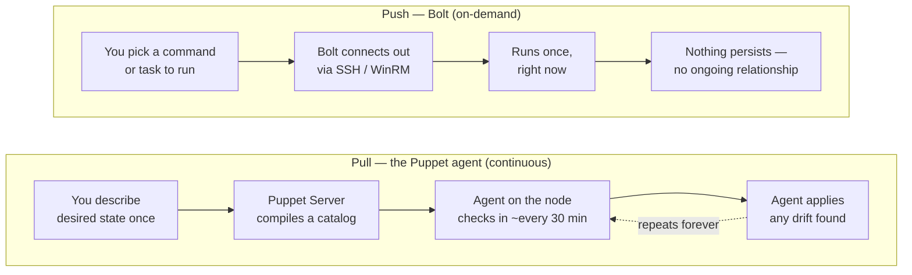
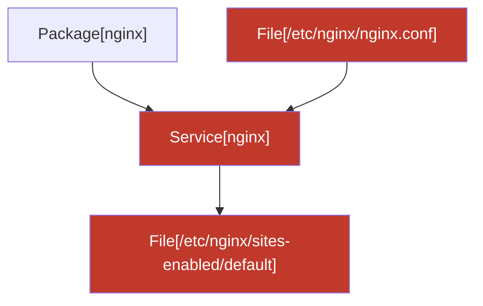

> **Who this is for:** you've never used Puppet, you've never used "automation" tools like this before, and honestly the word "automation" makes you a little nervous. Good, this guide assumes nothing. Every term gets explained the first time it shows up.

---

## The Five-Minute Version

Think of every computer you manage (a server, a VM, a laptop) as a **node**. Right now, keeping all your nodes configured correctly, same software versions, same settings, same security patches, probably means SSHing into each one by hand, or copying a script around and hoping you remember which machines you already ran it on.

**Puppet** is a tool that lets you describe _what a node should look like_ (its "desired state") in one place, and then keeps every node matching that description automatically, forever, on a schedule, without you touching each machine again.

**Puppet Stagehand** (this app) is the dashboard on top of Puppet. It's where you:

- See every node you manage, and whether it's currently correct ("compliant") or has drifted.
- Decide _what_ a node or group of nodes should look like (this is called **classification**).
- Run one-off commands or scripts against nodes when you need something done right now, not on the next schedule (this is called **Bolt**, more below).
- Check patch/update status across your fleet.
- See a complete record of every change anyone made (the Activity Log). Stagehand 1.0 has one administrator account; team roles and approvals are built but deferred to a later release.

You don't need to know Puppet's internals to use the console. You need to know what buttons do what, that's this guide.

---

## Two Ways Things Get Done: "Push" vs "Pull"

This is the single most important concept in the whole console, so we're covering it before anything else.

- **Pull (the Puppet agent, continuous):** A small program (the "agent") runs on each node in the background. Every 30 minutes or so, it "pulls" the latest desired-state description from Puppet and fixes anything that's drifted. You set the description once; the agent keeps enforcing it forever, on its own. This is how most day-to-day configuration management happens.
- **Push (Bolt, on-demand):** Sometimes you need something to happen _right now_, restart a service, run a diagnostic script, apply an emergency fix, without waiting for the next scheduled agent run, or on a machine that doesn't even have the agent installed yet. **Bolt** connects out to a node over SSH (Linux) or WinRM (Windows) and runs the command directly, once, on demand. Nothing persists, it's a push, not an ongoing relationship.

Here's what each one actually looks like end to end:

Rule of thumb: **pull** is for "this should always be true." **push** is for "do this thing right now."

---

## Signing in and First-Run Setup

The very first time anyone opens the console, there's a one-time bootstrap step: create the first administrator account (the password has to be at least 12 characters, this is non-negotiable and protects the whole fleet, so make it a real passphrase, not a word with a number stuck on the end).

After that, you sign in like any web app. **Stagehand 1.0 has exactly one administrator account**, the one created at bootstrap. It can do everything this guide describes, and every privileged action asks for an explicit confirmation before it runs. (Team-based access control with multiple roles and second-person approvals is planned for a later release.)

The very first time _anyone_ signs in to a given installation, they land on the End User License Agreement instead of the dashboard, a full-screen page with the agreement text and an **Accept** button, and nothing else in the console is reachable until it's accepted. This only ever happens once **per installation**, not once per person: as soon as one person accepts it, every sign-in afterward, theirs or anyone else's, skips straight to the dashboard. You can still read the full agreement any time afterward from **Settings → EULA**, though that page is just a reference; there's nothing left to accept there.

**This is enforced by the console itself, not just by the screen you're looking at.** Until the agreement is accepted, the console refuses signed-in requests for anything else, including from scripts or tools talking to it directly rather than through a browser. That matters because the agreement's whole purpose is being a record that the terms were accepted before the console was used, and a check that only lives in the web page is a check anything not using the web page can walk straight past. Nodes fetching their own configuration are the deliberate exception, blocking those would stop Puppet managing your estate because nobody had clicked a button.

**Repeated wrong passwords pause sign-in for a few minutes.** After a run of failed attempts from the same place on the network, the console stops accepting sign-ins from there for a short while and says so: "Too many sign-in attempts." This is deliberate. Stagehand ships with exactly one administrator account, so the sign-in page is the entire front door, and without a pause anything on the network could sit there guessing passwords as fast as it liked.

Two things about the pause are worth knowing before it happens to you:

- **Waiting is the only fix.** Typing the correct password during the pause does not end it early. That is on purpose: if the right password ended the pause, a program guessing passwords would be told the moment it guessed correctly and the pause would have protected nothing.
- **The budget is generous, but it is shared per network address.** It takes many failures in a row to trigger, far more than a normal person produces. But if everyone at your site reaches the console through one shared address (a proxy or a company gateway, which is common), then everyone's failed attempts count together. If a colleague has been fumbling their password, you may hit the pause on your first try. Wait a few minutes and try again.

The console never tells you how many attempts you have left, or how long remains. That is also deliberate, and for the same reason: a countdown is exactly what a password-guessing program would use to pace itself.

### Changing Your Password

You change the administrator password from **Settings**, in the section called **Account security**. That's the whole feature, there's no separate page to hunt for, no wizard, and no "Forgot password?" link anywhere in the console. (If you prefer typing addresses, `/settings#account` opens straight to it.)

The section has four boxes, top to bottom:

- **Signed in as**, read-only. It just shows which account you're about to change; you can't type in it. It's there mainly so your browser's password manager knows which saved entry to _update_, rather than quietly saving a second one and leaving you with two entries and no idea which is current.
- **Current password**, the password you're using right now. The console asks for it to confirm it's really you doing this, and not someone who wandered up to a screen you left unlocked. Getting it wrong changes nothing.
- **New password**, what you want it to be from now on. It has to be **at least 12 characters**; longer is better, and a short sentence you'll actually remember beats a short word with a number stuck on the end. There is an upper limit too, but only very long passwords reach it, if you paste in something enormous, the console tells you plainly: "That password is too long, bcrypt accepts at most 72 bytes (fewer than 72 characters if you've used accented or non-Latin letters). Shorten it and try again."
- **Confirm new password**, type the new one a second time. This box exists purely to catch a typo. Nothing on this screen ever shows you the characters you typed, so without a second copy to compare against, one slipped keystroke would set your password to something you don't know, on the one account that can get back in. If the two don't match you get "These don't match, retype the new password." and nothing is sent anywhere.

Then click **Change password**.

**The single most important thing on this page.** There is no password-reset email, and there is no second administrator account to let you back in. Stagehand 1.0 ships with exactly one administrator, and this screen is the only supported way to change its password. So the new password must be something you can genuinely retrieve later, written into your organization's password manager, or a passphrase you're certain of. If you lose it, nobody in the console can help you; recovering the install means going back to whoever deployed it.

**What happens to your other sign-ins.** When the change succeeds, the console tells you "Password changed. You're still signed in here." and adds that any other browser or device signed in as your account has been signed out. That's deliberate, and it's the whole point: the usual reason to change a password is that you think somebody else might have it. Signing every _other_ session out is how that person stops being signed in. The tab you're sitting in is the one exception, you did the right thing, so you don't get punished with a re-login. Anywhere else, the next click asks for a sign-in, and the new password is what works.

**Attempts that get refused are written down.** Every time this form refuses a password change, because the current password was wrong, or because the new one was something the console won't accept, it writes a line to the console's **Activity** log, which you'll find at **Reporting → Activity & Runs** on the **Audit** tab. That matters for one specific reason: if somebody who isn't you sits there guessing at the current password, the Activity log is the place those guesses show up, and it's the only place in the console where you'd notice it happening. So if you ever suspect somebody has been poking at this account, that's where to look. Successful changes are recorded there too, so the log shows the whole picture rather than only the bad days.

What is written down is the _event_, never the secret. The password you typed is **never** written to the Activity log, not the old one, not the new one, not a scrambled version of either. A line says what kind of refusal it was, a wrong current password, or which rule the new password broke ("too short," say), and nothing more. Somebody reading the Activity log learns that an attempt was refused; they don't learn anything that would help them make the next attempt.

**If several current-password attempts go wrong in a row.** After five wrong tries the console stops accepting attempts from that browser session for a while, and shows a message headed "Too many incorrect attempts." with "Wait a few minutes before trying again. Your password has not been changed." Nothing is locked, reset, or deleted, you're still signed in, everything else in the console still works, and the only thing that changes is that this one form pauses. Waiting is the entire remedy: the pause clears itself after ten minutes without you doing anything. (The screen deliberately says "a few minutes" rather than naming the exact wait, so nobody has to keep two numbers in step; ten minutes is the value the console actually uses.) The pause applies to the browser you were typing in, not to your account, so it can never be used to lock you out of your own console.

In the Activity log, **the entry to look for is the moment the pause starts**, that is, the fifth and last wrong attempt, which is marked as the one that used up the allowance. The pause itself is deliberately quiet: once it's in force, further attempts are turned away without adding any more entries, so you'll see one line marking the block rather than a long run of identical lines from somebody hammering at a form that has already stopped listening. One block, one entry. If you're scanning the log for signs of guessing, that marked entry is the thing worth finding.

**If you left the page open a long time.** Sign-ins don't last forever, so if this page has been sitting open since yesterday the console may answer with "Your session expired." and "Sign in again, then change your password. Nothing was changed." That's not a complaint about anything you typed, your current password is still fine, and your password has not been changed. Sign in again and repeat the change; it'll go through normally the second time.

**One unusual outcome worth recognizing.** Very rarely the console reports "Password changed, but other sessions couldn't be signed out." followed by "Your new password is in effect. Signing yourself out won't clear the other sign-ins, that only ends your own. Restarting the console clears them all at once."

Read that carefully, because it is _not_ a failure. Taking it a piece at a time:

- **Your password did change.** The new one is what works from now on, everywhere, including here. Don't try the change again with the old password: the old one is already gone, and retyping it will just be rejected as wrong.
- **What didn't happen is the tidy-up of the other sign-ins.** Any other browser, phone, or machine that was signed in as your account is _still_ signed in, with the session it already had. That's the part the console couldn't finish.
- **Signing yourself out does not fix it.** This is the important bit, and it's the opposite of what most people assume. Signing out ends _your_ sign-in, on the screen you're looking at. It does nothing at all to anybody else's. So if the reason you changed the password was that you think someone else has been using the account, signing yourself out leaves them exactly where they were.
- **What does fix it is restarting the console.** A restart clears every sign-in at once, everywhere, because the console keeps the list of who's signed in only while it's running. So tell whoever runs this console, your operations team, or whoever deployed it, that it needs a restart. Until then, everything else in the console keeps working normally, and your new password is already the one to use.

---

## The Main Areas of the Console

### Dashboard

Your at-a-glance view, also called the **Action Center**, because that's really what it is: how many nodes you manage, how many are healthy vs. drifted vs. failing, how many certificate requests are waiting on you, and a prioritized list of everything else that needs a look, each one linking straight to the page where you'd actually deal with it. Start here every morning. One of the things it watches for is Puppetfile modules that have fallen behind the latest release on the Forge, see **Task Repos** below.

The node-status tiles show five categories: **Failed**, **Changed** (split into **Corrective** and **Intentional**), **Overdue**, and **Unchanged**. A card also appears in the attention list whenever any nodes are Overdue, linking straight to Inventory filtered to just those nodes. (A node that has _never_ reported at all, "Unreported", isn't given a tile or a card: there's nothing to act on until it reports once. It still counts toward the Nodes total, and its own row in Inventory still says "unreported".)

Every card in that prioritized list has a small **Dismiss** button (an administrator-only affordance). Clicking it asks you to pick one of three reasons, **Not a problem**, **I'm OK with this**, or **I'll deal with this later**, plus an optional note. The first two dismiss the card until further notice; the third **snoozes** it, the card automatically comes back after the configured snooze duration (seven days by default, changeable at Settings → Action Center, anywhere from 1 hour up to one week, which is the longest snooze the console allows) instead of staying hidden forever. Every dismissal or snooze is written to the **Activity** log, so there's always a record of who dismissed what, when, and why.

**If a number here couldn't be checked, the page says so.** Nearly everything on this screen comes from somewhere else: node counts and patch posture from PuppetDB, waiting certificate requests from Puppet Server. When one of those is set up but doesn't answer (it's restarting, overloaded, or the network between them is having a moment), you get a note near the top headed **"Some of these numbers could not be checked"**, naming what's missing.

This exists because of a specific way a monitoring screen can mislead you. If the console can't reach PuppetDB, the node counts have nothing to show, so they show zero. Zero failing nodes. Zero nodes needing patches. Zero certificate requests waiting. That looks exactly like a perfectly healthy estate, and it's the one kind of wrong answer you'd never think to question. A screen that says everything is fine is a screen you close. The note is there so you know the difference between "nothing is wrong" and "nothing could be checked".

Everything else on the page is still real, so it's worth reading the rest. This usually clears within seconds; if it doesn't, the **Service health** cards just below tell you which connection is unhappy.

**Service health.** Below the attention list, a row of small cards shows what the console can currently reach: itself (always "running", you're looking at it), Puppet Server, PuppetDB, and Bolt execution, plus a "Bolt runtime readiness" summary once Bolt is configured. Each card's status is a glyph + label pill (**running**, **unreachable**, or **not configured**), never color alone, a card that isn't configured yet just says so, with a pointer to Settings. A **Test now** button on the Puppet Server and PuppetDB cards re-checks that connection on the spot. This used to be its own separate "Service Status" page in the sidebar; it now lives here instead, since it's exactly the kind of thing you'd want to glance at alongside everything else on your morning check of the Action Center. Recent task runs still have a home too, they're on the **Tasks & Plans** page's own run history table, and the fuller reporting view is under **Reporting → Activity & Runs**, on the **Runs** tab.

### Estate Viewer

This console can watch more than one Puppet install at a time, each one is called an **instance**. Right now, the console works against exactly one instance, the **home instance**, for every other page: Inventory, Bolt, Certificates, and so on. **Estate Viewer**, in the Overview nav group, is the separate page that shows ALL your registered instances (or a chosen few) side by side at once, it has its own independent "Showing:" scope and never has to agree with anything else. It's the one place to see, at a glance, how many nodes, editions, and problems exist across your whole estate, not just whichever single instance the rest of the console is pointed at.

Adding a new instance walks you through a short wizard, name it, optionally give it a **Console URL** (a link straight to that instance's own web console, see below, leave it blank if you don't want one), pick its product type (Core, Enterprise, or OpenVox), connect and test its PuppetDB, optionally connect and test its Puppet Server (used for the Certificates page and CSR counts, leave the host blank to skip it for now), then confirm, reached from Estate Viewer's own **Add instance** button. The wizard won't let you confirm until every connection you actually fill in has passed its own test, so you can't register an instance the console has never actually reached. An instance the console can't currently reach shows honest question marks (**? unreported**) instead of pretending everything is fine, it stays in your instance list and in every count, it just tells you plainly that it hasn't checked in.

**Two things about the numbers on an instance's row are worth knowing.**

The agentless count is the console's own. An instance row's **Agentless** figure is the number of devices you authored against that instance, counted out of the console's own records, not something it asks PuppetDB for. So a PuppetDB that is down, slow or restarting has no bearing on it, and it does not drop to zero while PuppetDB is unavailable. It used to: the count was gathered correctly and then thrown away on the way past a failed PuppetDB check, so forty devices reported as nought at exactly the moment somebody was trying to work out what was still working. That is fixed at the source. On screen, though, an instance the console cannot currently reach still shows the blanket `? unreported` across its whole row, agentless figure included, the row does not yet have a way to say "we could not reach this instance, but this particular number we do know", and inventing one would risk printing a confident `0` for an instance nobody has checked yet. So the number is now right underneath; what is on the row for an unreachable instance is still a question mark. That is a known gap and it is written down as one.

The composition bar is a proportion of the whole instance, not of itself. The colored bar on each row now measures against the node count printed two lines above it. If 50 of 100 nodes came back unchanged, the bar is half full, the empty half is the nodes with no outcome to draw yet, and it is spoken to a screen reader as "not yet reported" at the end of the bar's description. Before, the drawn outcomes were always stretched to fill the whole track, so an instance where 500 of 600 nodes had never reported looked exactly like one where every node had. A bar that is always full can only ever tell you the ratio between things that did happen; it can never show you the part that did not.

Every instance row also has **Edit** and **Delete**. Edit changes the instance's name, product type, Console URL, or **Overdue threshold**, it doesn't touch its connections (that stays a separate step, below), so it opens with a **Manage connections** shortcut that switches this instance active and takes you straight to Settings → Connections. Delete removes the instance and its connections; you can't delete whichever instance is currently active, use another row's **Manage connections** shortcut to make it active first, then come back and delete the one you meant to.

The **Overdue threshold** (minutes) controls when a node that has reported before, but has since gone quiet, gets flagged **Overdue** instead of showing its last known status, see the Glossary below. It defaults to 60 minutes and is worth adjusting if this instance's agents run on a schedule very different from Puppet's own 30-minute default (a shorter threshold catches trouble sooner; a longer one avoids false alarms on a deliberately slow schedule).

Each instance row also carries two link-outs, opening in a new tab, so you never have to leave Stagehand hunting for how to reach that instance's own resources: **Open console**, only shown once you've set that instance's Console URL, and **Support options**, which opens the exact Puppet Core, Puppet Enterprise, or OpenVox lifecycle/support page. Core, PE, and PE Advanced rows show whether their release track is **Supported**, plus its published **End of Support** and **End of Life** dates. When the exact track is not reported, the row shows the published current-track date range instead of guessing one track. OpenVox is outside Puppet's product lifecycle and is labeled **Unsupported**.

Settings → Connections always shows and edits whichever instance is currently active, that's the home instance unless you've used a **Manage connections** shortcut to switch to another one, in which case any page you already had open re-fetches right away against the newly active instance. The sidebar switcher that used to change the active instance directly isn't shown at the moment; Estate Viewer, above, is where you see and work with other instances.

Settings → Connections also offers **PDCTNG** as an optional third service beside Puppet Server and PuppetDB. PDCTNG is installed and operated separately; connect it once for the active instance with the same **Save & test** flow. Until that test succeeds, Stagehand keeps its PDCTNG-backed node and fleet views out of sight instead of showing empty or misleading data. Connecting PDCTNG is only half of what those views need, they also have to be switched on under **Settings → Puppet Labs**, because PDCTNG is still being built upstream. See **PDCTNG Deploy-Attributed Changes** below for both steps.

You don't have to come back to Estate Viewer just to rename an instance or double-check what's registered, though. Settings → Connections has its own **Instances** card above the connection forms: the primary (active) instance's name is shown there and is editable right in place, click **Edit**, type the new name, **Save**. Every other registered instance is listed below it too, each with its own **Edit** button that opens the same edit drawer Estate Viewer uses (name, product type, and Console URL only, connections still aren't editable from there; switch that instance active first). Registering a brand-new instance still only happens in one place: the card's **Add or manage instances in Estate Viewer →** link takes you to that page's **Add instance** wizard rather than duplicating it here.

**Note (2026-09-15):** the sidebar's old "Active instance:" switcher under the logo is hidden for now, so there's no single control that changes which instance the rest of the console works with. Estate Viewer stays the multi-instance view, it's still where you see, and work with, every registered instance.

### Inventory (Nodes and Devices)

The sidebar's **Inventory** group holds three entries: **Estate Viewer** (above), **Nodes** (this section), and **Devices** (the next section). The entry that used to be called simply "Inventory" is now **Nodes**, because it is only half the story, see **Devices (machines with no Puppet agent)** below for the other half and for why the two are separate pages.

The full list of every node the console knows about, pulled from PuppetDB (Puppet's own database of node facts and run history). The status tiles at the top, **Failed**, **Corrective**, **Intentional**, **Overdue**, **Unchanged**, double as filters: click one to show only nodes in that category. **Overdue** is for a node that has reported before but hasn't checked in again within its instance's expected window, see the Glossary below, and Estate Viewer above for where that window is configured. A node that has never reported at all shows "unreported" on its own row but has no tile or filter of its own. Click into any node to open its detail page, which is organized into three tabs:

**If you bookmarked a link to a filter that no longer exists, the page falls back to showing everything.** Clicking a tile puts the filter in the page's web address, so those links can be bookmarked and shared, and links made in an earlier release can outlive the filter they name. The clearest example: there used to be an **Unreported** card that linked to `/inventory?status=unreported`, and that filter has since been withdrawn (there is nothing to act on for a node that has never reported once). Open such a link now and you get the **full, unfiltered** list with the filter control reading **All statuses**, which is exactly what you are looking at.

- **Overview**: the node's **facts** (hardware, OS, network info Puppet collected about it), its recent **run reports** (what Puppet did the last few times it checked in), and a one-line count of how many classes are currently applied to it (with a link straight to the Classes tab, below). If your administrator has turned on the experimental **Node Dependency Graphs** feature, this tab also shows a **View dependency graph →** link, see **Node dependency graph (Puppet Labs)** just below for what it shows and how to turn it on or off.
- **Activity**: a single time-ordered timeline of everything that has happened to this node: console actions (like classifying it or rotating a credential), Bolt push runs, and Puppet agent run reports, all merged into one feed instead of three separate places to check. It defaults to showing the last 30 days, with a date-range picker to widen or narrow that window, plus filter chips so you can show only audit entries, only Bolt runs, or only Puppet reports (any combination, at least one is always turned on). Click any entry to jump straight to the underlying run, report, or audit record it came from. A Bolt run that was launched but never reported a result back (the target went offline mid-run, say) eventually shows as **unreported** instead of sitting there looking "in progress" forever, see the Glossary below. This tab can also gain a **Deploy-attributed changes** section, but only if the **PDCTNG Change Attribution** Puppet Labs feature has been turned on _and_ PDCTNG is connected, see **PDCTNG Deploy-Attributed Changes** further down. With the feature off, this section is simply absent and the rest of the timeline is unaffected.
- **Classes**: the applied classes currently on this node (a **class** is a reusable bundle of Puppet configuration, think "the web-server setup" or "the security-baseline setup"). Each one is tagged with where it came from: declared in the node's ENC classification (see **Classification** below), present in the node's last compiled catalog, or both. When a class is declared but hasn't shown up in the catalog yet, or shows up in the catalog without ever having been declared, the console flags it with a distinct badge, since that usually means something is out of sync (a classification change that hasn't run yet, or a class applied some other way). See the Glossary below for the exact terms.

**If part of the page can't be loaded, it says so.** All of this comes from PuppetDB, and sometimes PuppetDB can answer one question and not another: it's briefly overloaded, a query times out, or it's partway through a restart. When that happens you get a note at the top of the node's page headed **"Some of this node's detail could not be loaded"**, naming exactly which part is missing, in plain words: its facts, its recent run reports, its applied classes, or its classification. That note matters because of what it rules out. An empty Facts section could mean two completely different things: the node genuinely has no facts recorded, or the console asked and didn't get an answer. Without the note they look identical. Everything still shown on the page is real and safe to act on; only the named part is blank because it couldn't be read. It's usually momentary, so try again in a minute.

### Devices (machines with no Puppet agent)

Everything described so far assumes a **node**: a machine with the Puppet agent installed on it, quietly checking in every half hour, telling PuppetDB what it looks like. The console never has to be told a node exists, it reads the list from PuppetDB.

A **device** is the opposite case. It is any machine the console reaches by connecting _out_ to it over **SSH** or **WinRM**, because it cannot run a Puppet agent at all, or because nobody has installed one. A network switch. A storage appliance. A firewall. A load balancer. A Windows box you have not adopted yet. A Linux server somebody else owns but you still need to run a command on. The industry word for "managed without an agent installed on it" is **agentless**, and that is exactly what a device is.

The difference that matters to you is where the list comes from:

- **Nodes are discovered.** They tell Puppet they exist. You never type a node's name into the console.
- **Devices are authored.** Nothing tells the console a switch exists. **You** do, by adding it by hand, importing a list of them, or scanning a network range and picking from what came back. If you delete the record, the console forgets the switch entirely; the switch itself carries on regardless.

That is why they get two separate pages rather than one list with a filter. A node has a last run report, an environment, and a set of applied classes; a device has none of those, because nothing on it ever ran Puppet.

What a device _does_ get is a **reachability** status of its own, whether the console can currently open a connection to it, and the history of every run that targeted it. A device's page also has a **Facts** tab, but nothing in this release collects device facts yet, so it honestly reads "No facts collected yet." every time rather than something that only looks collected. The tab exists ahead of a future Bolt-based fact-gathering pass; until that lands, an empty Facts tab is expected, not a sign anything is broken.

**Keep the two vocabularies apart.** A node's run outcome is one of _unchanged_, _changed_, _failed_, _unreported_ or _overdue_, those words describe what Puppet **did** on its last run. A device's status is one of **Reachable**, **Unreachable** or **Never reached**, those words describe whether the console could **open a connection**, and nothing more. A device that reads Reachable has not been "corrected" and has not "succeeded"; a door was answered, that is all.

**The Devices list's filter row degrades stale links the same way Nodes' status tiles do.** Transport and Reachability are both drop-downs, and both write your choice into the page's web address so a filtered view can be bookmarked or shared. If a link ever names a value that drop-down no longer offers, an older release supported a transport this one does not, say, the page falls back to the full, unfiltered list with the control reading its default ("All transports" / "All"), rather than showing an empty table under a control that looks blank or names something it cannot display.

#### Adding your first device

**Inventory → Devices → Add device.** The form asks for very little:

- **Display name**: what you want to call it. This is a label, not an identity: rename it whenever you like and its run history, its trust record and its audit entries all follow it.
- **Address**: the hostname or IP the console should connect to.
- **Transport**: **SSH** (default port 22) or **WinRM** (default port 5986). These are the two ways in: SSH is how you reach Linux, network gear and most appliances; WinRM is Windows' own remote-management channel.
- **Port**: filled in for you from the transport; change it if yours is non-standard.
- **Team**: who will own this device: who may see it, edit it, retire it, and run anything against it. The list offers **only teams you belong to**, so you cannot hand a device to a team you are not on. Until you pick one, **Save** stays greyed out. A Global Administrator gets the full list plus an explicit **none** option, and is the only role that may leave a device teamless.
- **Instance**: which registered Puppet install this device belongs to. This is what makes Estate Viewer's per-instance counts truthful. It does **not** decide who is allowed to see the device, a device's **team** does that, and the two are separate things.
- **Credential**: optional here, and genuinely optional (see the next section). This is a **credential pair**: a saved username plus either an SSH key or a password. Pick one you already have, or create one inline if the dropdown is empty, which it will be the first time. The secret is write-only, once you save it the console will never show it back to you, only its name.
- For WinRM there are two extra tick boxes: **Use TLS (HTTPS)** and **Verify the WinRM certificate**. Both are on by default, which is the safe posture.

Then **Test connection**, then confirm the fingerprint, then **Save**. Save stays greyed out until you have done both, and, if you are not a Global Administrator, until you have chosen a **Team** as well.

If a device already exists at that address, the console says so and names it, warns you that the two records are trusted separately and that a run against a group will target both, and lets you carry on after you tick to confirm. That is a warning, not a refusal, there are legitimate reasons to have two records at one address (two different credentials for two different purposes, or a jump host fronting several targets). If the device already at that address is on a team you are not on, the console tells you the address is taken but not what is there, the same silence rule as opening another team's device by URL, below: naming the device would confirm it exists, which is exactly what the console declines to do.

#### Who can see which devices

Every device belongs to a **team**, the same teams that decide who may do what elsewhere in the console. This is not a display preference. It is the thing that decides who can run commands on that switch.

What you actually see, if you are **not** a Global Administrator:

- **The Devices list shows only devices on your own teams.** A device belonging to a team you do not hold is not on the list at all, and it is not in the count above the list either.
- **Opening another team's device by URL does not work.** Paste or bookmark the address of a device you have no access to and the page reports that it could not load the device, the same as for a device that does not exist.
- **Editing, retiring, restoring, probing or dismissing a promotion prompt on another team's device is refused**, and nothing about the device changes. You can only ever name a team you already hold, so you cannot hand yourself access to something by editing it.
- **A device with no team at all is visible only to a Global Administrator.** A device nobody can see is a device nobody can look after, so this is treated as a mistake to be corrected rather than a valid state.

**How you give a device a team.** Anyone who is not a Global Administrator must name a team when they create a device. Every way of adding a device asks you for one: **Add device** offers a **Team** list containing exactly the teams you belong to; **Import** has an optional `team` column plus a drawer-level **Team** control; **Discover** (Global Administrators only) has the same drawer-level control. You can only ever choose a team you already hold, so naming one is how you claim the device, never how you reach into somebody else's.

**If you belong to no team at all, you cannot add a device yet, and the console says so**, the Team list is empty and disabled, with a hint pointing you at a Global Administrator to add you to one.

#### Editing a device

You do not have to delete and re-add a device to correct a typo, rename it, move it to a different credential or team, or fix an address that was wrong from the start. Every field on the Add device form can be changed afterwards, from either the device's own page (**Edit**, next to **Test connection** and **Retire device**) or from the Devices list's own **Edit** button on each row. Both open the same form the Add device drawer uses, already filled in, titled **Edit device**.

**Editing does not repeat the onboarding ceremony.** Test connection and the fingerprint tick box are both absent from the edit form on purpose, they exist to vouch for a connection nobody has confirmed yet, which is not this device's situation.

**If you do change the address, port or transport, the device's pin goes stale**, and the device's own page tells you so, right after you save: a **"Pin not currently honoured"** banner names both the address it was confirmed against and the address it answers on now, with **Re-confirm fingerprint** as its remedy. The device is not deleted and its run history is not lost, it is simply skipped from runs until you confirm the fingerprint at its new address.

A device with no team can only be edited by a Global Administrator, and clearing a device's team back to none is likewise Global-Administrator-only. Changing the credential does not ask you to re-enter its secret, the secret store is write-only, so there was never anything to show you back.

#### What an address may not contain

An address is written into a file that tells the connection software which key belongs to which host, so a handful of characters are refused: spaces, tabs and line breaks; control characters; `#` (starts a comment); `,` (separates several host patterns); and `*`, `?`, `{`, `}` (Bolt treats these as wildcards). Square brackets are **allowed**, because `[2001:db8::1]` is a perfectly ordinary way to write an IPv6 address. On the Add device form the refusal names the field and the character; in a CSV import the offending row is skipped and the good rows still import.

#### What "Test connection" actually tests

This is the single most misread thing on the page: **Test connection checks the device is reachable and records its host key; it does not test credentials.**

Three things follow from that: you do not need to choose a credential before testing, since the test never presents a login; a successful test does not mean the console can log in, only that the device answered and showed its identity key; and changing the credential afterwards does not undo a good test, since the credential was never part of it. What does invalidate a test is changing the **address**, the **port**, or the **transport**.

**The pre-save test only dials the standard port.** If you typed a non-standard port, pressing **Test connection** before saving refuses and tells you to save the device first, then use Test connection on its detail page, which dials the port actually stored on the device. This button is the one place in the console where anything you type becomes an outgoing connection from the console itself to an address nobody has authored yet, so it is deliberately limited to the ports a device transport actually uses.

Once past that, a dial can fail because the device didn't answer, or, on WinRM over the encrypted port, because its certificate couldn't be verified. Both end the same way: a failed test writes nothing.

**A "reached" result is not always good news.** If a device already has a confirmed fingerprint and the host now presents a **different** key, the console reports it in red, headed "This host presented a different key", never in green. That can mean the host was rebuilt, or that something else is now answering at that address. **In this release, a changed key cannot be re-confirmed from the device page**; the fingerprint step exists to establish trust, not replace it. The route back is either removing the device and adding it again (a fresh onboarding), or asking an administrator to clear the device's stored host key so the ordinary confirm path applies again. (Ordinary Puppet **nodes** are different and do have a re-trust action, see _Trust on first contact_ in the Glossary; that subsystem doesn't apply to devices.)

**A word about WinRM specifically.** The console has no WinRM client built into it, so a successful WinRM test only proves that something is listening on the port and, on the encrypted port, that its certificate checked out. It does **not** prove that WinRM is switched on, configured, or willing to accept your account. A Windows device can read Reachable and still fail its very first real run on authentication.

#### The fingerprint, and what "out of band" means

Every SSH host has a **host key**, a cryptographic identity it presents when you connect. The short readable digest of that key is its **fingerprint**, a string beginning `SHA256:`. For ordinary Puppet nodes the console uses **TOFU** (trust on first use); devices get something stronger, precisely because you authored the record: the console shows you the fingerprint it just saw and asks you to confirm it before the device is saved at all, by ticking **I verified this fingerprint out of band**.

"Out of band" means: read the real fingerprint through some channel that is **not** the connection you are about to trust, a cloud serial console, a KVM, the provider's boot log, somebody physically at the machine reading it off a screen. If someone has already inserted themselves between you and the device, checking the fingerprint over that same connection proves nothing.

**WinRM devices have no host key to pin.** SSH host keys are an SSH concept; a WinRM device's identity is its TLS certificate instead. Both the Add device drawer and the device's own page explain this plainly rather than asking you to confirm a thumbprint that was never actually pinned to anything.

**If you change a trusted device's address, port or transport, its host key stops counting.** You confirmed that fingerprint for a particular machine at a particular address; move the address and the console skips the device rather than guessing, calling this a **stale pin** (see the Glossary). Nothing is lost, the device keeps its record and run history; open the device and run **Test connection** again to re-confirm and put it back into service. Blanking a device's port, or setting it to 22, is not treated as a move for an SSH device, since that is SSH's default either way.

#### Creating a credential from the device form

If the **Credential** dropdown is empty, and it will be the first time, you can create a pair without leaving the drawer. Switching between password and SSH-key method empties the secret box on purpose, so a secret typed for one method can never be silently carried over and saved as the other kind. A credential name already in use is refused by the console itself at the moment of saving, not just by what your browser happened to have loaded when the drawer opened, so a colleague creating the same name moments earlier can no longer have their credential quietly overwritten by yours.

#### Importing a list of devices

Adding forty switches one at a time would be miserable, so **Inventory → Devices → Import** takes a **CSV** file with a header row naming at least `display_name`, `address` and `transport`. A **Download a template** button gives you a correctly-headed file with one example row. The full column set is eight: the three required ones, plus optional `port`, `tags` (semicolon-separated), `credential`, `instance`, and `team` (leave either of the last two blank and the drawer's own choice is used). The file is capped at 1 MB and 1,000 rows.

**Nothing is created until you have read the preview.** The drawer shows two tables, always both, even when one is empty: **Will be created** and **Will be skipped**, with every skipped row naming its line and exactly what to change (no address, an unsupported transport, an out-of-range port, an unknown credential, a duplicate name, an unregistered instance or team, and so on). A **duplicate name** is skipped, but a **duplicate address** is imported and marked, the same rule as adding by hand. If you edit the file between reading the preview and pressing Import, the console notices and refuses rather than importing something you have not read.

**Imported devices are not trusted yet.** They exist, but nothing has confirmed any of their host keys, so they are not run targets until you do, which is the next step, and the drawer opens it for you.

#### Reviewing fingerprints in a batch

After an import (or after onboarding hosts you found by scanning), the console probes everything it just created and shows you one table: a row per device, each with the fingerprint that device presented. Nothing is ticked. You tick the ones you have verified, press **Trust {n} selected**, and only those are trusted. **Skip for now** leaves them added but untrusted, which you can come back to from each device's own page.

**These fingerprints go stale after ten minutes**, called the **confirmation window**. The caption tells you when it has closed rather than letting you find out by being turned down; when it runs out, **Trust {n} selected** goes grey with a notice explaining that nothing is wrong with the hosts, the window simply expired. Your ticks are kept, so **Probe again** re-reads the fingerprints and your selection is still there to check against them.

#### Discovering devices on a network range

The third way to add devices is **Discover** on the Devices page: give it a **network range** in **CIDR** notation (`10.0.4.0/24` means "all 254 usable addresses") and let it find what is out there.

**This needs the Global Administrator role**, and the button says so rather than disappearing if you do not have it. Sweeping a network range opens connections to addresses that may not be yours, and on many networks it will be noticed by somebody's monitoring, so it sits behind the highest bar the console has.

**What discovery does, exactly:** it only ever tries three TCP ports (22, 5985, 5986); each connection attempt is given up after 3 seconds; a single scan is capped at a /16 (65,536 addresses); every scan is written to the Activity log, the range, the ports, who ran it and when, before the first connection is opened; and there is no configuration switch to turn discovery off, withholding the Global Administrator role is the only control.

You can **stop a scan at any moment**, and whatever it already found stays on screen. A scan that finds nothing is a result, not a failure. If the console loses contact with a running scan (a network blip, for instance), it says so plainly rather than pretending the scan found nothing, and **Cancel scan** stays available since the sweep may still be running server-side.

Discovery only _finds_ hosts. Adding them is the same review you would do by hand: an address already in your Devices list shows **Already added** and cannot be ticked, and the ones you do tick go through the same import path and fingerprint review as everything else.

#### Opening a device

Click a device's name in the Devices list and its detail opens **in a panel that slides in from the right**, with the list still visible behind it, the same side-panel behavior Nodes already has, controlled by **Settings → Appearance → Infrastructure UI**. Turn side panels off and clicking a device name is an ordinary full-page navigation instead. A device URL you bookmarked or pasted always opens the full page.

#### When a device is unreachable

The console checks each device on a schedule, every 15 minutes by default, and gives it one of three statuses: **Reachable** (the last check got through), **Unreachable** (a run of consecutive checks failed, two by default), or **Never reached** (no check has ever succeeded, and so there is no "since when" to show). Both the check interval and the failure count needed to call a device unreachable are configurable per instance, at Estate Viewer's Edit button or Settings → Connections → Instances.

**What happens to a run when one of its targets is unreachable** depends on how you chose the targets: if you selected by group or by tag, unreachable devices are **skipped**; if you named a single device explicitly, the console **attempts it anyway**, since you may well be trying to find out whether it is back. Either way the run tells you, with a banner naming the count and a **Show which** control listing each device by name, address, and reason.

#### "This device may now be a Puppet node"

Every few minutes, on its own cycle, the console compares your device addresses against the certnames reporting to PuppetDB. When one matches, the device's page offers a prompt to **Retire device record**, **Keep both**, or **View {certname} in Nodes**, never acting on its own. Take the word "guess" literally: the match is an exact comparison of the device's address against the node's certname, so a device you reach by IP will essentially never match, and a reused DNS name can match something entirely unrelated. **Keep both** is durable and stops the prompt from coming back.

#### Retiring a device (which is not deleting it)

Devices are **retired**, not deleted. **Retire** takes a device out of the list and stops it being a run target, but keeps everything that ever referred to it: its run history, its Activity log entries, and its host-key trust record. **Restore** puts it back, exactly as it was. There is no hard delete, because a six-month-old run report naming a device you deleted becomes a report about nothing, which is worse than useless. Use **Show retired** on the Devices page when you want to see them.

### Node Dependency Graph (Puppet Labs)

Every node's catalog, the full list of resources Puppet manages on it (files, packages, services, and so on) and how they depend on each other, can be viewed as a graph. Get there from a node's Inventory page via the **View dependency graph →** link. The page has three tabs:

- **Summary**: a friendly, grouped inventory of what's on the node (package counts, service counts, and so on). The "what does this machine have on it?" view, no dependency lines to untangle.
- **Triage**: a ranked list of what failed on the node's most recent Puppet run and what else it's likely to affect, sorted worst-first so you know what to look at first.
- **Dependencies**: the full map: every resource as a dot (node) on a canvas, connected by lines showing which resource depends on which other resource.

**The failure overlay.** On the Dependencies tab, every resource is colored by its latest Puppet run outcome, not by what kind of resource it is:

- Red = **failed**, Puppet tried to fix this and couldn't.
- Amber = **changed**, Puppet found this out of the desired state and corrected it.
- Green = **unchanged**, this resource was already exactly right; nothing to do.
- Gray = **unreported**, this resource has never had a Puppet run report at all. (Deliberately never shown as a false "clean" green, no report means no information, not "all good.")

Click any failed or changed resource and two things happen: a read-only panel opens showing its status and how many other resources sit downstream of it (things that could break if this one stays broken), and every one of those downstream resources gets a highlighted border right on the graph so you can see the blast radius at a glance. This is look-only, clicking a node never takes you anywhere or opens Triage for you. If you want to act on a failure, use the Triage tab instead.

A small example makes this concrete. Say a node's catalog has these resources, one depending on the next:

If `File[/etc/nginx/nginx.conf]` (in red) fails, clicking it highlights everything downstream of it, `Service[nginx]` and `File[/etc/nginx/sites-enabled/default]`, because those are exactly what could break next. That highlighted set is the **downstream impact / blast radius** the Glossary defines below: not everything on the node, just what's actually reachable from the one thing that broke.

**Turning it on or off.** This whole feature, all three tabs, and the link that reaches them, lives behind a Puppet Labs flag called "Node Dependency Graphs." It ships turned on by default. An administrator can turn it off from **Settings → Puppet Labs**; doing so hides the graph link and tabs everywhere, but never deletes anything already recorded, turn it back on and everything reappears exactly as it was.

### Classification

This is where you tell Puppet _what a node should be_. Instead of writing config files by hand, you assign nodes to **groups** (e.g., "web servers," "database servers") through the console UI, and each group carries the settings/roles that get applied. Think of it like tagging, a node's group membership determines its desired state.

**Settings that are lists of things.** A group's class settings are not limited to single values like a hostname or a port number. Plenty of real Puppet configuration wants a _list of items, each with its own fields_: a set of firewall rules (each with a port, a protocol, and an action), a set of filesystems to mount (each with a path and some options), a set of user accounts. You can enter those, and Stagehand hands the whole structure to Puppet intact, nested as deeply as you need it. If you have ever seen a setting arrive at Puppet as a lump of text instead of the list you typed, that was a Stagehand bug and it is fixed.

### Discovering Classes and Groups From Another Instance: Deferred in Stagehand 1.0

A discovery/import wizard exists in the codebase, reachable from the Classification page in earlier builds via a "Discover from instance" button, that reads what classes/groups are already applied on a registered PE, Core, or OpenVox instance and offers to import that structure into Stagehand instead of retyping it by hand. It is **not part of the supported 1.0 surface**: its screens are hidden and its endpoints answer with a stable "feature not available" response. For 1.0, [Estate Viewer](#estate-viewer) is the only cross-instance surface, it lets you view another instance's registration/health and link out to that instance's own web UI and support options, but it does not classify, discover, or import anything from it. The wizard returns for reassessment in v2.

### Data (Hiera): Deferred in Stagehand 1.0

Puppet separates _what a node's role is_ (classification, above) from _the actual values_ that role needs (a Hiera hierarchy). A visual Data/hierarchy editor exists in the codebase but is **not part of the supported 1.0 surface**, its screens are hidden and its endpoints answer with a stable "feature not available" response. What remains active is invisible plumbing: the Puppet installer reads Hiera data through machine-only service tokens (never a browser session). The editor returns for reassessment in v2.

### Hierascope Analysis Jobs: Deferred in Stagehand 1.0

Hierascope compares resolved Hiera bindings between two repository snapshots for a deliberately narrow node population, "what would change for these nodes if I moved from this branch to that one?" without actually running anything on any machine. Durable jobs, evidence breakdown (what changed, confidence level, redaction of secret-looking values), scope preview, cancel/restart, and JSON/CSV export all exist in the codebase, fully built and tested. It is **not part of the supported 1.0 surface**: the nav entry, page, and its endpoints are hidden, and the endpoints answer with a stable "feature not available" response.

This is a genuine scope narrowing, not a bug fix or a quality problem with the feature, it was built, tested, and worked. It was deferred (2026-09-14, a product decision to rework this area) before shipping in 1.0. The code remains intact in the codebase for reassessment once that rework lands.

### EYAML Profiles & the Secret Wizard: Deferred in Stagehand 1.0

A secret wizard exists in the codebase, reachable from the same **Configuration → Data Management** nav entry as Hierascope above, on its **Create Secret** tab, that encrypts a plain-text value into Puppet EYAML ciphertext (`ENC[PKCS7,...]`) you can paste into a Hiera YAML file, plus key-pair lifecycle (generate, upload, verify, delete). It is **not part of the supported 1.0 surface**: the nav entry, page, and its endpoints are hidden, and the endpoints answer with a stable "feature not available" response.

This was deferred for the same reason as Hierascope above, which it shares its nav home and its deferral decision with, not a quality problem with the feature itself. The code (key-pair generation and matching verification, write-only private-key storage) remains intact for reassessment alongside Hierascope's.

### Search From Anywhere (the Command Palette)

Wherever you are in the console, you can jump straight to what you need
without hunting through the sidebar. Either click the **"Search anything…"**
button near the top of the sidebar, or press **⌘K** (Mac) / **Ctrl+K**
(Windows/Linux), the shortcut works even while you're in the middle of
typing into a form field, and it never changes or clears what you'd typed;
your unfinished text is still there when you come back.

A search box opens at the top of the screen with your cursor already in it.
As you type, matching results appear in groups: **Nodes** (live matches
from your inventory), **Sections** (console pages, the same set your
sidebar shows), and **Actions** (shortcuts like "Add a node" or "Run a Bolt
task"). If your console has the vulnerability findings feature enabled, an
**Issues** group appears first as well. Matching is forgiving, you can
type just a few letters of a name and it will still find it.

Click a result (or Tab to it and press Enter) and the console takes you
there and closes the search. Press **Escape** to close without going
anywhere. If nothing matches what you typed, you'll see exactly
`No matches.`, every result only ever _navigates_; searching can never
change or run anything by itself.

If a live readiness change removes the result that currently has keyboard
focus, Stagehand moves focus to the next available result, or back to the
search field when no result remains. It never leaves keyboard focus on a
control that has disappeared.

### Puppet Agent (on-demand run)

Reachable from **Automation → Puppet Agent** (`/puppet-run`). This is the "just run Puppet now" button: pick one or more nodes, optionally a dry run (**noop**) and/or a specific environment, and click **Run Puppet** to trigger a normal `puppet agent -t` on those nodes immediately, the same as SSHing in and running it by hand, instead of waiting for the node's next scheduled agent run.

Under the hood this is a Bolt push (see "Bolt (Push Runs)" just below) that connects over SSH and runs `puppet agent --test` on the target. A real Puppet agent run always needs to execute as **root**: that's what lets it read the node's real, system-wide `/etc/puppetlabs/puppet/puppet.conf` and what lets it make any changes at all. Because the console's default SSH login for push runs is the unprivileged `stagehand` account (see "Stagehand SSH Identity and Controller-Key Security" below), an on-demand Puppet Agent run escalates to root for this one command using Bolt's own `--run-as` privilege escalation, it does not change the SSH login itself. A Patchbot patch run and a Compliance scanner install/upgrade/uninstall action escalate the same way, for the same reason (see "Patching" and "Compliance" below); every other push action still runs as the plain `stagehand` login.

**This requires the target's `stagehand` account to have a narrowly scoped, passwordless (NOPASSWD) sudo rule that lets it run exactly `puppet agent` as root**, set this up once as part of provisioning the `stagehand` account. Without that sudoers rule, on-demand Puppet Agent runs fail with a permission/authentication error from `sudo` instead of running as root. A Global Administrator can turn this escalation off, or point it at a different account, with a deployment setting if a fleet already handles Puppet-run privilege another way, ask whoever manages your deployment configuration.

### Bolt (Push Runs)

Where you run one-off commands or scripts against a node or group of nodes, right now, over SSH/WinRM. The console shows you exactly which nodes it's about to touch (**inventory preview**) before you run anything, and every run's output is recorded so you can look back at what actually happened. Everything Bolt-related lives on this one page, as tabs: **Runner**, **Discover**, **Plan Builder**, **Run a Playbook**, and **Credentials**, described below.

**Using this with Puppet Enterprise or Enterprise Advanced.** Registering a PE or PE Advanced instance works exactly the same as any other product type, see [Estate Viewer](#estate-viewer), and once it's your active instance, every page here (Inventory, Bolt, Certificates, and so on) works against it the same way it would against a Core or OpenVox instance. For task and plan execution specifically: right now, **every run goes through Bolt over SSH/WinRM**, unconditionally, regardless of which product type the active instance is. The console does not yet talk to PE's own built-in orchestrator (PXP), if you already have that set up and were hoping to route runs through it instead of managing SSH keys for your fleet, that integration is on the roadmap but not available in this release.

**The Plan Builder tab (visual plan builder):** think of a Bolt plan as a recipe, a list of steps the console runs in order. The Plan Builder lets you build that recipe visually instead of writing code. Open **Bolt Tasks & Plans → Plan Builder** and:

1. **Add steps from the palette.** The palette lists every task and plan the console already knows about (the same catalog the Runner uses). Search it, click one, and it becomes the next card in your plan. Steps run top to bottom; drag a card's handle to reorder, or delete a card you don't want (any step that referenced the deleted one by name will need updating, though Undo can bring it back while the page stays open, see below).
2. **Fill in each step.** Click a card and its settings open beside it, the exact same typed input form the Runner shows (required inputs first, sensitive inputs picked from Secrets, never typed in plain text) plus the same target selector, so each step knows which machines it applies to.
3. **Reference an earlier step.** If a later step needs an earlier step's result, use the small link button inside a text field to insert a `$stepname` mention, plain text that names the earlier step, no wires to drag.
4. **Save your draft.** Drafts are private to you and stored by the console. If the same draft was changed in another window or session since you loaded it, the console blocks your save and shows a reload notice instead of silently overwriting the newer copy, reload, then carry on.
5. **Validate.** The **Validate** button asks the real Bolt engine to compile your plan without running anything on any machine. You either get a green "valid" result or a list of what's wrong, with the raw error text one click away if you want the details.

6. **Undo and Redo as you build.** The two small arrow buttons in the toolbar step backwards and forwards through your edits, adding, reordering, or deleting a step, filling in an input, or changing a step's targets can all be walked back and re-applied. This history only lives while the page is open: reload the page or leave the Plan Builder tab and it starts fresh (your _saved_ draft is never affected by undo, only the unsaved edits on screen).
7. **Dry run.** Once your draft is saved and at least one step has targets, the **Dry run** button previews what the plan would do against real machines _without changing anything_, the Bolt engine visits the targets in "look, don't touch" mode and reports back a per-step success/failure list, with each step's output one click away. It's the safe rehearsal before publishing.
8. **Publish (confirm and publish).** The **Publish** button turns your finished draft into a real proposal in your control repository. A confirm dialog shows the branch name (always prefixed `psh/`) and commit message first; confirming pushes a **proposal branch** to the attached repository immediately, and the success banner links you straight to the proposal so it can be reviewed and merged like any other code change. Publishing never changes any machine by itself, machines are only touched when the merged plan is actually run later. Publishing requires administrator access: if you're not signed in, or not an administrator, the console refuses the publish and tells you why.

**Guided by default.** The Runner, Discover, and Run a Playbook forms all open in a guided, less-cluttered default view, with one clear primary action front and center and a short helper line telling you what to do first. Power-user options, Group/PQL targeting, extra vars, tags, skip tags, and credential overrides, sit behind an **Advanced options** toggle labeled **"Show advanced options"** that you can open any time; the page remembers whether you left it open the next time you visit. On a finished run's detail page, each target's full output is one **"View output"** click away instead of being shown in full for every target at once. Nothing was removed, every option is still there, just tidier by default.

**Running a task or plan (the Runner tab):** pick a task or plan from your attached module repos and the console reads its declared inputs for you, no need to know the underlying command syntax. Required inputs are listed first with a red note under any you've left blank, so you can't accidentally launch with something missing (the Launch button itself stays greyed out until every required field is filled). If an input is sensitive (a password, API key, or token), you don't type it in plain text, you either pick an existing entry from **Secrets** by name, or, if you don't want to store it, enter a one-off value that's masked as you type.

**Read-only node discovery (the Discover tab)** uses the same target selector as the Runner tab, described next, Discover otherwise keeps its own dedicated, narrower form (a fixed checkbox list of resource types). (Triggering a compliance scan uses this same target selector too, but lives on the Compliance page under Patching & Compliance, not here, see "Compliance" below.) **Ansible® playbook runs have their own tab**, see "Running an Ansible® playbook (the Run a Playbook tab)" next; it shares this exact same target selector too, not just the same look and feel. **Discover has one extra rule:** it only ever runs against exactly one node at a time, if your Group or PQL selection matches more than one node, the console tells you how many matched and asks you to narrow it down before Launch becomes available again.

**Running an Ansible® playbook (the Run a Playbook tab):** open **Bolt Tasks & Plans → Run a Playbook**. First, attach a **playbook repo** under Task Repos (see "Structuring a repo for the Run a Playbook tab" below), the tab's own "Attach repo" button takes you straight there, pre-selecting the right repo kind. Once one's attached, the tab discovers every playbook under that repo's `playbooks/` directory automatically after each fetch. Pick one from the list, no YAML editing needed for the common case, and the console fills in a form field for each variable the playbook declares in its own `vars:` block, pre-filled with that playbook's own declared defaults. It uses the exact same target selector as Runner and Discover (internally the console calls this shared control the **TargetSelector**), same Group/PQL/Static tabs, same PQL preview, same team-scoped safety net described below.

Beyond targeting, "extra variables" now covers BOTH the generated fields above (for a playbook that declares `vars:`, each one can include a `secret://` reference, resolved only at run time and redacted from the captured output if a task ever echoes one back) AND an advanced JSON box, always available, and the only option when a playbook has no `vars:` block to generate fields from, plus tags/skip-tags, an optional check-mode (dry run, like Puppet's own noop) toggle, and an install-method choice for how the console should get Ansible onto a node that doesn't already have it. A playbook run shows up in the same run history table below the tabs as every other Bolt run, there's no separate history list to check.

**Structuring a repo for the Run a Playbook tab.** This isn't quite a normal Ansible project layout, there's no separate Ansible control node here, so there's nothing to resolve `roles/`, `group_vars/`, `host_vars/`, or `requirements.yml` against. Instead, keep it simple:

- Put each playbook as its own flat file directly under a `playbooks/` folder at the repo root, `playbooks/apache-install.yml`, `playbooks/web/setup.yml`, and so on (subfolders are fine; the console uses the path under `playbooks/` as the playbook's name).
- Every playbook must be **fully self-contained in that one file**, no external roles, no separate inventory file, no `ansible.cfg`. Anything the play needs (package names, service names, per-OS differences) should live in that file's own `vars:`/`when:` logic.
- Every playbook must declare **both** `hosts: localhost` and `connection: local`, the console checks for these two exact strings before it'll run a playbook, since Bolt pushes each one to a target and runs it there against itself.
- The **name of the first play** (its own `name:` key) becomes the playbook's description in the picker, so give it something descriptive.
- Any top-level `vars:` keys the first play declares become the generated form fields described above, each one's own value in the file is used as that field's pre-filled default. Variables declared via `vars_prompt:` are not picked up; use `vars:` for anything you want to show up as a field.
- Attach the repo under **Task Repos** with kind **"playbook repo"**, the console automatically scans it for playbooks after each fetch, and they show up in the picker on the Run a Playbook tab.

If you don't have a playbook repo handy, ask your console administrator for a small example repo to test against.

**Choosing your targets (the target selector):** every place you pick which nodes to run against uses the same three tabs:

- **Group**: pick an existing node group (the same groups you use for classification).
- **PQL**: write a query in the console's node-query language and click **Preview** to see, before you run anything, exactly how many nodes match and (on request) their names. This is the **PQL preview**.
- **Static**: type or pick specific node names by hand, comma-separated; a **Devices** checklist underneath lets you also tick any device you've added via scan or Add device (see "Devices" above).

Whichever tab you use, the console never shows you a node outside what your role/team is allowed to touch, a query or group that includes nodes you can't manage simply won't include them in the result.

**Devices can be targets too.** The Static panel has its own **Devices** section beneath the node names field, every device you've added, each one a checkbox, independent of the node list above it. Tick any you want included and they run alongside whatever nodes you named, you can mix nodes and devices in the same run. A retired device doesn't appear in the list. The **PQL** tab is nodes only, by construction, PQL is a query over PuppetDB, and devices are not in PuppetDB. See "Devices (machines with no Puppet agent)" above, and "When a device is unreachable" in particular for what happens when one of your targets is not answering.

**Service tokens cannot target devices.** Some things talk to the console with a **service token** rather than by signing in, an installer, a script, another system. If a run started that way includes a device in its target list, the console **refuses the whole run before anything runs at all**, and answers with the reason in as many words: `service tokens cannot target devices`. Nothing is dispatched, no node in that same list is touched, and no run appears in the history. The reason, in one sentence: a token is not a person and does not belong to a team, so the console has no way to work out which devices it should be allowed to reach, and rather than guess, it says no. Runs that target only nodes keep working from a token exactly as they always did.

**Trust on first contact (TOFU):** the very first time the console talks to a brand-new node over SSH, it records that node's cryptographic "host key" (proof of identity) automatically. If that same node ever presents a _different_ key later, the console refuses to connect and flags it for you, because that's exactly what it would look like if someone swapped in an impostor machine. You have to explicitly approve ("re-trust") a changed key before the console will talk to that node again. For normal fleet nodes, use **Bolt Tasks & Plans → Derived inventory → Show → Request re-trust**. If the changed host is the Puppet primary and the failure occurs during Code Deploy, the deployment result shows the presented fingerprint and the re-trust action directly. Verify the fingerprint through the target's console or another trusted channel before using that action. This is a safety feature, not a bug, don't work around it without knowing why the key changed.

**Excluding a target:** if a node is flaky, decommissioned, or otherwise shouldn't be touched by push runs right now, you can exclude it (with a required reason, so it's clear later why). Excluded nodes are skipped automatically.

**Bolt credential pairs (the Credentials tab):** the username/key or username/password pairs Bolt uses to connect. Manage them under **Bolt Tasks & Plans → Credentials**, add one by name, and you can rotate (replace with a new value) or revoke (kill immediately, including any run currently using it) a credential from that same tab. **Rotating or revoking a credential pair requires the Deployer role or above.** Anyone signed in can still see the list of names and references (never the secret values themselves), but only a Deployer or higher can change or remove one, an earlier gap that let any signed-in session rotate or revoke any pair is now closed. Revoking a pair also deletes the secret material the console derived for it, but only the copy it owns: a pair pointing at a secret you created yourself, or deliberately reusing another pair's secret, is left alone.

**One SSH credential for the fleet:** a Global Administrator can choose a fallback SSH-key credential for console-initiated Bolt runs at **Settings → Execution/Bolt → Fleet SSH credential**. It is used only when the target has no more-specific choice: a credential selected for this run, a credential bound to that node, or a node's inline credential always wins. Choose a different SSH-key pair and **Save** to switch the fleet fallback, or choose **Use existing per-node/default SSH behavior** and Save to clear it. If Settings warns that the saved pair is unavailable (for example, it was revoked), choose a current SSH-key pair or use **Clear unavailable credential** to recover the normal fallback behavior.

To rotate the key material for the pair already selected as the fleet default, replace that pair under **Bolt Tasks & Plans → Credentials**. The next Bolt run uses the replacement immediately, no Settings Save is needed unless you are switching to a different pair or clearing the default. This target-access credential is separate from a Task Repos deploy key, which authenticates the console to your Git host rather than to fleet machines.

#### Stagehand SSH Identity and Controller-Key Security

For Linux SSH targets, the console's default login is the dedicated **`stagehand` account**, not `root`. The console authenticates that account with a persistent **controller key**. A public key accepted by `stagehand` does not grant root access by itself: what it can do is determined by the account's filesystem permissions, its sudo policy, and any privileged wrapper programs it may invoke.

There is an important boundary to understand, however. If the same controller key is accepted on every server **and** `stagehand` has unrestricted passwordless sudo, or can use a generic wrapper to execute arbitrary commands as root, then possession of that one private key is effectively fleet-wide root access. Compromise of the console host or private key would compromise every server in that trust set. Encrypting the key at rest and setting its file mode to `0600` are necessary protections, but the running console must still be able to use it; they do not remove that shared-credential risk.

**Production ownership is split deliberately:**

- The **installer** should generate or import the controller keypair before the service starts, create the persistent Bolt project, protect the private key, configure the console to use that project, and preserve the key across upgrades. The project must remain writable by the Stagehand service account: the console refreshes its bundled module, derived inventory, and SSH trust state there. A container deployment must therefore use a writable persistent mount for this directory, never a read-only bind mount. The installer should expose the public half to configuration management without ever copying the private half to a managed server.
- The **Puppet module that installs/configures Stagehand** should create the `stagehand` OS account only on intended targets, install the controller **public** key in that account's `authorized_keys`, and manage the account's exact permissions and sudo rules. The module must never distribute the controller private key.
- The **console binary** carries and installs its bundled Stagehand tasks into the configured Bolt project. For a manually copied standalone binary, it can also generate a persistent keypair as a recovery/convenience fallback. That fallback is useful for a lab or manual installation, but it is not a recommendation to make one generated key a universal production credential.

**Use separate credential boundaries in production:**

- Give Code Deploy its own key/account trusted only by the Puppet primary. Do not reuse that deployment credential across the managed fleet.
- Separate fleet credentials by at least production versus non-production and, where appropriate, by security zone, environment, or administrative team. A separate key per node gives the smallest blast radius but costs more to operate.
- Store those identities as named Bolt credential pairs. The Runner's credential override and Code Deploy's **SSH credential** picker let an operator select the correct boundary for a run without replacing the saved default.
- Rotate or revoke each boundary independently. Revoking one environment's credential should not break every other environment.

Keep `stagehand` unprivileged by default. Never grant it an unrestricted rule such as `ALL=(ALL) NOPASSWD: ALL`. When a push task genuinely needs elevation, prefer a small root-owned wrapper with fixed behavior and a narrowly scoped sudo rule. A wrapper that accepts an arbitrary command, script path, or shell expression is still effectively unrestricted root. For broad privileged remediation, prefer Puppet's normal pull/enforcement path: the Puppet agent already has a purpose-built privileged execution model and does not require opening a fleet-wide SSH trust path.

Harden every accepted Stagehand public key as far as the deployment permits: disable SSH agent, port, and X11 forwarding; restrict accepted source networks when the console has stable addresses; disable interactive access that the required Bolt workflow does not need; monitor key use; and remove old public keys promptly after rotation. A forced-command restriction can break Bolt's task transport, so use one only with a purpose-built gateway or wrapper that has been tested with the exact allowed tasks.

For higher-security estates, the preferred longer-term model is an **SSH certificate authority with short-lived certificates**. The console receives a time-limited certificate for the identity and scope needed by a run, while targets trust the CA instead of retaining one permanent fleet-wide public key. The current console credential-pair workflow supports scoped static credentials; automatic issuance of short-lived SSH certificates is a future or externally integrated deployment capability, not something the current UI configures for you.

**Windows nodes (WinRM):** Windows targets connect over WinRM instead of SSH. The console defaults to the encrypted connection (HTTPS, port 5986) with certificate verification on, the same "secure by default" posture as SSH's TOFU. If you're connecting to a Windows node with a self-signed or internal certificate, an operator can turn on a per-node/group override rather than disabling verification everywhere.

**Where the console finds Bolt (Settings → Execution):** to run Bolt at all, the console needs to know two things: where the `bolt` program lives on this server, and which **Bolt project** folder to use (the folder holding your inventory and modules). Normally whoever set up your deployment already configured these. If either is ever wrong, say, Bolt got reinstalled somewhere else, or the project folder moved, a **Global Administrator** can fix it from **Settings → Execution**, right in the console: type the new path, save, and it takes effect immediately, no one has to touch deployment configuration or restart anything. That page always shows you where the value currently in use actually came from, a fixed setting your deployment team configured, a value saved here, or one the console found on its own, so if a save here doesn't seem to "take," the page tells you a fixed deployment setting is pinning it instead (a fixed setting always wins over what's saved here).

### Runs

Reachable from **Reporting → Activity & Runs**, on the **Runs** tab (the
other tab, **Audit**, is the Activity Log described further below, the two
used to be separate sidebar entries and are now one). A history of every
Bolt push run and Puppet report the console knows about, what ran, when,
against which nodes, and whether it succeeded, failed, or was stopped
(including runs stopped because a credential was revoked mid-run, those
show a distinct "revoked" status so you can tell it apart from an ordinary
failure).

### Check-ins

Reachable from **Reporting → Check-ins**, right after Activity & Runs. This is a different thing from a "run": a **run** is work the console told Bolt to do (a task, a plan, a scheduled job); a **check-in** is the routine, unattended report a Puppet agent sends on its own regular schedule (every 30 minutes by default) even when nobody asked it to do anything. Check-ins shows you the health of that background heartbeat across your whole fleet, not any one thing you triggered.

The page shows two things: a row of totals for the most recent day (how many nodes reported unchanged, changed, failed, unreported, or overdue), and a trend chart plotting all five of those counts over time so you can see whether things are getting better, worse, or staying steady. "Unreported" means a node has never checked in at all; "Overdue" means a node checked in before but has gone quiet longer than its instance's configured threshold, those are two different problems and the console never conflates them.

The counts you see come from a small background job inside the console itself, which asks PuppetDB for every node's latest status a few times an hour and saves one summary row per day. The console never stores full report detail this way, that stays a live question to PuppetDB every time you open a report, only these five daily counts, so opening this page is fast even on a large fleet with a long history.

If the trend fails to load, you'll see a clearly marked error banner with a **Retry** button, never mistaken for "no data," which is its own separate, calmer message shown only when the fetch succeeded and there's genuinely nothing recorded yet.

**Configuring how long the console keeps this history.** Click **Check-in settings** in the top-right of the Check-ins page (or go to **Settings → Check-ins** directly) to change how many days of daily totals the console keeps, 30 days by default, adjustable anywhere from 1 to 365. Only a **Global Administrator** can change this; anyone else sees the same control, but it's grayed out with an explanation of who can turn it on.

This is easy to mix up with something Puppet itself controls, so it's worth being precise: this setting only affects the small daily-summary table the console keeps for itself. It has nothing to do with, and never touches, **PuppetDB's own report retention** (sometimes called `report-ttl`), that's a separate, longer-lived archive of full report detail that PuppetDB manages on its own, and this console doesn't read, write, or expose any control over it.

Raising the number takes effect immediately. Lowering it is treated as the one genuinely destructive click on this page: since old daily totals get deleted permanently once they fall outside the new, shorter window, the console asks you to confirm by checking a box before it applies the change. There's no undo for that deletion.

**Forwarding daily totals to a webhook.** In the same **Settings → Check-ins** panel, a **Global Administrator** can turn on **Forward daily totals to a webhook** and give it a URL, any external logging tool that can receive an HTTP POST of JSON. Once a full day finishes, the console sends that day's five counts (unchanged, changed, failed, unreported, overdue) to that URL exactly once. The payload is deliberately small: it never contains a node name, a resource value, or any part of a report, just the counts, a date, and which console instance sent them.

The URL must be a full web address starting with `http://` or `https://`, a bare hostname isn't accepted. `https://` is recommended; if you enter an `http://` address instead, the console shows an inline warning explaining that the payload will travel unencrypted, but it still lets you save it, that choice is yours to make, not the console's to block.

Before you rely on it, click **Send test webhook** to prove the target actually works, it sends one real delivery of today's counts right then and shows you the outcome inline, without you needing to read server logs. A test never counts as "today's real delivery."

Beneath the webhook fields, a status line always tells you the truth about the last REAL delivery: **No deliveries yet** before the background job has sent anything, or **Last delivery: succeeded** / **Last delivery: failed** with a timestamp once it has. A delivery failure is never retried automatically and is never silently swallowed.

**Exporting an individual report.** The webhook above only ever sends aggregate daily counts, never a single report's full detail. To take one specific report out of the console (say, to attach it to a support ticket or open it in a spreadsheet), open that report, from a node's recent-reports list, and use the **JSON / CSV** picker and **Export** button in the page's header. **JSON** downloads the report in the exact shape the page itself reads it in: status, environment, timings, metrics, logs, and every resource event. **CSV** flattens the same resource events into one spreadsheet row per event, with the report's own hash, certname, environment, and status repeated on every row. Either format is generated fresh from PuppetDB the moment you click Export, never a stale copy sitting on the console's own disk, and every export is logged in the Activity audit trail.

### Schedules

A **Schedule** lets the console run a task, plan, or playbook automatically, over and over, on a repeating basis, hourly, daily, weekly, or monthly, instead of an operator having to come back and click **Run** every single time. Anything you can already run by hand from **Tasks & Plans** (a task, a plan, or an Ansible playbook) can also be scheduled; it's the exact same underlying run, just triggered by the clock instead of by a click. Reach it from **Tasks & Plans → Schedules**, third entry in the Automation group, right after Tasks & Plans itself.

**Who can do what.** Anyone signed in can look at the Schedules page and see every schedule fleet-wide, its name, what it runs, how often, whether it's active or paused, and when it's next due. Only a **Global Administrator** can create, edit, delete, pause, or resume a schedule. If you're signed in without that role, every one of those buttons is still visible, nothing is hidden from you, but each one is grayed out, and hovering or focusing it tells you why.

**Creating one.** Click **Create schedule**, pick what to run (a task, a plan, or a playbook, the same picker Runner and Run a Playbook already use) and which nodes to target (the same Group/PQL/Static target selector described under "Choosing your targets" above), fill in its inputs, then pick how often it should fire: hourly, daily, weekly, or monthly, plus a time of day. There's no cron syntax or expression language to learn, just that one simple picker. The parameters you enter (which task, which inputs, which targets) are locked in at creation time, but the actual list of nodes a group or query resolves to is worked out fresh every single time the schedule fires, so if you add a node to a group after creating the schedule, the next fire picks it up automatically without you having to touch the schedule again.

**If the console was briefly down.** Schedules don't try to make up for lost time. If the console was off, restarting, upgrading, whatever the reason, when a schedule was due to fire, that firing is simply skipped. The schedule just waits for its next normal time; it will not suddenly run several times in a row to "catch up" on whatever it missed.

**If a run is still going.** If a schedule's previous run is still in progress when its next scheduled time arrives, that turn is skipped rather than starting a second run on top of the first one.

**Pausing and resuming.** Pausing a schedule keeps everything about it, what it runs, its targets, its frequency, exactly as you set it up, it just stops firing until you resume it. Resuming picks a fresh next-fire time going forward; it does not immediately fire the moment you resume it.

**If a scheduled run fails.** A failed scheduled run doesn't just quietly disappear into the run history, it shows up as a card on the Dashboard's Action Center, so an unattended failure still gets noticed.

**Who a scheduled run acts as.** A scheduled run is authorized fresh, every single time it fires, using whatever permissions the person who created it currently has, never a snapshot of what their permissions were on the day they set the schedule up. If that person's access is later removed or reduced, the schedule stops running instead of continuing to act on permissions that no longer exist.

### Compliance

Compliance is opt-in. During installation, Trivy vulnerability scanning,
OpenSCAP configuration assessment, and Perforce SCE enforcement are three
separate questions and all default to off. Stagehand does not install or show
a scanner the administrator did not select. If no compliance capability is
selected, Compliance is omitted from normal navigation; **Settings → Compliance
scanners** remains available so a Global Administrator can enable one later
without rebuilding the console.

Selected capabilities keep distinct meanings. **Trivy** reports CVE exposure
and fixable packages; those packages can seed a Patchbot campaign.
**OpenSCAP** reports assessment results for a CIS/STIG profile: pass rate,
failed controls, coverage, freshness, and a node-by-benchmark heatmap.
**Perforce SCE** continuously enforces selected controls through Puppet. SCE
is premium Forge content included with a Puppet Core entitlement, but it is
never added to a user-owned control repo or assigned to nodes automatically.
For an existing repo, the installer shows exact Puppetfile pins or offers a
review branch; for an installer-created repo it may add the pins after explicit
consent. Preparing SCE does not enable a CIS/STIG profile.

The scan wizard lists only installer-selected scanners. It uses the shared
Group/PQL/Static selector and Bolt, then results return through the normalized
`compliance.v1` ingestion contract. Trivy and OpenSCAP results are not blended
into one score: vulnerability exposure and configuration assessment are
different questions. OpenSCAP and SCE correlate initially at an exact
benchmark/profile identifier only; Stagehand does not invent control mappings.

The Compliance page has separate **Vulnerabilities**, **Assessments**, and
**Enforcement** lanes. Trivy and OpenSCAP summaries are filtered by scanner;
OpenSCAP alone owns the assessment heatmap. The Enforcement lane reads bounded
`sce_linux`/`sce_windows` catalog evidence from PuppetDB and reports query
failures as unknown. It never classifies a node. A fixable Trivy exposure can
prefill a new Patchbot campaign with the affected FQDNs, but you still review
and freeze that campaign before launch.

To change scanner selection, open **Settings → Compliance scanners**, choose
Trivy or OpenSCAP, an install/upgrade/uninstall action, and target FQDNs. Preview
first: Stagehand freezes the resolved targets and separates already-ready,
planned, and externally managed nodes. Confirmation is explicit and work is
split into batches of at most 25. Desired state and observed per-node state are
shown separately. Disable removes only artifacts whose ownership marker names
this Stagehand console instance; pre-existing scanners and another console's
artifacts remain in place. Refresh the preview to reconcile its Bolt task
results and expose partial failures for retry.

Installing, upgrading, or removing Trivy/OpenSCAP genuinely needs root (it
installs or removes OS packages and writes to `/usr/local/bin`), so this
confirm step escalates to root via Bolt's `--run-as`, the same mechanism and
target-side sudoers prerequisite as the Puppet Agent on-demand run, see
"Stagehand SSH Identity and Controller-Key Security" above. A Global
Administrator can disable this specific escalation with a deployment setting.

The SCE proposal API produces review-only Puppetfile lines and accepts only
exact versions of `puppetlabs-sce_linux` or `puppetlabs-sce_windows`. It never
edits, merges, deploys, or classifies a control repo; dependency resolution and
the existing Task Repos proposal review remain required.

Two **Summary / Heatmap** buttons above the results switch between two ways of looking at the same data. **Summary** (the default) is the fleet-score dashboard described above. **Heatmap** instead lays your nodes out as rows and your compliance benchmarks as columns, one small button per node-and-benchmark pair, colored and marked by its worst result: a check for pass, an exclamation mark for warn, an X for fail, a question mark for error, and a centered dot for a pair no scan has ever covered (so you can spot coverage gaps, not just failures, at a glance). Click any cell to open that node's controls filtered to just that benchmark, the same drilldown panel the Summary table's rows open, just narrowed to one column instead of one node's whole history.

### Patching

The Overview shows Patchbot fleet posture: nodes needing updates, security
updates, reboot-required nodes, stale/unknown facts, package-manager
composition, and freshness. The Nodes view pages through patch groups and can
run `patchbot::patch` through Bolt against a node or group. Patchbot facts are
authoritative for current posture; a successful task is execution history and
does not make the node current until fresh facts arrive.

Applying updates and rebooting genuinely need root, so a `patchbot::patch` run
escalates to root via Bolt's `--run-as`, the same mechanism and target-side
sudoers prerequisite as the Puppet Agent on-demand run, see "Stagehand SSH
Identity and Controller-Key Security" above. A Global Administrator can
disable this specific escalation with a deployment setting.

Manual staged campaigns freeze their resolved FQDN target list, optionally run
a canary, divide the remainder into fixed batches, and wait for the
administrator to continue each stage. A failed or ambiguous stage stops the
campaign; retry targets the same frozen batch. Only one active campaign is
allowed in v1. There are no schedules, approval gates, blackout windows,
automatic continuation, or concurrent campaigns.

Open **Campaigns**, choose **New campaign**, and select a Static FQDN list,
Patch group, or PQL query. Choose security-only or all updates, the reboot
policy, optional canary size, and fixed batch size. **Freeze targets** resolves
the selector through your team scope and saves the sorted FQDN list; it does
not start patching. Review that frozen list and the generated timeline, then
start the canary or first batch. Use **Refresh run status** after inspecting
the linked Bolt task. A successful non-final batch pauses at **ready** until
you explicitly choose **Continue to next batch**. A failed or ambiguous batch
becomes **blocked** and offers **Retry current batch** against exactly the same
targets. **Stop campaign** prevents later batches from launching.

Every launch re-checks the current Patchbot fact for every node. A missing,
invalid, or older-than-24-hours fact blocks the batch before a Bolt process is
started, even when the fact was valid when the campaign was created. After a
successful Bolt task, the campaign records the execution but the Overview and
Nodes posture remains unchanged until Puppet submits a newer Patchbot fact.
Use the task link for execution detail and the Patching freshness indicators
for current fleet truth.

Stagehand patching is **roll-forward only**. It records posture and Bolt-run
history, stops on failure, and supports retry or a new corrective campaign.
It does not present a generic Rollback button because Linux/Windows package
managers and repositories cannot promise a safe universal downgrade.

### Task Repos

A **task repo** is a git repository holding Bolt tasks, Bolt plans, or Ansible playbooks, attach one and the console clones it, scans it after every fetch, and everything it finds becomes runnable under **Automation → Tasks & Plans** (the **Run a Playbook** tab for a playbook repo). Reachable from **Configuration → Task Repos**.

**Attaching a repo:**

1. Open **Configuration → Task Repos** and fill in the **Attach a repo** form: paste the git URL, pick a **Kind**, **module** (Bolt tasks/plans, the default) or **playbook repo** (Ansible playbooks), and optionally a host provider (auto-detected from the URL) and a default branch.
2. Choose how the console authenticates to your git host: **generate a new deploy key** (the console makes an ed25519 keypair and shows you the public half once, paste it into your git host's deploy-key settings), **use a saved git credential** you've already added under Git Credentials below, **reuse the key from another attached repo**, or paste an **HTTPS token**.
3. Click **Attach**. Attaching gives the repo ownership of its own folder, named after it, inside the console's Bolt project, the console derives that name from the repo's own URL (its last path segment, which must already be a simple lowercase name). Two attached repos can't share one: if the name isn't a simple lowercase name, or another attached repo already has it, or it matches the name the console's own built-in tasks use, the attach is refused outright and told you exactly which name was the problem, rather than silently renaming anything or overwriting what's already there.
4. The repo appears in the list; click **Fetch now** to clone and scan it, this is also what runs automatically after that on your own schedule. A fetch does two things: it copies the repo's content into that folder, and it scans it. That copy is what makes a discovered task or plan actually runnable, not just listed, once a fetch succeeds, its tasks, plans, and (for a module repo) any Git-sourced Puppetfile modules it discovers appear under **Tasks & Plans**, ready to run, no separate step to "publish" them into the Runner. If the console can't write into its Bolt project's folder on the fetch, the fetch itself still returns normally, but the problem shows up on the repository's own row instead of the fetch silently appearing to succeed.

The deploy key in one plain sentence: the console makes a key, you give your git host the public half, the private half never leaves the console. From the repo's row you can **Rotate** its deploy key (the old one stops working immediately) or **Delete** the repo, detaching it removes both its deploy key and the folder attaching it created, so nothing the console can still run is left behind with no row to show for it. A fetch and a detach for the same repo can't run at the same time, so if you try to delete a repo while it's still fetching, the console refuses and tells you a fetch is in progress.

**Proposals.** Scaffolds the console builds elsewhere, a Plan Builder plan, a Compliance SCE version pin, are pushed as `psh/*`-prefixed branches to an attached repo instead of a tarball you shuttle by hand. The console never writes to a default branch; a human reviews and merges the resulting branch/MR like any other code change. The Plan Builder's **Publish** button uses this same attached-repo connection to push a proposal branch directly.

**Git Credentials.** Beneath the repo list, the **Git Credentials** panel is where you save a credential once, scoped to a whole git host (e.g. `github.com`) as a default, or to one specific repository as an override, so it authenticates that repo _and_ every private module its Puppetfile pins, instead of needing its own deploy key. A host-default credential is overridden by a repository-specific one for that one repository. Revoking a credential that's bound to repositories unbinds them in the same action; each falls back to needing its own deploy key or a different credential. Git Credentials are not Bolt Credentials: Git Credentials read source code from Git hosts, while Bolt Credentials log in to managed nodes.

**What this is not.** Task Repos is scoped to discovering and proposing changes to runnable content, there is no site-wide deployment-repository attachment, no per-branch Puppetfile view, no environment/branch picker, and no "Deploy now" pull-based deploy anywhere in the console. That older, wider surface (a whole-environment deployment repo kind, pull-based environment deploys, the setup wizard) shipped once and was narrowed out of the console permanently, it's expected to return in a future, separate expansion rather than reappearing here.

**Puppetfile version cross-check.** For any attached module repo, the Puppetfile table shown after a fetch has a **Latest (Forge)** column: for every module pinned by `version:` (not `git:`/`ref:`, those are a different kind of pin and aren't checked here), the console looks up what's currently published on the **Puppet Forge**, sending the key you set under **Settings → Packages** as authentication to unlock license-gated ("premium") modules, the same key your `apt`/`yum` package repos already authenticate with, though this is the standard public Forge API, not a separate host. Each row gets a status pill:

- **✓ current**: your pinned version is the latest published, or newer (e.g. a private fork bump).
- **↻ update available**: a newer version is published; the version number is shown next to the pill.
- **? unknown**: no Forge key is configured yet, the module isn't found on the Forge, or the version couldn't be compared. This is always shown honestly instead of guessing, you'll never see a false "current."

If the Forge has marked a module **deprecated**, its row shows an **✕ deprecated** pill instead, in a distinct color from the status pills above, since this is the row's "stop using this" signal, the strongest state a module can be in. Hover the pill for why it was deprecated and, if the Forge named one, which module replaces it. A module's Forge **endorsement** (`supported`, `partner`, or community) shows in that same hover text when the Forge reports one.

**Settings → Packages: knowing which Forge key is configured.** The Forge key field is write-only, once saved, the console never shows it back to you, on purpose. To help you tell keys apart without re-pasting one to check, once a key is set the page shows a **reference**: the key's last six characters and when it was last saved through this page. There's also an optional **expiration date** field you can fill in by hand, the Puppet Forge doesn't currently expose a way for the console to check a key's expiration itself, so this is a reminder you set, not something the console verifies. Once you've entered one, it shows as a day-count ("expires in 12 days") that turns into "expired N days ago" once it's passed, and, starting 30 days out, or any time it's overdue, an Action Center card links straight back here.

This is a **read-only** check: nothing is ever changed or proposed automatically. Results are cached for about 30 minutes so opening the page repeatedly doesn't hammer the Forge; a **"Check Forge now"** button on each Puppetfile card forces a fresh look. If any of your pinned modules are behind the latest release, the Dashboard's Action Center surfaces a card for it, linking straight back here.

**Settings → Packages: Puppet component versions.** Below the Forge key, a **Puppet component versions** panel shows which **puppet-agent** version(s) your fleet is actually running right now, a live count straight from PuppetDB, refreshed on demand with its own **Refresh** button, never a cached guess. If nodes are split across versions (say, most on one release with a handful still on an older one), every version and its node count are listed, not just one. **Puppet Server** and **PuppetDB** show as **? not available** instead, hover the pill for why: this console doesn't currently have a way to ask either of those services what version of itself it's running (that's different information from the Puppetfile check above, which only ever looks at Forge-published _modules_, not the Puppet platform's own core components). For the same reason, there's no "latest available" column here yet either, the console has nothing to compare your installed versions against. This panel tells you what you have, honestly; it doesn't yet tell you whether you're behind.

**Secrets** has its own separate home under Settings (not a Task Repos tab) so it stays reachable independently.

### Certificates

Puppet nodes authenticate using certificates issued by your Puppet Certificate Authority (CA). This screen lists pending certificate requests (a new node asking to join) and issued certificates, sign a pending request to let that node in, or revoke a certificate to kick a node out. The list pages 25/50/100 at a time, so a large fleet's "signed" filter (effectively every enrolled node) stays fast to browse.

### Self-Update: Deferred in Stagehand 1.0

A full self-update lifecycle exists in the codebase, reachable from Administration → Self-Update in earlier builds, that let a Global Administrator pick an update channel (Test Pilots, Beta, or Stable), see when a newer signed version was available, trigger an update, watch it snapshot the database, apply, restart, and verify live, and automatically roll everything back if the new version failed its post-restart health check. It is **not part of the supported 1.0 surface**: the nav entry, page, and its endpoints are hidden, and the endpoints answer with a stable "feature not available" response.

This is a genuine scope narrowing, not a bug fix or a quality problem with the feature itself, it was built, tested, and worked. Stagehand's console lifecycle is being redesigned around **container deployment** (a Hiera-driven image-tag bump plus a Puppet-module-owned lifecycle, instead of the console updating its own running binary in place), and that redesign needs its own design decision before self-update's replacement ships. Until then, updating a console build stays an operator/installer task outside the console UI. The self-update mechanism, manifest signature verification, downgrade/replay rejection, snapshot-then-apply-then-verify with automatic rollback, remains intact in the codebase for reassessment once the container-deployment redesign lands.

The container-deployment redesign is no longer a future intent, it now exists as an accepted architecture decision in the puppet-console codebase. For a console running as a Docker container, updating means an operator's own infrastructure-as-code applies a Puppet-module-managed container lifecycle: the operator commits a new image reference to their control repo, the same review-and-commit motion as any other configuration change, and Puppet takes it from there. This is still not a console-UI feature, there is no button in the console itself to trigger, watch, or roll back this process.

### Console SBOM

Reachable from **Settings → SBOM**. This is a **Software Bill of Materials**, a list of every third-party piece of software the console itself is built from, for when your own security or compliance team needs one to evaluate the console as a vendor.

There are two versions, because they answer slightly different questions:

- **App SBOM**: the console's own Go and JavaScript dependencies. This one is generated when the console is built and lives _inside_ the running console itself, so the **Download App SBOM (CycloneDX)** button works instantly, even if this console has no internet access at all.
- **Full Container SBOM**: everything in the App SBOM, plus the operating-system packages and the Puppet Bolt installation that ship inside the console's container image. Producing this one requires scanning the finished container image, so it's generated once per release and published alongside that release's downloads on GitHub, the page links straight to the exact one that matches the version you're running. If that link isn't available yet (for example, on a local development build), the page says so instead of showing a broken link.

Below the two downloads, a **Components** table lists every package the App SBOM covers, name, version, and license, with a filter box to search by name or license. It's read straight out of the same file the App SBOM download button produces, so it always matches exactly what you'd get from that button.

Both are in the industry-standard **CycloneDX** format, so you can hand either one to whatever vendor-risk or dependency-scanning tool your company already uses.

### HTTPS / TLS

Reachable from **Configuration → HTTPS / TLS**. HTTPS is what puts the padlock in your browser's address bar: it encrypts everything between your browser and the console, and lets your browser confirm it's actually talking to your console and not something pretending to be it. Until you set this up, the console serves plain HTTP, fine for a quick local trial, but not something you want left that way anywhere reachable over a real network, since anyone in the path could read (or tamper with) your session.

There are two ways to turn HTTPS on, both on the same page:

- **Generate a self-signed certificate**: the console creates its own certificate for you on the spot. This is the fast path for lab, trial, or internal-only use: fill in the hostnames or IP addresses people will use to reach the console (comma-separated), click **Generate self-signed**, and it's done. The catch is that browsers don't trust a self-signed certificate the way they trust one from a recognized authority, so visitors will see a security warning the first time, that's expected and not a console bug, it's inherent to any self-signed certificate everywhere, not just here.
- **Upload your own certificate**: if your organization already has a certificate from a trusted certificate authority (CA), internal or public, paste the certificate and private key (both PEM-encoded) into the upload form, plus an optional CA chain if your certificate needs one. This is the path to a real, browser-trusted padlock with no warning.

Either way, **the change doesn't take effect until the console restarts**, the page tells you so with a banner right after you generate or upload. HTTPS setup happens once at boot, not while the console is running, so nothing changes for anyone using the console until that restart happens.

The page's **Current status** card always shows you the plain truth: whether HTTPS is configured yet, which mode is active (self-signed or uploaded), which hostnames/addresses it covers, and when the current certificate expires. If nothing's configured, it says so plainly, "Not configured, the console is serving plain HTTP", rather than leaving you to guess.

**Certificate expiry.** As the configured certificate's expiry date approaches, the Dashboard's Action Center raises a card the same way it does for other date-driven reminders (like the Forge key expiration), a warning starting 30 days out, escalating to a more urgent one once it's actually expired, linking straight back to this page to renew.

**The reminder that points you here in the first place.** This page is easy to miss on a brand-new install, so while the console is still serving plain HTTP the Dashboard's Action Center carries a card headed **"The console is serving plain HTTP"**, marked **review**. It explains why that matters in concrete terms, "Sign-ins and session cookies travel unencrypted between browsers and this console. Add a certificate here, or, if a proxy in front of the console already terminates TLS, snooze this reminder.", and its **Open HTTPS / TLS settings** button brings you straight to this page. Set up a certificate by either route above and the card stops appearing on its own; there's nothing to tick off.

**You can snooze that reminder, but you can't dismiss it for good.** Most Action Center cards offer three dismissal reasons, two of which hide the card until further notice. This one offers only the snooze. Open its **Snooze** button and the dialog says so outright: "This reminder can only be snoozed, not dismissed for good, a console serving plain HTTP is a standing risk, so it comes back on its own. The snooze is recorded in the Activity Log." There are no reason buttons to choose between, just a line telling you what's being recorded, an optional note, and a **Snooze** button. The card goes away for the configured snooze duration (seven days by default) and then returns. One week is also the _longest_ snooze the console will accept, anywhere, otherwise setting the snooze to, say, a hundred years would be a permanent dismissal by another name, and this is exactly the reminder that isn't allowed to have one.

**If something in front of the console already handles HTTPS.** Plenty of deployments put a load balancer, an nginx or HAProxy, or a cloud application gateway in front of the console, and let _that_ do the encryption, this is usually described as the proxy "terminating TLS". If that's your setup, your users genuinely are on HTTPS, and nothing is misconfigured. The console still can't tell: it only knows whether _it_ was given a certificate, and it has no way to see what happened further upstream. So the reminder will keep coming back for you, and **snoozing it is the correct answer**, not a workaround, and not an admission that something's wrong. Snooze it whenever it resurfaces, or configure a certificate on the console as well if you'd rather the traffic between the proxy and the console be encrypted too.

**One thing to set if a proxy is doing your HTTPS.** When the console serves HTTPS itself, it automatically marks your sign-in cookie "HTTPS only", which tells your browser never to send it over an unencrypted connection. Behind a proxy it can't do that on its own, because from where the console is standing the connection genuinely is plain HTTP. Set the environment variable `PSH_SECURE_COOKIES=true` on the console service and restart it, and the cookie is marked "HTTPS only" regardless. If you don't, everything still works; the cookie just isn't protected against being sent in the clear if someone ever reaches the console directly rather than through the proxy.

### Secrets

Where sensitive values (passwords, keys, tokens) that other parts of the console need are stored, encrypted at rest.

### EULA

The real, final End User License Agreement text. It's shown once, full-screen, blocking sign-in until it's accepted, see **Signing in and first-run setup** above for that flow. Acceptance is **installation-wide, not per person and not versioned**: the first person to accept it does so for everyone who ever signs in to this installation, and there's no separate step to re-accept later. **Settings → EULA** is a read-only place to read the agreement again any time, it shows the same text and a note confirming it's been accepted, but has no Accept button of its own.

### Activity (Audit Log)

Reachable from **Reporting → Activity & Runs**, on the **Audit** tab (the
default tab, the other tab, **Runs**, is described above). A record of
every meaningful change anyone made through the console, who did what,
when. If your org uses the approval-gate workflow (below), this is also
where you can trace who requested and who approved each change.

Click **detail** on any row to expand the before/after values that changed. Where a row was actually a Bolt task run behind the scenes, a code deploy, a Puppet Agent run, a scan, a **view run →** link also appears, taking you straight to that run's full output and status under Tasks & Plans (opening in the side panel if you have that preference on).

**A device entry is an exception to "before/after values": it names which fields changed, not what they changed to or from.** Expand one and you see the device's id and a list of field names, `address`, `credential_pair`, `team`, and so on, never the actual address, credential name or team value on either side. Browsing the log tells you _that_ a device's credential was rotated or its team was changed; it never hands you the values themselves. That is deliberate: the log is readable by anyone signed in, across every team, so it must not become a back door around the device pages' own per-team visibility rules.

**Export CSV (Global Administrator only).** A Global Administrator sees an **Export CSV** button above the table, absent for every other role. It downloads exactly the rows the table would show you, honoring whatever filters you currently have set (object type, action, actor, target certname); leave every filter blank and it exports the whole log. It is not a snapshot generated ahead of time, every click reads the log fresh, so a filter you just changed is reflected in the download. The export itself is written to the log too, so there is always a record of who pulled a copy of the trail and when. A single export is capped at 100,000 rows.

### PDCTNG Deploy-Attributed Changes

Ordinary Puppet reports can tell you that a resource changed. PDCTNG can often add the missing cause: which Puppet code deploy, identified by its Git commit, was associated with that change. Stagehand calls this **deploy-attributed drift**. It is read-only context for investigation; it does not deploy code or change a node.

**This is off when you first install Stagehand, and that is deliberate.** PDCTNG itself is a separate project that is still being built, so the way it reports changes may still shift between releases. Rather than have the feature quietly appear or disappear depending on whether something happens to be plugged in, Stagehand puts it behind a switch you control, called **PDCTNG Change Attribution**, in **Settings → Puppet Labs**. Nothing about it is hidden from you, you can see the switch, read what it does, and turn it on whenever you want to try it.

**Two things have to be true before you see anything**, think of them as a light switch and a power supply, you need both:

1. **The switch:** turn on **PDCTNG Change Attribution** under **Settings → Puppet Labs**. (You need to be the administrator to do this.)
2. **The power supply:** connect PDCTNG once under **Settings → Connections**, and have **Save & test** pass.

With only the switch on, the fleet page will tell you it still needs a PDCTNG connection. With only the connection configured and the switch off, nothing PDCTNG-related appears anywhere. With both, this information shows up in two places:

- A node's **Inventory → Activity** tab gains a **Deploy-attributed changes** section for that one node. When PDCTNG knows the deployment, the row includes its code SHA and a deploy link.
- **Reporting → Fleet Changes** groups recent changes across the fleet by resource type and environment. Expand a group to see its bounded node list; the displayed node count remains the real total, and the page calls out any nodes omitted from the bounded list.

**The switch takes effect straight away.** You do not have to reload the page, sign out, or restart anything. The moment the switch is saved, the **Fleet Changes** item appears in (or disappears from) the left nav and the command palette, and the **Deploy-attributed changes** section follows on the node Activity tab.

**Turning it back off is safe.** It hides both surfaces and stops Stagehand asking PDCTNG anything. It does not delete anything already recorded, and it does not remove your PDCTNG connection, turn the switch back on and everything reappears as it was.

**If you follow a link or bookmark to Fleet Changes while the switch is off**, you will not get a broken page or a mysterious redirect. The page explains that Fleet Changes is a Puppet Labs preview, that it is currently off, and offers a link straight to Settings so you can turn it on.

Immediately after you turn everything on, the fleet page may say its collector is still warming up; that means PDCTNG has not completed its first background summary yet, not that there were zero changes.

**If you turn the switch on but PDCTNG is not connected**, or if PDCTNG becomes unavailable while **Fleet Changes** is open, Stagehand does not send you anywhere. The page stays exactly where it is and swaps the report for a short note headed **"Fleet Changes is under construction"**, explaining that this part is still being built and that the PDCTNG service it needs is not connected yet. Connect PDCTNG under **Settings → Connections** and the report takes the note's place.

### Grafana History Links (Puppet Labs)

The console is very good at telling you what is true right now: this node failed its last run, that patch group has forty security updates outstanding, this many resources changed across the fleet today. What it cannot tell you is whether any of that is new. Has the node been failing all week? Has that patch group been getting steadily worse, or did it just spike this morning?

That half of the picture lives in PDCTNG's Grafana dashboards, which already draw it well. So rather than rebuild those charts inside the console, Stagehand puts a small **View … history in Grafana** link on the pages that show you the "now" figure, pointing at the board that carries the same figure over time. Click one and Grafana opens in a new browser tab with the right dashboard already filtered to whatever you were looking at, that node, that patch group, that resource type.

**Grafana is a separate application**, so the tab that opens may ask you to sign in to Grafana first. That is normal, and it is why these are described as links out rather than as part of the console. Nothing you do in Grafana changes anything in Stagehand; the boards are read-only history.

You will find the links in four places, once they are switched on: **Inventory → a node**, in the header beside the node's name; **Patching**, in the top row of the page for the whole fleet, and again in each patch group's card; **Action Center**, directly under the node-status tiles; and **Reporting → Fleet Changes**, in the filter row.

**Three things have to be true before any of these appear**, and if a link is missing it is always one of them: **PDCTNG Change Attribution** is on under **Settings → Puppet Labs**; a **Grafana address** is set under **Settings → Observability** (for example `https://grafana.example.com`, one for the whole console); and a **scrape alias** is set on the PDCTNG connection under **Settings → Connections**, the short name PDCTNG labels every metric with for the Puppet installation it came from. If any one of the three is missing, the links simply are not there, you will not get a broken link or a greyed-out button. **Settings → Observability** is the page that will tell you which of the three is missing.

### PDCTNG Panels (Puppet Labs)

The Grafana links above take you _out_ of Stagehand. This does the opposite: it draws PDCTNG's own dashboard panels inside the console, so you can see the numbers without leaving.

**The queries are PDCTNG's, not Stagehand's.** The console asks PDCTNG what a board contains, the panel titles, what units they are in, what counts as good or bad, and then runs PDCTNG's own queries to fill them in. If somebody changes a panel in PDCTNG, it changes here the next time you open the page, with nothing to keep in step by hand.

Pick a board from the **Board** menu at the top, then use the pickers beside it to narrow what you are looking at, which Puppet installation, which node, which environment.

**Before it can draw anything, three things have to be true.** PDCTNG must be willing to describe its boards (the Hiera key `pdctng::enable_dashboard_export_api`, off by default); PDCTNG must let this console ask (the console's certificate name has to be in PDCTNG's allowlist); and a **Prometheus connection** must exist under **Settings → Connections**, without it the page still lists boards and panel titles, but every panel reads "no data". Whoever runs PDCTNG sets the first two; you set the third.

**What it draws.** Five kinds of panel: single numbers ("3 nodes failing"), bar comparisons, tables, charts over time, explanatory text, and heatmaps (one row per node over time, shaded by value). A line under the pickers, like "Drawing 25 of 28 panels on Node Detail", tells you honestly how many of the board's panels could be shown here, a few panel types PDCTNG does not offer to other tools at all, and **Open the full board in Grafana** on every panel title is the answer for those.

**A gap is a gap, not a zero.** When something stops reporting, a service goes down, a collector stops running, a node leaves the estate, Prometheus does not send a zero for the missing time, it sends "no number at all". Stagehand draws that as a break in the line, an empty cell in a table, and no square at all on a heatmap, it never drops the value to the floor.

**It needs one more thing than the history links do:** a **Prometheus** connection under **Settings → Connections**, where the numbers actually live. Because it needs that extra service, it has its own switch, **PDCTNG Panel Rendering** under **Settings → Puppet Labs**, separate from the change-attribution one, since turning it on means the console will run one query against your Prometheus per panel every time you open a board.

### Class Coverage

A fleet-wide view of configuration coverage, how your classes, environments, and modules are actually being used across every node the console manages, reachable from **Class Coverage** in the Configuration section of the nav. (It was called "Class Usage" in earlier versions, then "Configuration Coverage" while it lived in the Reporting section; the URL and underlying data haven't changed through either rename or the move, only the name and its nav location, since the page grew beyond just classes.)

**Summary cards**, at the top, give an at-a-glance count for each of the following, each linking through to where you can dig in further:

- **Environments**: how many environments are deployed to Puppet Server. Links to the Environments tab of Node Groups.
- **Classes in use**: how many distinct classes are actually applied somewhere in the fleet. Links down to the Most applied list below.
- **Declared but unused**: how many ENC-declared classes are applied to zero nodes. Links down to the Declared but unused list below.
- **Unclassified nodes**: how many nodes have no ENC-declared classes at all. Links to the full unclassified node list.
- **Modules**: how many distinct modules are pinned in an attached repo's Puppetfile. This card reads only from a legacy repository kind that predates Task Repos and can no longer be attached through the console, so on a fresh install it doesn't appear at all, the console never guesses at a module count it hasn't actually seen.

**Below the cards**, the same three ranked sections as before:

- **Most applied**: which classes show up in the most nodes' catalogs right now, ranked, with a bar showing relative usage. Click a class to see the exact list of nodes it's applied to.
- **Declared but unused**: classes that are declared in your ENC classification (assigned to a node group) but currently applied to zero nodes, a sign that a group might have no members yet, or a class was set up but the rollout hasn't happened. Click one to confirm which (if any) nodes have it.
- **Unclassified nodes**: a count of nodes with no ENC-declared classes at all. Click through to see exactly which nodes those are.

Clicking through to a class's (or unclassified) node list pages 25/50/100 rows at a time, so a class applied fleet-wide loads just as quickly as one applied to a handful of nodes.

Every number on this page is a link to a plain list of the matching nodes, you're never left staring at a count with no way to see what it represents.

### Typeface

The console's typeface (the font used for all headings and body text) is
**IBM Plex Sans**, an openly-licensed font family. It's the only typeface
the console ships, there's no older brand font hiding behind a build flag,
and no setting to toggle. This keeps the console's look free of any
font-licensing question.

### Teams, Roles, and Approvals: Deferred in Stagehand 1.0

Stagehand 1.0 is a **single-administrator** console: one local account, created at first-run bootstrap, with an explicit confirmation step in front of every privileged action and every action recorded in the Activity Log. The full multi-user model, teams, four roles, and second-person approvals where the requester can never approve their own change, is implemented and preserved in the codebase, but its screens are hidden and its endpoints answer with a stable "feature not available" response in 1.0. It returns for reassessment in v2. A per-team repo kind that used to depend on this same team model was removed outright in Task Repos, for an unrelated reason (a permanent scope narrowing, see "Task Repos" above), Task Repos never re-introduces the team-scoped repo kind, but the plain repo kind it sat alongside is a normal, always-available option today.

### Patchbot Installation and Ownership

Patchbot is the single Stagehand v1 patching engine. There is no provider
picker and no Soup dependency in the supported user path. The installer owns
making the pinned Patchbot module/task available in Stagehand's writable Bolt
project and arranging the node-side Patchbot fact through an explicitly owned
starter repo or a reviewable change to an existing control repo. A normal OS
package update never edits the user's Puppetfile or upgrades its modules.

Direct and transitive module versions stay exact. Existing control repos
default to **notify/propose**: Stagehand or the installer shows the version
change and creates a patch/review branch only with permission. Automatic
module mutation is permitted only for an installer-created, explicitly
installer-owned starter repo, and then only during an explicit controlled
upgrade.

---

## Puppet Package and Runtime Protection

Stagehand-managed Puppet machines now carry a role-specific package contract.
Think of it as a checked packing list: routine patching can still deliver safe
updates inside the approved Java and PostgreSQL major families, but it cannot
quietly replace a Puppet component with a different release. The installer can
show the desired and observed state before an explicit Puppet Core upgrade.

<!-- platform-lock-contract:start -->

### Puppet Package and Runtime Lock Contract

Contract set: `puppet-core-9-v1` (Puppet repository track 9).

| VM role                                 | Ubuntu 24.04 amd64 Puppet packages                                                                        | EL9 amd64 Puppet packages                                                                                         | OS-managed runtime/dependency ownership                                                                                                                                                   | Current live evidence                    |
| --------------------------------------- | --------------------------------------------------------------------------------------------------------- | ----------------------------------------------------------------------------------------------------------------- | ----------------------------------------------------------------------------------------------------------------------------------------------------------------------------------------- | ---------------------------------------- |
| Agent (`agent`)                         | `puppet-agent=9.0.0-1noble`                                                                               | `puppet-agent=0:9.0.0-1.el9.x86_64`                                                                               | No separately managed Java or PostgreSQL runtime. Puppet, Facter, Hiera, PXP agent, Ruby, OpenSSL, and root certificates bundled inside `puppet-agent` are not separate OS-package locks. | Ubuntu and EL9 tuples are `unvalidated`. |
| Primary/Puppet Server (`puppet_server`) | `puppet-agent=9.0.0-1noble`; `puppetdb-termini=9.0.1-1noble`; `puppetserver=9.0.2-1noble`                 | `puppet-agent=0:9.0.0-1.el9.x86_64`; `puppetdb-termini=0:9.0.1-1.el9.noarch`; `puppetserver=0:9.0.2-1.el9.noarch` | Java 21 with a service-specific `JAVA_HOME`; `puppetdb-termini` stays in the PuppetDB compatibility set.                                                                                  | Ubuntu and EL9 tuples are `unvalidated`. |
| PuppetDB application (`puppetdb`)       | `puppet-agent=9.0.0-1noble`; `puppetdb=9.0.1-1noble`                                                      | `puppet-agent=0:9.0.0-1.el9.x86_64`; `puppetdb=0:9.0.1-1.el9.noarch`                                              | Java 17 with a service-specific `JAVA_HOME`; PostgreSQL 17 client/contract. The agent package is present when Puppet manages this VM.                                                     | Ubuntu and EL9 tuples are `unvalidated`. |
| PostgreSQL database (`postgresql`)      | No Puppet package; `postgresql-17`, `postgresql-client-17`, and `postgresql-contrib-17` stay in major 17. | No Puppet package; `postgresql17-server`, `postgresql17`, and `postgresql17-contrib` stay in major 17.            | PostgreSQL 17 and observable `pg_trgm`; no Puppet package unless this VM is also Puppet-managed.                                                                                          | Ubuntu and EL9 tuples are `unvalidated`. |

**Release disposition:** all eight intended tuples are `unvalidated`. The
approved package identities are not public platform-support evidence. Ubuntu
24.04 amd64 and EL9 amd64 must therefore be treated as unvalidated, not
supported, until exact live artifacts pass. SLES and Windows are outside the
current release intent and cannot inherit evidence from another platform.

**Ownership and state:** Stagehand source owns
`stagehand/data/platform_contract_v1.json` and the declarative native locks.
The installer consumes a generated, byte-identical vendored copy and selects
the contract entry for each target; it does not maintain a second hand-written
version list. On a managed VM, Stagehand writes root-only
`/var/lib/stagehand/platform-lock/desired.json` and `observed.json`. The
installer's authenticated platform-lock status is read-only: it compares
package EVRs, repository track, Java/PostgreSQL majors, `pg_trgm`, and native
lock evidence, and blocks a Puppet Core upgrade unless the result is an exact
verified match.

**Native protection:** an ordinary operating-system update leaves exact Puppet
packages protected through APT preferences/holds or DNF/Yum versionlock on the
current intended platforms. Zypper locks and immutable, SHA-256-bound Windows
agent installers exist as fail-closed adapters, but do not create SLES or
Windows support. Java and PostgreSQL are OS-managed major-family guards so
security fixes within the selected major remain possible. The libraries and
runtimes bundled inside `puppet-agent` are updated only with that exact agent
package and must not be separately frozen as OS dependencies.

**Controlled upgrade:** use the installer workflow, not a general package
update. It verifies manifest identity and health, prepares exact-prior rollback
material, unlocks only the active boundary, applies exact candidates, checks
health, and restores/verifies the lock before continuing. The fixed future
multi-VM order is PostgreSQL → PuppetDB → `puppetdb-termini` → Puppet Server → agents.
PostgreSQL major changes additionally require a verified backup/restore or
`pg_upgrade` plan; package rollback alone is not a database rollback.

**Interruption and recovery:** retry the same controlled operation so its
durable operation ID can recover the one active boundary. A failed health check
uses only verified exact-prior artifacts, then relocks and verifies before it
stops. If status says `recovery_required` or `relock_failed`, stop ordinary
maintenance, preserve the evidence, correct access/package-manager/health
errors for that boundary, and resume the installer recovery path. Do not unlock
every role or continue to later roles. Do not delete the desired/observed
manifests, operation marker, recovery history, or rollback artifacts; those
files are the evidence that makes safe recovery possible.

**Scope:** the installer and Stagehand module own Puppet package mutation;
Stagehand console self-update remains deferred and there is no fleet-wide
package-upgrade button in the console. Full multi-VM installation is planned
for a later release, but the role boundaries and order above are already the
contract it must use.
<!-- platform-lock-contract:end -->

## Glossary (Plain English)

| Term                                                 | What it actually means                                                                                                                                                                                                                                                                                                                                                                                                                                                                                                                                                                       |
| ---------------------------------------------------- | -------------------------------------------------------------------------------------------------------------------------------------------------------------------------------------------------------------------------------------------------------------------------------------------------------------------------------------------------------------------------------------------------------------------------------------------------------------------------------------------------------------------------------------------------------------------------------------------- |
| **Node**                                             | Any machine (server, VM) the console manages through an installed Puppet agent. The console never has to be told a node exists, it reads the list from PuppetDB. Contrast **Device**, immediately below.                                                                                                                                                                                                                                                                                                                                                                                     |
| **Device**                                           | A machine the console manages without a Puppet agent, by connecting out to it over SSH or WinRM: a switch, a firewall, a storage appliance, a Windows box you haven't adopted, a server somebody else owns. Unlike a node, a device is **authored**, nothing tells the console it exists, so you add it by hand, import a list, or scan a network range. Lives at **Inventory → Devices**. See "Devices (machines with no Puppet agent)" above.                                                                                                                                              |
| **Agentless**                                        | Managed without any software installed on the managed machine, the console reaches out to it each time instead of the machine checking in. Every device is agentless by definition.                                                                                                                                                                                                                                                                                                                                                                                                          |
| **Transport (device)**                               | How the console reaches a device: **SSH** or **WinRM**. Chosen per device when you add it, and it decides the default port (22 for SSH, 5986 for WinRM).                                                                                                                                                                                                                                                                                                                                                                                                                                     |
| **WinRM**                                            | Windows' own remote-management channel, the Windows equivalent of SSH, and the second device transport. The console has no WinRM client of its own, so a WinRM reachability check can only prove that the port answered, not that a sign-in would succeed.                                                                                                                                                                                                                                                                                                                                   |
| **Host key / fingerprint**                           | An SSH host's cryptographic identity, and the short readable digest of it (a string starting `SHA256:`) that lets you compare one against another by eye. For ordinary nodes the console records whatever key it sees first (**TOFU**, below); for devices it shows you the fingerprint and makes you confirm it before the device is saved. WinRM devices have no host key to pin, their identity is their TLS certificate instead.                                                                                                                                                         |
| **Out of band**                                      | Checking something through a channel that is not the connection you are about to trust, a cloud serial console, a KVM, the provider's boot log, or somebody reading it off the machine's own screen. Anyone already sitting between you and a device can show you whatever fingerprint they like over that connection, so confirming it over that same connection proves nothing.                                                                                                                                                                                                            |
| **Reachability (devices)**                           | A device's own status, **Reachable**, **Unreachable**, or **Never reached**, recorded by a scheduled check that simply tries to open a connection. This is a different vocabulary from a node's run outcome on purpose: _unchanged / changed / failed / unreported / overdue_ describe what Puppet **did** on a node's last run, whereas _reachable / unreachable / never reached_ describe only whether a door was answered.                                                                                                                                                                |
| **Stale pin (device host key)**                      | A confirmed host-key fingerprint that no longer matches where its device now lives, because the device's address, port or transport was changed after the confirmation. The trust record is kept, but it stops counting, and runs skip the device rather than dialling a machine nobody has vouched for. The device's own page shows a **"Pin not currently honoured"** banner with **Re-confirm fingerprint** as its remedy.                                                                                                                                                                |
| **Retire (a device)**                                | Taking a device out of the Devices list and out of every future run, without deleting it. Its run history, Activity entries and host-key trust all keep working, and **Restore** puts it back exactly as it was. There is no hard delete for a device on purpose.                                                                                                                                                                                                                                                                                                                            |
| **Team (a device's)**                                | Which team owns a device, and therefore who may see it, edit it, retire it or run anything on it. A device is on exactly one team; if you are not a Global Administrator you see only your own teams' devices. Not the same as the device's **instance**, which decides which Puppet install it is counted against and nothing more.                                                                                                                                                                                                                                                         |
| **Discovery (network range)**                        | Scanning a **CIDR** range (e.g. `10.0.4.0/24`) for hosts answering on ports 22, 5985 or 5986, and picking from the results to onboard as devices. Requires the **Global Administrator** role, capped at a /16 per scan, and writes an Activity-log row before it opens the first connection. There is no configuration switch to disable it, withholding the role is the control.                                                                                                                                                                                                            |
| **Instance**                                         | One Puppet install (Puppet Server + PuppetDB) the console knows about, the console can register and watch more than one at a time.                                                                                                                                                                                                                                                                                                                                                                                                                                                           |
| **Instance registry**                                | The console's list of every registered instance, plus a health check it runs on each one every few minutes.                                                                                                                                                                                                                                                                                                                                                                                                                                                                                  |
| **Active instance**                                  | The ONE instance most pages (Inventory, Bolt, Certificates, and so on) currently work with, right now that's the home instance, since the sidebar switcher that used to set it isn't shown (2026-09-15).                                                                                                                                                                                                                                                                                                                                                                                     |
| **Overdue**                                          | A node status (Dashboard, Inventory, Estate Viewer, and per-instance health tiles) for a node that _has_ reported before but hasn't checked in again within its instance's expected window, distinct from **Unreported**, which means a node has never reported at all.                                                                                                                                                                                                                                                                                                                      |
| **Overdue threshold**                                | The per-instance setting (Estate Viewer → an instance's **Edit** button, or Settings → Connections → **Instances**) controlling how long a node can go quiet before it's flagged **Overdue**. Defaults to 60 minutes but is adjustable per instance.                                                                                                                                                                                                                                                                                                                                         |
| **Check-in**                                         | A routine, unattended report a Puppet agent sends on its own regular schedule (30 minutes by default), distinct from a **run**, which is work the console explicitly told Bolt to do. **Reporting → Check-ins** shows the fleet's check-in totals and trend over time.                                                                                                                                                                                                                                                                                                                       |
| **Schedule**                                         | A recurring Bolt task, plan, or playbook run the console fires on its own, on an hourly/daily/weekly/monthly clock, no cron syntax, no external job runner. Managed on the **Schedules** page (Automation group); only a Global Administrator can create, edit, delete, pause, or resume one.                                                                                                                                                                                                                                                                                                |
| **Puppet Agent (on-demand run)**                     | The **Automation → Puppet Agent** page's "just run Puppet now" button, triggers `puppet agent -t` on chosen nodes immediately instead of waiting for the scheduled run. Escalates to root via Bolt's `--run-as`, which requires a narrowly scoped sudoers rule on the target.                                                                                                                                                                                                                                                                                                                |
| **Privilege escalation (`run-as`)**                  | Bolt's own mechanism for running a specific pushed command as a different (usually more privileged) user via `sudo`, without changing the SSH login itself. The console uses it for three push actions that genuinely need root: the on-demand Puppet Agent run, a Patchbot patch run, and a Compliance scanner install/upgrade/uninstall action.                                                                                                                                                                                                                                            |
| **Estate Viewer scope (Showing)**                    | Estate Viewer's own, separate instance picker, labeled "Showing:", lets you view one instance or all of them side by side without changing which instance every other page is working with.                                                                                                                                                                                                                                                                                                                                                                                                  |
| **Console URL**                                      | An optional link you give a registered instance, pointing at that instance's own web console (its PE console, or Core/OpenVox's own web UI). Set it from the Add instance wizard or an instance's Edit drawer; Estate Viewer shows it as an **Open console** link-out, opening in a new tab, only when it's set.                                                                                                                                                                                                                                                                             |
| **Support options (Estate Viewer)**                  | A link-out on every instance row to that product's lifecycle/support page. Puppet products also show Supported/Unsupported status and published End of Support and End of Life dates; OpenVox is labeled Unsupported.                                                                                                                                                                                                                                                                                                                                                                        |
| **Agent**                                            | Software installed on a node that pulls its desired configuration and applies it automatically, on a schedule.                                                                                                                                                                                                                                                                                                                                                                                                                                                                               |
| **Bolt**                                             | The tool the console uses to push one-off commands/scripts to a node right now, over SSH/WinRM.                                                                                                                                                                                                                                                                                                                                                                                                                                                                                              |
| **Credential pair (Bolt)**                           | A named username + SSH key or username + password pairing Bolt uses to authenticate to a target, managed on the **Credentials** tab under Bolt Tasks & Plans. The secret value is write-only, the console never shows it back to you once saved.                                                                                                                                                                                                                                                                                                                                             |
| **Fleet SSH credential**                             | The optional SSH-key credential pair selected under **Settings → Execution/Bolt** as a fallback for console-initiated Bolt runs. More-specific run, node-bound, and inline credentials always take precedence.                                                                                                                                                                                                                                                                                                                                                                               |
| **Service health**                                   | The row of small status cards on the Action Center (Dashboard) showing what the console can currently reach, itself, Puppet Server, PuppetDB, Bolt execution, and a Bolt runtime readiness summary. Replaced the standalone "Service Status" sidebar page (2026-08-19).                                                                                                                                                                                                                                                                                                                      |
| **Command palette**                                  | The search box that opens with ⌘K / Ctrl+K (or the sidebar's "Search anything…" button) to jump to any node, page, or common action by typing a few letters.                                                                                                                                                                                                                                                                                                                                                                                                                                 |
| **Finding (issue)**                                  | One recorded problem on a machine, for example a known software vulnerability, kept in the console's findings list so it can be tracked until fixed.                                                                                                                                                                                                                                                                                                                                                                                                                                         |
| **Compliance benchmark**                             | A named checklist your scanner tests a node against (e.g. CIS or DISA STIG), each individual check within it is a "control," and pass/fail/warn/error on those controls is what the Compliance page summarizes.                                                                                                                                                                                                                                                                                                                                                                              |
| **Compliance heatmap**                               | The Compliance page's alternate view (a **Heatmap** button next to **Summary**): every node as a row, every benchmark as a column, one glyph-and-color cell per pair showing its worst result, including a distinct "not scanned" marker for pairs no scan has ever covered. Click a cell to drill into that node's controls for just that benchmark.                                                                                                                                                                                                                                        |
| **Trivy**                                            | Optional installer-selected vulnerability scanner. It reports CVEs and fixable packages; it is absent from Stagehand when not selected.                                                                                                                                                                                                                                                                                                                                                                                                                                                      |
| **OpenSCAP**                                         | Optional installer-selected configuration assessor for CIS/STIG-style XCCDF profiles. It is absent from Stagehand when not selected.                                                                                                                                                                                                                                                                                                                                                                                                                                                         |
| **Plan Builder (Bolt)**                              | The visual builder on the Bolt Tasks & Plans page's own tab for making a Bolt plan out of step cards, without writing code. Renamed from "Designer" (2026-08-19), same tab, same feature, just a clearer label.                                                                                                                                                                                                                                                                                                                                                                              |
| **Draft (Plan Builder)**                             | A saved, private work-in-progress plan in the Plan Builder. Only you can see your drafts, and a stale window can never silently overwrite a newer save.                                                                                                                                                                                                                                                                                                                                                                                                                                      |
| **Step (Plan Builder)**                              | One card in a Plan Builder plan, a single task or plan with its own inputs and targets, run in top-to-bottom order.                                                                                                                                                                                                                                                                                                                                                                                                                                                                          |
| **$stepname reference**                              | A plain-text mention of an earlier step's name inside a later step's field, used to hand one step's result to another.                                                                                                                                                                                                                                                                                                                                                                                                                                                                       |
| **Validate (Plan Builder)**                          | A real compile check of your drafted plan by the Bolt engine, nothing runs on any machine; you just learn whether the plan is well-formed.                                                                                                                                                                                                                                                                                                                                                                                                                                                   |
| **Dry run (Plan Builder)**                           | A rehearsal of your drafted plan against its real target machines in "look, don't touch" mode, you see what each step _would_ do, per step, without changing anything.                                                                                                                                                                                                                                                                                                                                                                                                                       |
| **Publish (direct confirm)**                         | Confirm-and-publish for a finished Plan Builder plan: after a confirm dialog, the console immediately pushes a `psh/` proposal branch to your control repository for review and merge. Publishing never changes any machine by itself, and it requires administrator access.                                                                                                                                                                                                                                                                                                                 |
| **Undo/redo (Plan Builder)**                         | The toolbar arrows that step backwards and forwards through your canvas edits while you're building a plan. In-session only, the history is cleared when you reload or leave the tab, and it never touches your saved draft.                                                                                                                                                                                                                                                                                                                                                                 |
| **Puppet Server / CA**                               | The central Puppet service nodes talk to; the CA part issues/manages the certificates nodes use to authenticate.                                                                                                                                                                                                                                                                                                                                                                                                                                                                             |
| **PuppetDB**                                         | Puppet's own database of facts and run reports; the console reads from it for Inventory/Dashboard.                                                                                                                                                                                                                                                                                                                                                                                                                                                                                           |
| **Deploy-attributed drift**                          | A resource changed on a node, and PDCTNG connected that change to the Puppet code deployment that likely caused it. It is investigation evidence, not an action Stagehand takes.                                                                                                                                                                                                                                                                                                                                                                                                             |
| **Code SHA / code_id**                               | The Git commit identifier for the Puppet code PDCTNG associated with a change. Stagehand may show it as a short SHA and a link to the corresponding deployment when one is available.                                                                                                                                                                                                                                                                                                                                                                                                        |
| **Collector (PDCTNG)**                               | PDCTNG's background job that prepares fleet-wide change summaries. If it has not finished its first run, Fleet Changes says the collector is still warming up (a 503 state) rather than pretending there are no changes.                                                                                                                                                                                                                                                                                                                                                                     |
| **PDCTNG Change Attribution**                        | The Puppet Labs feature (Settings → Puppet Labs) that turns on Stagehand's two PDCTNG surfaces: the Fleet Changes report and the Deploy-attributed changes section on each node's Activity tab. It ships **off**, because the PDCTNG project itself is still being built. Turning it off hides both surfaces and stops Stagehand querying PDCTNG; it deletes nothing and leaves your PDCTNG connection alone.                                                                                                                                                                                |
| **Preview (Puppet Labs)**                            | A feature you can switch on to try, whose behaviour may still change between releases. Stagehand shows you the switch, what the feature does, and what it costs to run, it is a maturity signal, not a paid upgrade and not a security control.                                                                                                                                                                                                                                                                                                                                              |
| **Webhook (check-in forwarding)**                    | An optional, Global-Administrator-only setting (Settings → Check-ins) that POSTs each completed day's five check-in counts, as JSON, to an external URL you provide. Aggregate counts only, never a node name or resource value. One best-effort delivery per completed day, never retried automatically; **Send test webhook** lets you prove the target works before relying on it.                                                                                                                                                                                                        |
| **Facts**                                            | Information Puppet automatically collects about a node (OS, hardware, IP, etc.).                                                                                                                                                                                                                                                                                                                                                                                                                                                                                                             |
| **Classification**                                   | Deciding what role/group a node belongs to, which determines its desired configuration.                                                                                                                                                                                                                                                                                                                                                                                                                                                                                                      |
| **Hiera**                                            | Puppet's hierarchy-based data lookup system, separates "what role" from "what values."                                                                                                                                                                                                                                                                                                                                                                                                                                                                                                       |
| **Compliant / Drifted**                              | A node currently matches (compliant) or doesn't match (drifted) its desired state.                                                                                                                                                                                                                                                                                                                                                                                                                                                                                                           |
| **TOFU (Trust On First Use)**                        | The console trusts a brand-new node's identity the first time it connects, then hard-fails if that identity ever changes without explicit approval.                                                                                                                                                                                                                                                                                                                                                                                                                                          |
| **Bolt execution settings (Settings → Execution)**   | Where a Global Administrator can tell the console where the `bolt` program and the Bolt project folder live on this server, without editing deployment configuration or restarting anything. Shows the value currently in use for each and where it came from, a fixed deployment setting (always wins), a value saved on this page, or one the console auto-detected.                                                                                                                                                                                                                       |
| **Hierascope**                                       | Compares resolved Hiera bindings between two repository snapshots for a chosen node population. [Deferred in Stagehand 1.0](#hierascope-analysis-jobs-deferred-in-stagehand-10) alongside EYAML/Create Secret, their shared `/data-management` nav home, nothing about it is reachable in this release, kept here as a term you may still see in the codebase or Activity Log history. There is no equivalent setting for `puppet-inspector`, that program runs on the target node being scanned, not on the console itself, so its path is a per-scan option in the compliance scan wizard. |
| **Approval gate**                                    | A workflow step requiring a second person to approve a change before it takes effect.                                                                                                                                                                                                                                                                                                                                                                                                                                                                                                        |
| **Audit trail**                                      | The permanent record of who did what, when.                                                                                                                                                                                                                                                                                                                                                                                                                                                                                                                                                  |
| **Task Repos**                                       | The Configuration-group page (and the git-repo-attachment feature behind it) where you attach a git repo of Bolt tasks/plans (**module** kind) or Ansible playbooks (**playbook repo** kind) so the console can discover and run what's inside, see "Task Repos" above. Not to be confused with **Tasks & Plans** in the Automation group, where discovered content actually runs.                                                                                                                                                                                                           |
| **Control repo (general Puppet term)**               | In the wider Puppet ecosystem, the one git repository holding your Puppet code's overall structure (environments, the Puppetfile listing which modules to pull), as opposed to a module repo, which holds one reusable piece of config. It is not a repository kind you can attach through this console, see "Task Repos" above for the kinds you can attach.                                                                                                                                                                                                                                |
| **Playbook repo**                                    | A git repository holding one or more self-contained Ansible playbooks under a `playbooks/` folder, the repo kind the Run a Playbook tab's picker discovers from. Attached under **Task Repos** with kind **"playbook repo"**.                                                                                                                                                                                                                                                                                                                                                                |
| **Puppetfile-discovered module**                     | A Git-sourced Puppet module listed by an attached module repo's Puppetfile. The console creates this row automatically after a fetch so its tasks/plans can be scanned and audited; an operator cannot attach this internal repo kind manually.                                                                                                                                                                                                                                                                                                                                              |
| **Git credential**                                   | A key or token you save once under **Task Repos → Git Credentials** so the console can read source code from a Git host. It has a name you choose, a scope (see below), and secret material the console stores write-only. Not the same thing as a Bolt credential pair, which logs in to managed machines rather than reading code.                                                                                                                                                                                                                                                         |
| **Git credential scope**                             | The boundary that decides where a Task Repos Git Credential applies: a host default covers repositories on one Git host, while a specific-repository scope overrides it for one repository URL.                                                                                                                                                                                                                                                                                                                                                                                              |
| **Team module repo (removed)**                       | A per-team repo kind (one team's own reusable Puppet code) that depended on the team/taxonomy model (see "Teams, roles, and approvals") and was removed outright when Task Repos launched, not merely hidden, it no longer appears in the Kind selector and can't be attached. A plain **module** repo (any repo of tasks/plans/modules you want the console watching) is a normal, always-available Task Repos kind and isn't affected by this.                                                                                                                                             |
| **Puppet Core Forge**                                | Puppet's official module registry, where published modules like `puppetlabs-stdlib` live. The console cross-checks your `Puppetfile`'s pinned versions against it using the key set under Settings → Packages; it never talks to OpenVox or any other/anonymous forge.                                                                                                                                                                                                                                                                                                                       |
| **Deprecated module (Forge)**                        | A module its author has marked "don't use this anymore" on the Forge, usually because it was renamed, merged into another module, or abandoned. The Puppetfile tab flags a deprecated, `version:`-pinned module with a distinct **✕ deprecated** pill; hover it for why, and what replaces it, if the Forge named one.                                                                                                                                                                                                                                                                       |
| **Puppet component versions (Settings → Packages)**  | The panel showing which `puppet-agent` version(s) your fleet is running, straight from live PuppetDB data. Puppet Server and PuppetDB show **? not available** instead of a version, since this console has no way to ask either service its own version today, a different, unresolved question from the Puppetfile → Forge module check above. There's no "latest upstream" column here either, for the same reason: nothing to compare against yet.                                                                                                                                       |
| **Deploy key**                                       | An SSH key pair the console generates when you attach a repo, used only for that one repo. You paste the public half into your git host as a read-only deploy key; the private half stays in the console's write-only secret store and is never shown again.                                                                                                                                                                                                                                                                                                                                 |
| **Environment (r10k branch)**                        | A named version of your Puppet code, one per git branch of the control repo (e.g. `production`, `staging`). Deploying an environment means pulling that branch's code onto the Puppet Server so agents start using it. The Deployments tab's environment picker lists your control repo's actual branches (fetched from the git host, not typed by hand), so what you see there always matches what really exists on the repo.                                                                                                                                                               |
| **Deploy scope**                                     | The mapping that says which team is allowed to deploy which environment. An environment with no mapping is denied to everyone except a Global Administrator, deploy access is opt-in, not open by default.                                                                                                                                                                                                                                                                                                                                                                                   |
| **PQL (Puppet Query Language)**                      | The console's one query language for "which nodes match this?", used anywhere you can target nodes by group, PQL, or a static list.                                                                                                                                                                                                                                                                                                                                                                                                                                                          |
| **Target selector / TargetSelector**                 | The Group/PQL/Static tabs you use anywhere the console asks "which nodes?", the same control everywhere (Runner, Discover, Run a Playbook, and the Plan Builder), so it works the same way no matter which one you're using. Console engineers call this shared control the **TargetSelector**.                                                                                                                                                                                                                                                                                              |
| **PQL preview**                                      | The "Preview" button next to a PQL query on the target selector's PQL tab, resolves your query against real node data _before_ you run anything, so you see exactly how many nodes matched (and, on request, their names) instead of finding out after launch.                                                                                                                                                                                                                                                                                                                               |
| **Advanced options**                                 | The console hides power-user settings you rarely need (like PQL/group targeting, extra vars, or credential overrides) behind a "Show advanced options" toggle, so the common path stays simple. They're never deleted, one click reveals them, and the page remembers if you like them open.                                                                                                                                                                                                                                                                                                 |
| **Secret reference (`secret://name`)**               | A pointer to a value stored in Secrets, used instead of typing a password/key/token in plain text. The console resolves it only at the moment it's actually needed.                                                                                                                                                                                                                                                                                                                                                                                                                          |
| **Playbook (Ansible)**                               | A script written in Ansible's format describing steps to run on a node. The console's Run a Playbook tab lets you pick one from an attached repo (or author one as a task step in the Plan Builder) and pushes it to each target node via Bolt, and the node runs it locally against itself, no separate Ansible control server needed.                                                                                                                                                                                                                                                      |
| **Puppet Labs**                                      | A settings section (Settings → Puppet Labs) listing experimental features, not a paid tier, just a maturity signal. Most ship off by default and are safe to leave off; a few (like Node Dependency Graphs) ship on by default because they replace something already visible. Turning a feature off stops it recording new work; it never deletes what it already recorded.                                                                                                                                                                                                                 |
| **Node Dependency Graphs**                           | A Puppet Labs feature: a visual map of a node's catalog (which resources depend on which), with Summary, Triage, and Dependencies views. Reached via the "View dependency graph →" link on a node's Inventory page, hidden entirely while the Labs feature is off. The Dependencies view colors each resource by its latest report status (failed / changed / unchanged / unreported, never a false-clean green when a node has no report yet) and clicking a failed or changed resource highlights everything downstream of it that could be affected.                                      |
| **Unreported**                                       | Two related uses, both meaning "nothing came back": (1) on the Node Dependency Graph, a resource with no Puppet run report at all yet, shown in gray, never treated as "clean" just because nothing is known about it; (2) on a node's Activity tab, a Bolt run that was launched but never reported a result back (target went offline, connection dropped), shown instead of leaving the run stuck looking "in progress" forever.                                                                                                                                                          |
| **Downstream impact / blast radius**                 | The set of other resources that depend, directly or transitively, on a given resource, if that resource stays broken, these are what could break next. Highlighted on the Dependencies graph when you click a failed or changed resource.                                                                                                                                                                                                                                                                                                                                                    |
| **Activity timeline**                                | The single time-ordered feed on a node's Activity tab, merging console actions, Bolt push runs, and Puppet run reports for that one node into one list, instead of checking three separate pages to see everything that happened to it.                                                                                                                                                                                                                                                                                                                                                      |
| **SBOM (Software Bill of Materials)**                | A list of every third-party piece of software a program depends on. Settings → SBOM produces one _for the console itself_, not to be confused with any per-node software inventory used elsewhere for vulnerability scanning.                                                                                                                                                                                                                                                                                                                                                                |
| **CycloneDX**                                        | The standard file format the Console SBOM is written in, widely supported by vendor-risk and dependency-scanning tools, so you're not stuck with a format only Puppet tooling understands.                                                                                                                                                                                                                                                                                                                                                                                                   |
| **Applied class (ENC-declared vs. catalog-applied)** | A class Puppet is currently using on a node. "ENC-declared" means it's assigned to the node via classification (see Classification); "catalog-applied" means it actually showed up in the node's last compiled catalog. Normally both are true for the same class at once, when they're not, the console flags it with a mismatch badge on the node's Classes tab.                                                                                                                                                                                                                           |
| **Declared-but-unused class**                        | A class that's assigned to a node group in ENC classification but currently applied to zero nodes across the whole fleet, usually means the group has no members yet, or the rollout hasn't happened. Shown on the Class Coverage page.                                                                                                                                                                                                                                                                                                                                                      |
| **Unclassified node**                                | A node with no ENC-declared classes at all, it hasn't been assigned to any node group yet. Counted and listed on the Class Coverage page.                                                                                                                                                                                                                                                                                                                                                                                                                                                    |
| **Typeface**                                         | The font used for the console's headings and body text: **IBM Plex Sans**, an openly-licensed font family, chosen so the console's look doesn't depend on an unresolved font-licensing question. It's the only typeface the console ships; there's no setting to toggle.                                                                                                                                                                                                                                                                                                                     |
| **Patchbot**                                         | Stagehand v1's patch engine. Its node fact reports current posture and its Bolt task performs patch actions; task success does not replace a fresh fact report.                                                                                                                                                                                                                                                                                                                                                                                                                              |
| **Migration attention required**                     | A provider switch could not prove that the original provider was restored. Stagehand blocks more patch changes until an administrator investigates and recovers it.                                                                                                                                                                                                                                                                                                                                                                                                                          |
| **EYAML**                                            | Puppet's encrypted-Hiera-values scheme, lets you keep secrets (passwords, API keys, tokens) inside your Hiera data files as unreadable ciphertext instead of plain text. An **EYAML profile** is the named key pair the console generates or accepts that makes this work. The console's own wizard for this is [deferred in Stagehand 1.0](#eyaml-profiles-the-secret-wizard-deferred-in-stagehand-10), see that section above.                                                                                                                                                             |
| **Create Secret / Data Management (nav entry)**      | `/data-management` was the **Configuration**-group sidebar entry combining the **Hierascope** and **Create Secret** (EYAML wizard) tabs into one destination. Both, and the nav entry itself, are [deferred in Stagehand 1.0](#hierascope-analysis-jobs-deferred-in-stagehand-10). Not to be confused with the separate, still-deferred **Data (Hiera)** hierarchy editor described above, an unrelated, unshipped feature that happens to share a similar name.                                                                                                                             |
| **Activity & Runs (nav entry)**                      | The **Reporting**-group sidebar entry at `/activity`, added 2026-08-19 by combining the previously separate **Activity Log** and **Run Reports** nav entries into one destination with two tabs, **Audit** (the default, the Activity Log described above) and **Runs** (the Bolt/Puppet run history described above).                                                                                                                                                                                                                                                                       |
| **PKCS7**                                            | The specific encryption envelope format `hiera-eyaml` (and this console) uses for EYAML ciphertext, recognizable by its `ENC[PKCS7,...]` wrapper in a Hiera YAML file.                                                                                                                                                                                                                                                                                                                                                                                                                       |
| **openssl**                                          | A small, independent, widely-trusted program that does low-level cryptographic work, generating key pairs, verifying signatures, that both EYAML profile generation and Hierascope's readiness check rely on (both [deferred in Stagehand 1.0](#hierascope-analysis-jobs-deferred-in-stagehand-10)). A standard deployment installs it automatically as part of setup regardless, since other console components use it too.                                                                                                                                                                 |
| **SCE**                                              | Perforce Security Compliance Enforcement premium Puppet modules (`sce_linux`/`sce_windows`). Core entitlement includes access, but installation into a control repo and profile assignment are always explicit.                                                                                                                                                                                                                                                                                                                                                                              |
| **Release unbound**                                  | The honest state of a supported module with no signed public release yet. Stagehand shows the provider but refuses to install or run it until a real, verified release is pinned, it never invents a version number.                                                                                                                                                                                                                                                                                                                                                                         |
| **Hierascope job, evidence, confidence, redaction**  | The vocabulary of a Hierascope comparison run, the queued/running/completed/partial/failed/cancelled job lifecycle, per-key evidence records with a static/verified/partial/opaque confidence level, the Data Service snapshot attached to opaque evidence, the active-node cap and its scope preview, and secret-looking values redacted before they're ever saved. All of it is [deferred in Stagehand 1.0](#hierascope-analysis-jobs-deferred-in-stagehand-10), kept here as terms you may still encounter in the codebase, not as a working 1.0 feature.                                 |
| **Dismiss (Action Center)**                          | Hiding a Dashboard attention card, with a required reason: **Not a problem**, **I'm OK with this**, or **I'll deal with this later**. The first two hide it until further notice; the third snoozes it (see below). Administrator-only, and always recorded in the Activity log.                                                                                                                                                                                                                                                                                                             |
| **Snooze (Action Center)**                           | What happens when you dismiss a card with "I'll deal with this later", it's hidden for a configurable duration (Settings → Action Center, seven days by default, one week maximum) and then reappears on its own if the underlying issue is still there.                                                                                                                                                                                                                                                                                                                                     |
| **Snooze-only card (Action Center)**                 | A card the console will let you snooze but never dismiss for good, its dialog offers no reason choices at all, just a **Snooze** button. The plain-HTTP reminder ("The console is serving plain HTTP") is the one card of this kind, because a console reachable over unencrypted HTTP is a standing risk rather than a one-off event. See **HTTPS / TLS** above.                                                                                                                                                                                                                            |
| **Session**                                          | One signed-in connection between one browser (on one device) and the console. Signing in creates a session; signing out ends it. Changing your password deliberately ends every session for your account _except_ the one you changed it from. See "Changing Your Password" above.                                                                                                                                                                                                                                                                                                           |
| **Plain HTTP**                                       | A connection to the console that isn't encrypted, the state every console is in before anyone sets up HTTPS. Anything sent over it, including your sign-in and the cookie that keeps you signed in, travels in a form anyone positioned between your browser and the console could read. See **HTTPS / TLS** above.                                                                                                                                                                                                                                                                          |
| **Terminate TLS (at a proxy)**                       | Where the encryption actually stops. If a load balancer, nginx, HAProxy, or cloud gateway sits in front of the console and handles HTTPS itself, that box "terminates TLS" and passes the request onward. The console can't see that, it only knows whether _it_ was given a certificate, so it keeps showing the plain-HTTP reminder. Snoozing the reminder is the correct answer in that setup, not a workaround.                                                                                                                                                                          |
| **Account security (Settings)**                      | The Settings section where you change the console administrator's own password, the only place in the console that can do it, and the only credential-rotation path there is (there's no reset email and no second administrator). See "Changing Your Password" above.                                                                                                                                                                                                                                                                                                                       |
| **EULA gate**                                        | The full-screen End User License Agreement page shown once per installation, before the very first sign-in completes. Blocks everything else in the console until someone clicks Accept, after that, it never appears again for anyone on this installation. **Settings → EULA** shows the same text afterward as a read-only reference.                                                                                                                                                                                                                                                     |
| **HTTPS / TLS**                                      | Encrypts the connection between your browser and the console and lets your browser confirm it's really talking to your console. Configured at **Configuration → HTTPS / TLS** by generating a self-signed certificate or uploading your own; the console keeps serving plain HTTP until this is set up, and a change here only takes effect after the console restarts.                                                                                                                                                                                                                      |
| **Self-signed certificate**                          | A TLS certificate the console generates and vouches for itself, rather than one issued by a recognized certificate authority. Fast to set up (no external CA involved) and fully encrypts the connection, but browsers show a security warning the first time they see one, that's inherent to any self-signed certificate, not a console bug. Good for lab/trial/internal use; upload a CA-issued certificate instead for a browser-trusted padlock with no warning.                                                                                                                        |

---

## Appendix: EULA in Plain Language

The End User License Agreement you see once per installation (**Signing in and first-run setup**, above) is a real legal document, and reading it can be intimidating if you've never seen one before. Here's what it actually says, in plain English:

- It lets you install and use this console's graphical interface with Puppet Core or Puppet Open Source, for free, for your own business use, for as long as you don't break the rules below. It doesn't change the separate open source license Puppet's own code is already released under.
- Don't reverse-engineer, resell, or copy the software, and don't strip out copyright notices.
- Puppet owns the software; using it doesn't give you any ownership stake in it.
- If someone sues you claiming the software itself infringes their patent or copyright, Puppet will defend you, as long as you were using it as intended and hadn't modified it yourself.
- Puppet promises the software will work as documented for the first 30 days. After that, it's provided "as is," with no other guarantees.
- Neither side is on the hook for indirect damages like lost profits.
- Either side can end the agreement if the other breaches it; if that happens, you have to stop using the software and destroy your copies.
- Delaware law governs any dispute.

**This summary is not a substitute for the real agreement, and it isn't legal advice.** If anything here matters for your organization, read the full text, it's shown in the console itself, once at your very first sign-in, and afterward any time from **Settings → EULA**.
