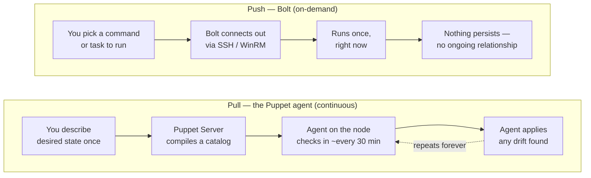
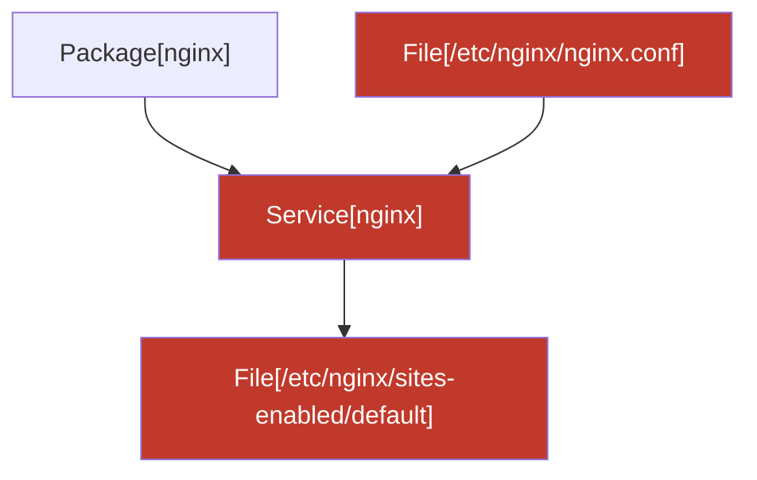
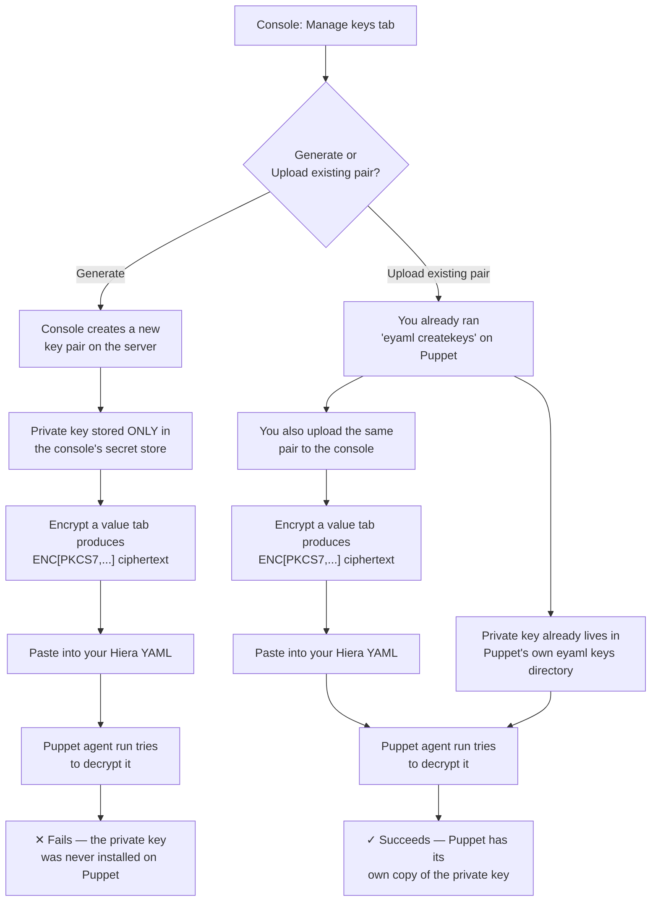

> **Who this is for:** you've never used Puppet, you've never used "automation" tools like this before, and honestly the word "automation" makes you a little nervous. Good — this guide assumes nothing. Every term gets explained the first time it shows up.

---

## The Five-Minute Version

Think of every computer you manage (a server, a VM, a laptop) as a **node**. Right now, keeping all your nodes configured correctly — same software versions, same settings, same security patches — probably means SSHing into each one by hand, or copying a script around and hoping you remember which machines you already ran it on.

**Puppet** is a tool that lets you describe _what a node should look like_ (its "desired state") in one place, and then keeps every node matching that description automatically — forever, on a schedule, without you touching each machine again.

**Puppet Stagehand** (this app) is the dashboard on top of Puppet. It's where you:

- See every node you manage, and whether it's currently correct ("compliant") or has drifted.
- Decide _what_ a node or group of nodes should look like (this is called **classification**).
- Run one-off commands or scripts against nodes when you need something done right now, not on the next schedule (this is called **Bolt**, more below).
- Check patch/update status across your fleet.
- See a complete record of every change anyone made (the Activity Log). Stagehand 1.0 has one administrator account; team roles and approvals are built but deferred to a later release.

You don't need to know Puppet's internals to use the console. You need to know what buttons do what — that's this guide.

---

## Two Ways Things Get Done: "Push" vs "Pull"

This is the single most important concept in the whole console, so we're covering it before anything else.

- **Pull (the Puppet agent, continuous):** A small program (the "agent") runs on each node in the background. Every 30 minutes or so, it "pulls" the latest desired-state description from Puppet and fixes anything that's drifted. You set the description once; the agent keeps enforcing it forever, on its own. This is how most day-to-day configuration management happens.
- **Push (Bolt, on-demand):** Sometimes you need something to happen _right now_ — restart a service, run a diagnostic script, apply an emergency fix — without waiting for the next scheduled agent run, or on a machine that doesn't even have the agent installed yet. **Bolt** connects out to a node over SSH (Linux) or WinRM (Windows) and runs the command directly, once, on demand. Nothing persists — it's a push, not an ongoing relationship.

Here's what each one actually looks like end to end:

Rule of thumb: **pull** is for "this should always be true." **push** is for "do this thing right now."

---

## Signing in and First-Run Setup

The very first time anyone opens the console, there's a one-time bootstrap step: create the first administrator account (the password has to be at least 12 characters — this is non-negotiable and protects the whole fleet, so make it a real passphrase, not a word with a number stuck on the end).

After that, you sign in like any web app. **Stagehand 1.0 has exactly one administrator account** — the one created at bootstrap. It can do everything this guide describes, and every privileged action asks for an explicit confirmation before it runs. (Team-based access control with multiple roles and second-person approvals is planned for a later release.)

The very first time _anyone_ signs in to a given installation, they land on the End User License Agreement instead of the dashboard — a full-screen page with the agreement text and an **Accept** button, and nothing else in the console is reachable until it's accepted. This only ever happens once **per installation**, not once per person: as soon as one person accepts it, every sign-in afterward — theirs or anyone else's — skips straight to the dashboard. You can still read the full agreement any time afterward from **Settings → EULA**, though that page is just a reference; there's nothing left to accept there.

---

## The Main Areas of the Console

### Dashboard

Your at-a-glance view — also called the **Action Center**, because that's really what it is: how many nodes you manage, how many are healthy vs. drifted vs. failing, how many certificate requests are waiting on you, and a prioritized list of everything else that needs a look, each one linking straight to the page where you'd actually deal with it. Start here every morning. One of the things it watches for is Puppetfile modules that have fallen behind the latest release on the Forge — see **Code Management** below.

Every card in that prioritized list has a small **Dismiss** button (an administrator-only affordance). Clicking it asks you to pick one of three reasons — **Not a problem**, **I'm OK with this**, or **I'll deal with this later** — plus an optional note. The first two dismiss the card until further notice; the third **snoozes** it — the card automatically comes back after the configured snooze duration (seven days by default, changeable at Settings → Action Center) instead of staying hidden forever. Every dismissal or snooze is written to the **Activity** log, so there's always a record of who dismissed what, when, and why.

**Service health.** Below the attention list, a row of small cards shows what the console can currently reach: itself (always "running" — you're looking at it), Puppet Server, PuppetDB, and Bolt execution, plus a "Bolt runtime readiness" summary once Bolt is configured. Each card's status is a glyph + label pill (**running**, **unreachable**, or **not configured**), never color alone — a card that isn't configured yet just says so, with a pointer to Settings. A **Test now** button on the Puppet Server and PuppetDB cards re-checks that connection on the spot. This used to be its own separate "Service Status" page in the sidebar; it now lives here instead, since it's exactly the kind of thing you'd want to glance at alongside everything else on your morning check of the Action Center. Recent task runs still have a home too — they're on the **Bolt Tasks & Plans** page's own run history table, and the fuller reporting view is under **Reporting → Activity & Runs**, on the **Runs** tab.

### Estate Viewer

This console can watch more than one Puppet install at a time — each one is called an **instance**. The **Active instance:** switcher under the logo, in the sidebar, picks which ONE instance every other page — Inventory, Bolt, Certificates, and so on — works with right now. **Estate Viewer**, in the Overview nav group, is a separate page that shows ALL your registered instances (or a chosen few) side by side at once, so it never has to agree with the sidebar switcher — it has its own independent "Showing:" scope. It's the one place to see, at a glance, how many nodes, editions, and problems exist across your whole estate, not just whichever single instance you happen to be pointed at.

Adding a new instance walks you through a short wizard — name it, optionally give it a **Console URL** (a link straight to that instance's own web console — see below — leave it blank if you don't want one), pick its product type (Core, Enterprise, or OpenVox), connect and test its PuppetDB, optionally connect and test its Puppet Server (used for the Certificates page and CSR counts — leave the host blank to skip it for now), then confirm — reached from Estate Viewer's own **Add instance** button. The wizard won't let you confirm until every connection you actually fill in has passed its own test, so you can't register an instance the console has never actually reached. An instance the console can't currently reach shows honest question marks (**? unreported**) instead of pretending everything is fine — it stays in your instance list and in every count, it just tells you plainly that it hasn't checked in.

Every instance row also has **Edit** and **Delete**. Edit changes the instance's name, product type, or Console URL — it doesn't touch its connections (that stays a separate step, below), so it opens with a **Manage connections** shortcut that switches this instance active and takes you straight to Settings → Connections. Delete removes the instance and its connections; you can't delete whichever instance is currently active (switch to a different one first).

Each instance row also carries two link-outs, opening in a new tab, so you never have to leave Stagehand hunting for how to reach that instance's own resources: **Open console** — only shown once you've set that instance's Console URL — and **Support options**, which opens the exact Puppet Core, Puppet Enterprise, or OpenVox lifecycle/support page. Core, PE, and PE Advanced rows show whether their release track is **Supported**, plus its published **End of Support** and **End of Life** dates. When the exact track is not reported, the row shows the published current-track date range instead of guessing one track. OpenVox is outside Puppet's product lifecycle and is labeled **Unsupported**.

Switching the **Active instance:** selector takes effect immediately, everywhere: any page you already had open re-fetches right away, and Settings → Connections always shows and edits whichever instance is currently active. If you need to edit a _different_ instance's connection details, switch to it first, or use its row's **Manage connections** shortcut above.

Settings → Connections also offers **PDCTNG** as an optional third service beside Puppet Server and PuppetDB. PDCTNG is installed and operated separately; connect it once for the active instance with the same **Save & test** flow. Until that test succeeds, Stagehand keeps its PDCTNG-backed node and fleet views out of sight instead of showing empty or misleading data.

You don't have to come back to Estate Viewer just to rename an instance or double-check what's registered, though. Settings → Connections has its own **Instances** card above the connection forms: the primary (active) instance's name is shown there and is editable right in place — click **Edit**, type the new name, **Save**. Every other registered instance is listed below it too, each with its own **Edit** button that opens the same edit drawer Estate Viewer uses (name, product type, and Console URL only — connections still aren't editable from there; switch that instance active first). Registering a brand-new instance still only happens in one place: the card's **Add or manage instances in Estate Viewer →** link takes you to that page's **Add instance** wizard rather than duplicating it here.

### Inventory

The full list of every node the console knows about, pulled from PuppetDB (Puppet's own database of node facts and run history). Click into any node to open its detail page, which is organized into three tabs:

- **Overview** — the node's **facts** (hardware, OS, network info Puppet collected about it), its recent **run reports** (what Puppet did the last few times it checked in), and a one-line count of how many classes are currently applied to it (with a link straight to the Classes tab, below). If your administrator has turned on the experimental **Node Dependency Graphs** feature, this tab also shows a **View dependency graph →** link — see **Node dependency graph (Puppet Labs)** just below for what it shows and how to turn it on or off.
- **Activity** — a single time-ordered timeline of everything that has happened to this node: console actions (like classifying it or rotating a credential), Bolt push runs, and Puppet agent run reports, all merged into one feed instead of three separate places to check. It defaults to showing the last 30 days, with a date-range picker to widen or narrow that window, plus filter chips so you can show only audit entries, only Bolt runs, or only Puppet reports (any combination — at least one is always turned on). Click any entry to jump straight to the underlying run, report, or audit record it came from. A Bolt run that was launched but never reported a result back (the target went offline mid-run, say) eventually shows as **unreported** instead of sitting there looking "in progress" forever — see the Glossary below.
- **Classes** — the applied classes currently on this node (a **class** is a reusable bundle of Puppet configuration — think "the web-server setup" or "the security-baseline setup"). Each one is tagged with where it came from: declared in the node's ENC classification (see **Classification** below), present in the node's last compiled catalog, or both. When a class is declared but hasn't shown up in the catalog yet — or shows up in the catalog without ever having been declared — the console flags it with a distinct badge, since that usually means something is out of sync (a classification change that hasn't run yet, or a class applied some other way). See the Glossary below for the exact terms.

### Node Dependency Graph (Puppet Labs)

Every node's catalog — the full list of resources Puppet manages on it (files, packages, services, and so on) and how they depend on each other — can be viewed as a graph. Get there from a node's Inventory page via the **View dependency graph →** link. The page has three tabs:

- **Summary** — a friendly, grouped inventory of what's on the node (package counts, service counts, and so on). The "what does this machine have on it?" view — no dependency lines to untangle.
- **Triage** — a ranked list of what failed on the node's most recent Puppet run and what else it's likely to affect, sorted worst-first so you know what to look at first.
- **Dependencies** — the full map: every resource as a dot (node) on a canvas, connected by lines showing which resource depends on which other resource.

**The failure overlay.** On the Dependencies tab, every resource is colored by its latest Puppet run outcome, not by what kind of resource it is:

- Red = **failed** — Puppet tried to fix this and couldn't.
- Amber = **changed** — Puppet found this out of the desired state and corrected it.
- Green = **unchanged** — this resource was already exactly right; nothing to do.
- Gray = **unreported** — this resource has never had a Puppet run report at all. (Deliberately never shown as a false "clean" green — no report means no information, not "all good.")

Click any failed or changed resource and two things happen: a read-only panel opens showing its status and how many other resources sit downstream of it (things that could break if this one stays broken), and every one of those downstream resources gets a highlighted border right on the graph so you can see the blast radius at a glance. This is look-only — clicking a node never takes you anywhere or opens Triage for you. If you want to act on a failure, use the Triage tab instead.

A small example makes this concrete. Say a node's catalog has these resources, one depending on the next:

If `File[/etc/nginx/nginx.conf]` (in red) fails, clicking it highlights everything downstream of it — `Service[nginx]` and `File[/etc/nginx/sites-enabled/default]` — because those are exactly what could break next. That highlighted set is the **downstream impact / blast radius** the Glossary defines below: not everything on the node, just what's actually reachable from the one thing that broke.

**Turning it on or off.** This whole feature — all three tabs, and the link that reaches them — lives behind a Puppet Labs flag called "Node Dependency Graphs." It ships turned on by default. An administrator can turn it off from **Settings → Puppet Labs**; doing so hides the graph link and tabs everywhere, but never deletes anything already recorded — turn it back on and everything reappears exactly as it was.

### Classification

This is where you tell Puppet _what a node should be_. Instead of writing config files by hand, you assign nodes to **groups** (e.g., "web servers," "database servers") through the console UI, and each group carries the settings/roles that get applied. Think of it like tagging — a node's group membership determines its desired state.

### Hierascope Analysis Jobs

Hierascope compares resolved Hiera bindings between two repository snapshots for
a deliberately narrow node population — think of it as "what would change for
these nodes if I moved from this branch to that one?" without actually running
anything on any machine. Everything below is for someone who has never heard of
Hierascope before.

**Where to click.** Open **Configuration → Data Management** in the sidebar,
then the **Hierascope** tab (it's the default tab, so you'll usually land
there automatically). Data Management's other tab, **Create Secret**, is an
unrelated feature that just happens to share this one nav entry — see "EYAML
profiles & the secret wizard" below. You'll see a list of every job that's
been run (newest first) with a **Start analysis run** button. Starting one walks you through three stacked steps on
one page — pick a repository and the two refs (branches/commits) you want to
compare, preview your scope (see below), then review and start. The result
page polls automatically every few seconds while a job is queued or running,
so you can leave it open and watch progress update on its own — no need to
refresh. Once a job finishes, its result page has three tabs: **Evidence**
(what actually differs), **Failures** (nodes Hierascope couldn't fully
evaluate), and **Inputs** (a read-only record of exactly what was compared).
A running job can be **cancelled**; a finished job (whatever the outcome) can
be **restarted**, which opens a brand-new job re-running the exact same
frozen inputs.

**Readiness.** Hierascope's readiness check may say **native ready** when the
signed `hierascope` artifact and static inputs are usable. That does not mean
**Puppet verified**: authoritative verification requires a matching trusted
Puppet 8 or Puppet 9 runtime and an approved EYAML profile. Missing or
tampered artifacts fail closed and show a recovery hint; they are not silently
replaced from a runtime URL.

**Where the console finds Hierascope (Settings → Execution).** Like Bolt
(see "Where the console finds Bolt" below), the console needs to know where
the signed `hierascope` program lives on this server. Normally your
deployment already configures this. If it's ever wrong — say, the artifact
was reinstalled somewhere else — a **Global Administrator** can fix it from
**Settings → Execution** without editing deployment configuration or
restarting anything: type the new path, save, and it takes effect
immediately for the next Hierascope job. The page shows whether the path
currently in use came from a fixed deployment setting (which always wins)
or a value saved on this page. Changing the path only tells the console
_where to look_ — it never changes what artifact (version, signature) the
console trusts, so this can't be used to point the console at an
unverified binary.

**A small helper tool, handled for you.** Behind the scenes, Hierascope's
readiness check relies on a small, well-known helper program called
`openssl` to do some of its cryptographic verification work — the same
trusted tool the console's own EYAML key generation uses (see "Where the key
pair comes from" below). You don't need to install this yourself: it's
included automatically as part of the console's own setup on a standard
deployment, so this is one less thing an administrator needs to think about.

**Where you can run this today.** Hierascope is fully supported on both of
the console's current deployment methods: a single server, and a small
multi-container setup (sometimes called "Compose"). It is not yet supported
on the Kubernetes/Helm deployment method some larger organizations use for
running the console itself — that deployment method doesn't have a way to
run the console at all yet, so this isn't a gap specific to Hierascope; it's
a known, tracked limitation of the console's Kubernetes/Helm support as a
whole, expected to close in a future release.

**What a "job" is.** Every time you ask Hierascope to compare two snapshots, the
console creates a durable **job** record and tracks it through a short list of
states: **queued** (waiting its turn) → **running** (the comparison is
happening right now) → and finally one of **completed** (finished cleanly),
**partial** (finished, but some nodes couldn't be fully evaluated),
**failed** (something went wrong), or **cancelled** (you stopped it). "Durable"
means this tracking lives in the console's own database, not just in memory —
so if the console itself gets restarted partway through a job, that job isn't
left stuck looking "running" forever; the console notices on its next startup
and marks it **failed** with a clear reason instead.

**Why the inputs are frozen.** When you start a job, the console immediately
pins down the exact two commits being compared (not just branch names like
"main" or "staging," which can keep moving) and the exact list of nodes it
resolved at that moment. This is deliberate: "what you see is exactly what
ran." If someone pushes a new commit to that branch five minutes later, your
already-running (or already-finished) job's result still reflects the commits
it actually compared — not a name that quietly points somewhere else now.

**Scope preview.** Before you commit to running a job, the console lets you
preview how many nodes your selection resolves to — the same active-node
population the job itself would use — so you can see the scope and, if it's
too large (over 100,000 nodes), narrow it down before spending any time on a
real run.

**Cancelling a job.** If a job is taking too long or you started it by
mistake, you can cancel it while it's running. This isn't just a status flip —
the console actually stops the underlying comparison process, the same way
closing a stubborn application actually ends it rather than just hiding its
window. A job you cancel ends up in the **cancelled** state.

**Restarting a job.** Once a job has finished — whether it completed, failed,
partially completed, or was cancelled — you can restart it. Restarting creates
a brand-new job that re-runs the EXACT same two commits and the EXACT same
node list the original job used; it never goes back out and re-resolves "what
does main point to now?" or "which nodes match this selector today?" This
matters because those things can change between when you first ran the job
and when you restart it — restart replays history precisely, it doesn't take
a fresh snapshot.

**Recovering from a console restart.** If the console process itself restarts
while a job is queued or running (a software update, a server reboot,
anything), that job cannot still be running when the console comes back — its
in-progress work was tied to the console process that no longer exists. The
console handles this automatically on startup: any job it finds stuck at
queued or running gets marked failed with a clear "interrupted by restart"
reason, so it never sits there looking falsely "in progress." You can restart
it (see above) once you notice.

**Evidence: what a job actually found.** Once a job reaches **completed** (or
**partial**), the console breaks its raw comparison result down into
**evidence** — one record per Hiera key whose resolved value would actually
change, plus a separate list of any nodes the job couldn't fully evaluate.
This happens automatically the moment the job finishes — no user action
triggers it. Each evidence record carries:

- **What changed** (`key`) — which Hiera lookup key's value differs between
  the two commits, and whether it was _added_, _removed_, or _changed_.
- **How sure the console is** (`confidence`) — Hierascope only ever reports
  one of four honest confidence levels: **static** (fully resolved by
  reading the repository alone), **verified** (double-checked against a real
  Puppet run), **partial** (only some of the picture could be resolved), or
  **opaque** (the value comes from a Hiera lookup function the console
  deliberately refuses to execute for safety — see below). The console never
  upgrades or invents a higher confidence than Hierascope itself reported.
- **What kind of impact** (`impact`) — either "the binding changed" or "this
  is confirmed applicable to a real node." Evidence never claims more than
  that — it does not claim to know exactly what a full catalog compile would
  do.
- **How many nodes are affected** — both the count Hierascope itself
  reported and a separately-counted list of which specific nodes are
  affected, so the two numbers can be compared rather than blindly trusted
  as identical.

**Why some values show up blank ("redacted").** Before any evidence is
saved, the console scrubs any value that looks like a password, secret,
token, or credential by name — even if Hierascope itself didn't flag it as
sensitive. This is deliberate double-checking: the console doesn't fully
trust any single tool's judgment about what's safe to show, so it applies
its own independent check as well. A redacted value shows as blank, never as
the real secret.

**Opaque values and "Data Service snapshots."** Some Hiera hierarchy levels
pull their value from a lookup function rather than a plain repository file
— the console never executes that kind of function itself (running
unreviewed code from a candidate change is exactly the kind of risk this
tool exists to avoid), so a value from a level like that is always reported
as **opaque** rather than guessed at. When that happens, the console attaches
a **snapshot**: a timestamped copy of whatever the console's own live Data
Service currently holds for that same key, purely as extra context ("here's
what the live system has today, for reference") — it never feeds that
snapshot back into the analysis or uses it to upgrade the opaque confidence
level.

**Nodes that failed instead of changed.** A job can have three genuinely
different outcomes, and the console keeps them distinct rather than
collapsing them into one flag: **clean** (no evidence records and no
failures — nothing would change), **changed** (one or more evidence
records), and **has failures** (one or more nodes couldn't be evaluated at
all, regardless of whether anything else changed). A node that failed
analysis is never silently counted as "no change."

**Downloading evidence (JSON/CSV export).** Once a job has evidence to show,
the console can produce the whole thing as a file — either **JSON** (a
machine-readable format, useful if you want to feed it into another tool)
or **CSV** (a spreadsheet-friendly format you can open directly in Excel,
Google Sheets, or Numbers). Both formats are generated fresh on every
request — the console never keeps a pre-made export file sitting around, so
what you get always matches the job's evidence at that exact moment. "Safe"
here means two things: first, any value the console already redacted (see
"Why some values show up blank" above) stays blank in the export too — a
download can never leak a secret the console already hid. Second, the CSV file is specifically hardened against a
classic spreadsheet trick: if a piece of text starts with `=`, `+`, `-`, or
`@`, some spreadsheet programs will try to run it as a formula instead of
just showing it as text — a malicious Hiera key name or node name could
otherwise trick your spreadsheet program into executing something you never
asked for. The console prevents this by adding an invisible-looking marker
in front of any such text before it's written to the file, so your
spreadsheet always shows it as plain text. In the CSV file, each row also
says whether it's a **change** or a **failure** (a column named
`record_type`), so the same clean/changed/has-failures distinction you see
on screen survives into the downloaded file too — a failure is never
disguised as an unremarkable row. **Download JSON**/**Download CSV** buttons
sit at the top of the job result's Evidence tab — each click generates the
file fresh from that exact moment's evidence, never a stale cached copy.

### EYAML Profiles & the Secret Wizard

**Where to click.** Everything below works end to end through the console
today: open **Configuration → Data Management** in the sidebar, then the
**Create Secret** tab (Data Management's other tab, Hierascope, is an
unrelated feature — see "Hierascope Analysis Jobs" above). Open it and you
land on the **Encrypt a value** tab — the whole point of the page — with a
second **Manage keys** tab alongside it for key lifecycle (generate, upload,
verify, delete). This used to live behind a "Set up EYAML keys" card on the
Action Center (Dashboard); that card is gone now that Create Secret is
reachable from this permanent, always-reachable Data Management nav entry, so
there's exactly one place to find it instead of two.

**What an EYAML profile is.** Puppet has a way to keep secrets — passwords,
API keys, tokens — safely inside your Hiera data files instead of writing
them in plain text: it encrypts each value with a key pair, so the file on
disk shows unreadable gibberish (`ENC[PKCS7,...]`) instead of the real
secret. An **EYAML profile** is that key pair, given a name, so the console
(and Puppet itself) knows which key to use. This is exactly the "authoritative
verification requires... an approved EYAML profile" piece mentioned above in
Hierascope's readiness check.

**Encrypt a value (the default tab).** Pick a profile, paste in a
plain-text secret, and get back a real `ENC[PKCS7,...]` ciphertext you can
paste straight into a Hiera YAML file yourself. This is a one-way, one-time
operation — the console encrypts it and hands you the result, but it never
remembers what you encrypted or the plaintext you typed in. It's a
convenience for building your Hiera files by hand, not a secrets manager you
look values up in later. If no EYAML profile exists yet, this tab's fields
are greyed out with a message pointing you at **Manage keys** to set one up
first.

**Manage keys.** This tab holds key lifecycle: **Generate** a brand-new key
pair (the console does the real cryptographic work itself, on the server,
using the same trusted `openssl` tool Puppet's own tooling relies on), or
**Upload** a key pair you already have from somewhere else. Either way, the
console double-checks that the public and private halves actually match
_before_ it saves anything — an uploaded pair that doesn't match, or that's
the wrong kind/strength of key, is rejected up front rather than silently
stored broken. Once at least one profile exists, this tab also lists it with
**Verify** and **Delete** actions.

**Generated keys are console-side only — read this before you rely on one.**
A key pair you **Generate** has its private half stored only inside the
console's own write-only secret store, and the console has no way to hand
that private key back to you — not through the API, not through the UI, not
anywhere. That means real Puppet runs on your infrastructure **cannot**
decrypt a value encrypted under a Generated profile, because Puppet's own
`hiera-eyaml` needs a copy of that same private key installed in its own
keys directory, and there is currently no way to get it there. The Generate
tab shows this warning inline. If you need Puppet to actually decrypt the
value later, use **Upload existing pair** instead with a key pair you
already created and installed on your Puppet infrastructure yourself (e.g.
via `eyaml createkeys` on your Puppet server) — uploading just gives the
console a copy of that same key so it can encrypt matching values here.

Here's why that distinction matters, laid out end to end:

**Private keys never leave the server.** Once a profile is generated or
uploaded, its private key is stored only in the console's own write-only
secret store — the same place every other console-managed credential lives.
No API response, no list view, and no audit log entry ever shows it again;
only the public key (which is safe to see, the same way a lock's shape is
safe to photograph) is ever displayed.

**Verifying a profile.** The **Manage keys** tab's **Verify** button checks
a profile against a real, trusted Puppet 8/9 runtime — but no such runtime
is staged in this release, so clicking Verify today always shows an honest
"not yet configured" result rather than a false pass. This is deliberate:
the button exists now so the workflow is already in place, and it will
start doing real verification once that trusted runtime ships in a later
release — it never pretends to have verified something it couldn't actually
check.

**Deleting a profile.** Deleting is permanent and the console warns you
plainly before you confirm: any Hiera value already encrypted
(`ENC[PKCS7,...]`) under that profile's public key becomes permanently
undecryptable the moment its private key is gone. There's no undo — only
delete a profile once you're certain nothing in your Hiera data still
depends on it.

### Search From Anywhere (the Command Palette)

Wherever you are in the console, you can jump straight to what you need
without hunting through the sidebar. Either click the **"Search anything…"**
button near the top of the sidebar, or press **⌘K** (Mac) / **Ctrl+K**
(Windows/Linux) — the shortcut works even while you're in the middle of
typing into a form field, and it never changes or clears what you'd typed;
your unfinished text is still there when you come back.

A search box opens at the top of the screen with your cursor already in it.
As you type, matching results appear in groups: **Nodes** (live matches
from your inventory), **Sections** (console pages, the same set your
sidebar shows), and **Actions** (shortcuts like "Add a node" or "Run a Bolt
task"). If your console has the vulnerability findings feature enabled, an
**Issues** group appears first as well. Matching is forgiving — you can
type just a few letters of a name and it will still find it.

Click a result (or Tab to it and press Enter) and the console takes you
there and closes the search. Press **Escape** to close without going
anywhere. If nothing matches what you typed, you'll see exactly
`No matches.` — every result only ever _navigates_; searching can never
change or run anything by itself.

If a live readiness change removes the result that currently has keyboard
focus, Stagehand moves focus to the next available result, or back to the
search field when no result remains. It never leaves keyboard focus on a
control that has disappeared.

### Bolt (Push Runs)

Where you run one-off commands or scripts against a node or group of nodes, right now, over SSH/WinRM. The console shows you exactly which nodes it's about to touch (**inventory preview**) before you run anything, and every run's output is recorded so you can look back at what actually happened. Everything Bolt-related lives on this one page, as tabs: **Runner**, **Discover**, **Plan Builder**, **Run a Playbook**, and **Credentials** — described below.

**The Plan Builder tab (visual plan builder):** think of a Bolt plan as a recipe — a list of steps the console runs in order. The Plan Builder lets you build that recipe visually instead of writing code. Open **Bolt Tasks & Plans → Plan Builder** and:

1. **Add steps from the palette.** The palette lists every task and plan the console already knows about (the same catalog the Runner uses). Search it, click one, and it becomes the next card in your plan. Steps run top to bottom; drag a card's handle to reorder, or delete a card you don't want (any step that referenced the deleted one by name will need updating — though Undo can bring it back while the page stays open, see below).
2. **Fill in each step.** Click a card and its settings open beside it — the exact same typed input form the Runner shows (required inputs first, sensitive inputs picked from Secrets, never typed in plain text) plus the same target selector, so each step knows which machines it applies to.
3. **Reference an earlier step.** If a later step needs an earlier step's result, use the small link button inside a text field to insert a `$stepname` mention — plain text that names the earlier step, no wires to drag.
4. **Save your draft.** Drafts are private to you and stored by the console. If the same draft was changed in another window or session since you loaded it, the console blocks your save and shows a reload notice instead of silently overwriting the newer copy — reload, then carry on.
5. **Validate.** The **Validate** button asks the real Bolt engine to compile your plan without running anything on any machine. You either get a green "valid" result or a list of what's wrong, with the raw error text one click away if you want the details.

6. **Undo and Redo as you build.** The two small arrow buttons in the toolbar step backwards and forwards through your edits — adding, reordering, or deleting a step, filling in an input, or changing a step's targets can all be walked back and re-applied. This history only lives while the page is open: reload the page or leave the Plan Builder tab and it starts fresh (your _saved_ draft is never affected by undo — only the unsaved edits on screen).
7. **Dry run.** Once your draft is saved and at least one step has targets, the **Dry run** button previews what the plan would do against real machines _without changing anything_ — the Bolt engine visits the targets in "look, don't touch" mode and reports back a per-step success/failure list, with each step's output one click away. It's the safe rehearsal before publishing.
8. **Publish (confirm and publish).** The **Publish** button turns your finished draft into a real proposal in your control repository. A confirm dialog shows the branch name (always prefixed `psh/`) and commit message first; confirming pushes a **proposal branch** to the attached repository immediately, and the success banner links you straight to the proposal so it can be reviewed and merged like any other code change. Publishing never changes any machine by itself — machines are only touched when the merged plan is actually run later. Publishing requires administrator access: if you're not signed in, or not an administrator, the console refuses the publish and tells you why.

**Guided by default.** The Runner, Discover, and Run a Playbook forms all open in a guided, less-cluttered default view, with one clear primary action front and center and a short helper line telling you what to do first. Power-user options — Group/PQL targeting, extra vars, tags, skip tags, and credential overrides — sit behind an **Advanced options** toggle labeled **"Show advanced options"** that you can open any time; the page remembers whether you left it open the next time you visit. On a finished run's detail page, each target's full output is one **"View output"** click away instead of being shown in full for every target at once. Nothing was removed — every option is still there, just tidier by default.

**Running a task or plan (the Runner tab):** pick a task or plan from your attached module repos and the console reads its declared inputs for you — no need to know the underlying command syntax. Required inputs are listed first with a red note under any you've left blank, so you can't accidentally launch with something missing (the Launch button itself stays greyed out until every required field is filled). If an input is sensitive (a password, API key, or token), you don't type it in plain text — you either pick an existing entry from **Secrets** by name, or, if you don't want to store it, enter a one-off value that's masked as you type.

**Read-only node discovery (the Discover tab)** uses the same target selector as the Runner tab, described next — Discover otherwise keeps its own dedicated, narrower form (a fixed checkbox list of resource types). (Triggering a compliance scan uses this same target selector too, but lives on the Compliance page under Patching & Compliance, not here — see "Compliance" below.) **Ansible® playbook runs have their own tab** — see "Running an Ansible® playbook (the Run a Playbook tab)" next; it shares this exact same target selector too, not just the same look and feel. **Discover has one extra rule:** it only ever runs against exactly one node at a time — if your Group or PQL selection matches more than one node, the console tells you how many matched and asks you to narrow it down before Launch becomes available again.

**Running an Ansible® playbook (the Run a Playbook tab):** open **Bolt Tasks & Plans → Run a Playbook**. First, attach a **playbook repo** under Code Management (see "Structuring a repo for the Run a Playbook tab" below) — the tab's own "Attach repo" button takes you straight there, pre-selecting the right repo kind. Once one's attached, the tab discovers every playbook under that repo's `playbooks/` directory automatically after each fetch. Pick one from the list — no YAML editing needed for the common case — and the console fills in a form field for each variable the playbook declares in its own `vars:` block, pre-filled with that playbook's own declared defaults. It uses the exact same target selector as Runner and Discover (internally the console calls this shared control the **TargetSelector**) — same Group/PQL/Static tabs, same PQL preview, same team-scoped safety net described below. Beyond targeting, "extra variables" now covers BOTH the generated fields above (for a playbook that declares `vars:`, each one can include a `secret://` reference, resolved only at run time and redacted from the captured output if a task ever echoes one back) AND an advanced JSON box — always available, and the only option when a playbook has no `vars:` block to generate fields from — plus tags/skip-tags, an optional check-mode (dry run, like Puppet's own noop) toggle, and an install-method choice for how the console should get Ansible onto a node that doesn't already have it. A playbook run shows up in the same run history table below the tabs as every other Bolt run — there's no separate history list to check.

**Structuring a repo for the Run a Playbook tab.** This isn't quite a normal Ansible project layout — there's no separate Ansible control node here, so there's nothing to resolve `roles/`, `group_vars/`, `host_vars/`, or `requirements.yml` against. Instead, keep it simple:

- Put each playbook as its own flat file directly under a `playbooks/` folder at the repo root — `playbooks/apache-install.yml`, `playbooks/web/setup.yml`, and so on (subfolders are fine; the console uses the path under `playbooks/` as the playbook's name).
- Every playbook must be **fully self-contained in that one file** — no external roles, no separate inventory file, no `ansible.cfg`. Anything the play needs (package names, service names, per-OS differences) should live in that file's own `vars:`/`when:` logic.
- Every playbook must declare **both** `hosts: localhost` and `connection: local` — the console checks for these two exact strings before it'll run a playbook, since Bolt pushes each one to a target and runs it there against itself.
- The **name of the first play** (its own `name:` key) becomes the playbook's description in the picker, so give it something descriptive.
- Any top-level `vars:` keys the first play declares become the generated form fields described above — each one's own value in the file is used as that field's pre-filled default. Variables declared via `vars_prompt:` are not picked up; use `vars:` for anything you want to show up as a field.
- Attach the repo under **Code Management** with kind **"Playbook Repo"** (see below) — the console automatically scans it for playbooks after each fetch, and they show up in the picker on the Run a Playbook tab.

If you don't have a playbook repo handy, ask your console administrator for a small example repo to test against.

**Choosing your targets (the target selector):** every place you pick which nodes to run against uses the same three tabs:

- **Group** — pick an existing node group (the same groups you use for classification).
- **PQL** — write a query in the console's node-query language and click **Preview** to see, before you run anything, exactly how many nodes match and (on request) their names. This is the **PQL preview**.
- **Static** — type or pick specific node names by hand, comma-separated.

Whichever tab you use, the console never shows you a node outside what your role/team is allowed to touch — a query or group that includes nodes you can't manage simply won't include them in the result.

**Trust on first contact (TOFU):** the very first time the console talks to a brand-new node over SSH, it records that node's cryptographic "host key" (proof of identity) automatically. If that same node ever presents a _different_ key later, the console refuses to connect and flags it for you — because that's exactly what it would look like if someone swapped in an impostor machine. You have to explicitly approve ("re-trust") a changed key before the console will talk to that node again. For normal fleet nodes, use **Bolt Tasks & Plans → Derived inventory → Show → Request re-trust**. If the changed host is the Puppet primary and the failure occurs during Code Deploy, the deployment result shows the presented fingerprint and the re-trust action directly. Verify the fingerprint through the target's console or another trusted channel before using that action. This is a safety feature, not a bug — don't work around it without knowing why the key changed.

**Excluding a target:** if a node is flaky, decommissioned, or otherwise shouldn't be touched by push runs right now, you can exclude it (with a required reason, so it's clear later why). Excluded nodes are skipped automatically.

**Bolt credential pairs (the Credentials tab):** the username/key or username/password pairs Bolt uses to connect. Manage them under **Bolt Tasks & Plans → Credentials** — add one by name, and you can rotate (replace with a new value) or revoke (kill immediately, including any run currently using it) a credential from that same tab.

**One SSH credential for the fleet:** a Global Administrator can choose a fallback SSH-key credential for console-initiated Bolt runs at **Settings → Execution/Bolt → Fleet SSH credential**. It is used only when the target has no more-specific choice: a credential selected for this run, a credential bound to that node, or a node's inline credential always wins. Choose a different SSH-key pair and **Save** to switch the fleet fallback, or choose **Use existing per-node/default SSH behavior** and Save to clear it. If Settings warns that the saved pair is unavailable (for example, it was revoked), choose a current SSH-key pair or use **Clear unavailable credential** to recover the normal fallback behavior.

To rotate the key material for the pair already selected as the fleet default, replace that pair under **Bolt Tasks & Plans → Credentials**. The next Bolt run uses the replacement immediately — no Settings Save is needed unless you are switching to a different pair or clearing the default. This target-access credential is separate from a Code Management control-repository deploy key, which authenticates the console to your Git host rather than to fleet machines.

#### Stagehand SSH identity and controller-key security

For Linux SSH targets, the console's default login is the dedicated **`stagehand` account**, not `root`. The console authenticates that account with a persistent **controller key**. A public key accepted by `stagehand` does not grant root access by itself: what it can do is determined by the account's filesystem permissions, its sudo policy, and any privileged wrapper programs it may invoke.

There is an important boundary to understand, however. If the same controller key is accepted on every server **and** `stagehand` has unrestricted passwordless sudo—or can use a generic wrapper to execute arbitrary commands as root—then possession of that one private key is effectively fleet-wide root access. Compromise of the console host or private key would compromise every server in that trust set. Encrypting the key at rest and setting its file mode to `0600` are necessary protections, but the running console must still be able to use it; they do not remove that shared-credential risk.

**Production ownership is split deliberately:**

- The **installer** should generate or import the controller keypair before the service starts, create the persistent Bolt project, protect the private key, configure the console to use that project, and preserve the key across upgrades. The project must remain writable by the Stagehand service account: the console refreshes its bundled module, derived inventory, and SSH trust state there. A container deployment must therefore use a writable persistent mount for this directory, never a read-only bind mount. The installer should expose the public half to configuration management without ever copying the private half to a managed server.
- The **Puppet module that installs/configures Stagehand** should create the `stagehand` OS account only on intended targets, install the controller **public** key in that account's `authorized_keys`, and manage the account's exact permissions and sudo rules. The module must never distribute the controller private key.
- The **console binary** carries and installs its bundled Stagehand tasks into the configured Bolt project. For a manually copied standalone binary, it can also generate a persistent keypair as a recovery/convenience fallback. That fallback is useful for a lab or manual installation, but it is not a recommendation to make one generated key a universal production credential.

**Use separate credential boundaries in production:**

- Give Code Deploy its own key/account trusted only by the Puppet primary. Do not reuse that deployment credential across the managed fleet.
- Separate fleet credentials by at least production versus non-production and, where appropriate, by security zone, environment, or administrative team. A separate key per node gives the smallest blast radius but costs more to operate.
- Store those identities as named Bolt credential pairs. The Runner's credential override and Code Deploy's **SSH credential** picker let an operator select the correct boundary for a run without replacing the saved default.
- Rotate or revoke each boundary independently. Revoking one environment's credential should not break every other environment.

Keep `stagehand` unprivileged by default. Never grant it an unrestricted rule such as `ALL=(ALL) NOPASSWD: ALL`. When a push task genuinely needs elevation, prefer a small root-owned wrapper with fixed behavior and a narrowly scoped sudo rule. A wrapper that accepts an arbitrary command, script path, or shell expression is still effectively unrestricted root. For broad privileged remediation, prefer Puppet's normal pull/enforcement path: the Puppet agent already has a purpose-built privileged execution model and does not require opening a fleet-wide SSH trust path.

Harden every accepted Stagehand public key as far as the deployment permits: disable SSH agent, port, and X11 forwarding; restrict accepted source networks when the console has stable addresses; disable interactive access that the required Bolt workflow does not need; monitor key use; and remove old public keys promptly after rotation. A forced-command restriction can break Bolt's task transport, so use one only with a purpose-built gateway or wrapper that has been tested with the exact allowed tasks.

For higher-security estates, the preferred longer-term model is an **SSH certificate authority with short-lived certificates**. The console receives a time-limited certificate for the identity and scope needed by a run, while targets trust the CA instead of retaining one permanent fleet-wide public key. The current console credential-pair workflow supports scoped static credentials; automatic issuance of short-lived SSH certificates is a future or externally integrated deployment capability, not something the current UI configures for you.

**Windows nodes (WinRM):** Windows targets connect over WinRM instead of SSH. The console defaults to the encrypted connection (HTTPS, port 5986) with certificate verification on — the same "secure by default" posture as SSH's TOFU. If you're connecting to a Windows node with a self-signed or internal certificate, an operator can turn on a per-node/group override rather than disabling verification everywhere.

**Where the console finds Bolt (Settings → Execution):** to run Bolt at all, the console needs to know two things: where the `bolt` program lives on this server, and which **Bolt project** folder to use (the folder holding your inventory and modules). Normally whoever set up your deployment already configured these. If either is ever wrong — say, Bolt got reinstalled somewhere else, or the project folder moved — a **Global Administrator** can fix it from **Settings → Execution**, right in the console: type the new path, save, and it takes effect immediately, no one has to touch deployment configuration or restart anything. That page always shows you where the value currently in use actually came from — a fixed setting your deployment team configured, a value saved here, or one the console found on its own — so if a save here doesn't seem to "take," the page tells you a fixed deployment setting is pinning it instead (a fixed setting always wins over what's saved here).

### Runs

Reachable from **Reporting → Activity & Runs**, on the **Runs** tab (the
other tab, **Audit**, is the Activity Log described further below — the two
used to be separate sidebar entries and are now one). A history of every
Bolt push run and Puppet report the console knows about — what ran, when,
against which nodes, and whether it succeeded, failed, or was stopped
(including runs stopped because a credential was revoked mid-run — those
show a distinct "revoked" status so you can tell it apart from an ordinary
failure).

### Compliance

Compliance is opt-in. During installation, Trivy vulnerability scanning,
OpenSCAP configuration assessment, and Perforce SCE enforcement are three
separate questions and all default to off. Stagehand does not install or show
a scanner the administrator did not select. If no compliance capability is
selected, Compliance is omitted from normal navigation; **Settings → Compliance
scanners** remains available so a Global Administrator can enable one later
without rebuilding the console.

Selected capabilities keep distinct meanings. **Trivy** reports CVE exposure
and fixable packages; those packages can seed a Patchbot campaign.
**OpenSCAP** reports assessment results for a CIS/STIG profile: pass rate,
failed controls, coverage, freshness, and a node-by-benchmark heatmap.
**Perforce SCE** continuously enforces selected controls through Puppet. SCE
is premium Forge content included with a Puppet Core entitlement, but it is
never added to a user-owned control repo or assigned to nodes automatically.
For an existing repo, the installer shows exact Puppetfile pins or offers a
review branch; for an installer-created repo it may add the pins after explicit
consent. Preparing SCE does not enable a CIS/STIG profile.

The scan wizard lists only installer-selected scanners. It uses the shared
Group/PQL/Static selector and Bolt, then results return through the normalized
`compliance.v1` ingestion contract. Trivy and OpenSCAP results are not blended
into one score: vulnerability exposure and configuration assessment are
different questions. OpenSCAP and SCE correlate initially at an exact
benchmark/profile identifier only; Stagehand does not invent control mappings.

The Compliance page has separate **Vulnerabilities**, **Assessments**, and
**Enforcement** lanes. Trivy and OpenSCAP summaries are filtered by scanner;
OpenSCAP alone owns the assessment heatmap. The Enforcement lane reads bounded
`sce_linux`/`sce_windows` catalog evidence from PuppetDB and reports query
failures as unknown. It never classifies a node. A fixable Trivy exposure can
prefill a new Patchbot campaign with the affected FQDNs, but you still review
and freeze that campaign before launch.

To change scanner selection, open **Settings → Compliance scanners**, choose
Trivy or OpenSCAP, an install/upgrade/uninstall action, and target FQDNs. Preview
first: Stagehand freezes the resolved targets and separates already-ready,
planned, and externally managed nodes. Confirmation is explicit and work is
split into batches of at most 25. Desired state and observed per-node state are
shown separately. Disable removes only artifacts whose ownership marker names
this Stagehand console instance; pre-existing scanners and another console's
artifacts remain in place. Refresh the preview to reconcile its Bolt task
results and expose partial failures for retry.

The SCE proposal API produces review-only Puppetfile lines and accepts only
exact versions of `puppetlabs-sce_linux` or `puppetlabs-sce_windows`. It never
edits, merges, deploys, or classifies a control repo; dependency resolution and
the existing Code Management proposal review remain required.

Two **Summary / Heatmap** buttons above the results switch between two ways of looking at the same data. **Summary** (the default) is the fleet-score dashboard described above. **Heatmap** instead lays your nodes out as rows and your compliance benchmarks as columns, one small button per node-and-benchmark pair, colored and marked by its worst result: a check for pass, an exclamation mark for warn, an X for fail, a question mark for error, and a centered dot for a pair no scan has ever covered (so you can spot coverage gaps, not just failures, at a glance). Click any cell to open that node's controls filtered to just that benchmark — the same drilldown panel the Summary table's rows open, just narrowed to one column instead of one node's whole history.

### Patching

The Overview shows Patchbot fleet posture: nodes needing updates, security
updates, reboot-required nodes, stale/unknown facts, package-manager
composition, and freshness. The Nodes view pages through patch groups and can
run `patchbot::patch` through Bolt against a node or group. Patchbot facts are
authoritative for current posture; a successful task is execution history and
does not make the node current until fresh facts arrive.

Manual staged campaigns freeze their resolved FQDN target list, optionally run
a canary, divide the remainder into fixed batches, and wait for the
administrator to continue each stage. A failed or ambiguous stage stops the
campaign; retry targets the same frozen batch. Only one active campaign is
allowed in v1. There are no schedules, approval gates, blackout windows,
automatic continuation, or concurrent campaigns.

Open **Campaigns**, choose **New campaign**, and select a Static FQDN list,
Patch group, or PQL query. Choose security-only or all updates, the reboot
policy, optional canary size, and fixed batch size. **Freeze targets** resolves
the selector through your team scope and saves the sorted FQDN list; it does
not start patching. Review that frozen list and the generated timeline, then
start the canary or first batch. Use **Refresh run status** after inspecting
the linked Bolt task. A successful non-final batch pauses at **ready** until
you explicitly choose **Continue to next batch**. A failed or ambiguous batch
becomes **blocked** and offers **Retry current batch** against exactly the same
targets. **Stop campaign** prevents later batches from launching.

Every launch re-checks the current Patchbot fact for every node. A missing,
invalid, or older-than-24-hours fact blocks the batch before a Bolt process is
started, even when the fact was valid when the campaign was created. After a
successful Bolt task, the campaign records the execution but the Overview and
Nodes posture remains unchanged until Puppet submits a newer Patchbot fact.
Use the task link for execution detail and the Patching freshness indicators
for current fleet truth.

Stagehand patching is **roll-forward only**. It records posture and Bolt-run
history, stops on failure, and supports retry or a new corrective campaign.
It does not present a generic Rollback button because Linux/Windows package
managers and repositories cannot promise a safe universal downgrade.

### Code Management

Under **Management → Code Management**, this is where you connect the console to your **Puppet control repository** so it can deploy code to your environments. (Attaching per-team module repos, or other tracked module repos, is coming in a later release — it depends on the team/taxonomy model that isn't part of this one, so the repository-kind picker shows those as disabled "coming soon" choices for now. Two kinds are selectable today: "control repo," described here, and "Playbook Repo" — used by the Run a Playbook tab under Bolt Tasks & Plans, see "Structuring a repo for the Run a Playbook tab" there.) Attaching a repo generates a fresh SSH key pair by default — the console shows you the **public** half once, which you paste into your git host (GitHub, GitLab, Gitea/Forgejo, Azure DevOps — anything with a plain git remote works) as a read-only deploy key. The private half never leaves the console's write-only secret store. If you'd rather not manage a separate deploy key per repo, the attach form's **"Reuse key from…"** dropdown lets you reuse an already-attached repo's keypair instead — handy if you registered that key at your git host's account level (so it already has access everywhere) or don't mind adding the same public key to a second repo's deploy keys. Once attached, the console can:

- **Fetch** the repo and show you what's inside (branches, classes, `Puppetfile` modules) without changing anything.
- **Propose** a change as a branch push, for review in your normal git workflow — the console never force-writes directly to your repo.
- **Deploy** — a manual "Deploy now" button that runs r10k to pull the latest code into your Puppet environments. **Deployments** (the second tab) opens with an **Environments** list: every branch on your control repo, the commit currently on that branch's tip, and — for any environment you've deployed from this console before — when that last happened, who ran it, and whether it passed or failed. An environment you've never deployed from here shows "Never deployed from this console" rather than a guessed or blank-looking date. Below that is the "Deploy now" control itself. The environment picker there is a dropdown, not a text box — by r10k convention an "environment" name is just the name of a branch on your control repo, so the console reads that repo's branches (a lightweight remote check, no cloning) and lists them for you, defaulting to the repo's configured default branch when it's among them. The adjacent **SSH credential** picker normally uses the primary server's saved Bolt override; choosing a credential pair replaces both its username and authentication method for this deploy only. Use a primary-specific deployment credential rather than a fleet-wide operations key; see **Stagehand SSH identity and controller-key security** under Bolt above. If no explicit identity is configured, the console uses the `stagehand` account and its persistent controller key. A standalone console creates that key at `<Bolt project>/id_ed25519` and the public half at `<Bolt project>/id_ed25519.pub`; authorize the public key for the primary's `stagehand` account before deploying (existing installations using `<Bolt project>/keys/id` keep that already-authorized legacy key). The standalone binary also installs its bundled Stagehand tasks into `<Bolt project>/modules/stagehand`, so copying the binary to a server does not require copying this source checkout. If no control repo (`kind=control`) is attached yet, the picker explains that and Deploy now stays disabled until you attach one on the Repositories tab; if the branch list can't be fetched (host unreachable, auth problem), an inline error explains why with a Retry button.

**The control-repo setup wizard:** after you attach a control repo, the console opens a guided drawer. Its first step safely looks for an existing `r10k.yaml`, Puppetfile, and deploy-key path on the Puppet primary; it does not execute Puppetfile content or read a private key. The same wizard then checks readiness, offers **Provision now** if the primary needs a managed OpenSSH server, shows which Git hosts still need credentials, and lets you confirm a real branch/environment name. Finishing the wizard configures readiness only — you still choose **Deploy now** separately. If you close it before the repo has a successful deploy, the Action Center keeps a dismissible setup reminder that returns you to the wizard.

**Git Credentials:** Code Management's separate **Git Credentials** card stores the SSH key or HTTPS token used to read Git repositories named by a Puppetfile. A **host default** can cover repositories on one Git host, while a **specific repository** credential overrides that default for one URL. These secrets are write-only: the console lists the name and scope, never the private key/token. Revoking a credential immediately stops in-flight module clone or re-scan work using it; rotate by saving replacement material under the same name. Git Credentials are not Bolt Credentials: Git Credentials read source code from Git hosts, while Bolt Credentials log in to managed nodes or the Puppet primary.

If detection finds an existing r10k deploy key on the primary, the wizard shows only that a path exists. Reading and importing the private key is a separate, security-sensitive action behind an explicit **Import this key** versus **Generate a new key instead** choice; nothing imports automatically. After import, remove or revoke obsolete copies at the Git host and primary when your migration plan allows, and revoke the saved Git Credential in Code Management when it is no longer needed.

After each control-repo fetch, the console scans tasks and plans both inside that repo's own module directories and inside Git-sourced modules listed in its Puppetfile. Each external module appears automatically as a **Puppetfile-discovered module** row, including its parent control repo and any per-module error, and can be re-scanned or revoked without making it manually attachable. Successfully discovered task/plan names flow into the Bolt Runner and Designer Palette automatically.

For a deploy whose Puppetfile spans several Git hosts, the console sends a per-run SSH configuration and the matching keys to the primary. The bundled `stagehand::r10k_deploy` task writes them into a restrictive temporary directory, uses them only for that r10k process, and removes them after success, failure, or interruption. They are not installed as durable user SSH keys on the primary.

The console binary is authoritative for these Stagehand tasks: at startup it replaces `<Bolt project>/modules/stagehand` with the module embedded at build time. A standalone binary copied without this source checkout therefore still carries `r10k_detect`, `ensure_ssh_server`, `r10k_read_deploy_key`, and the SSH-staging `r10k_deploy` behavior. Keep the Bolt project writable and persistent, and do not edit the installed bundled module by hand because the next initialization replaces it.

The Plan Builder's **Publish** button uses this same attached-repo connection to push a proposal branch directly.

**Puppetfile version cross-check.** For any attached control repo, the Puppetfile table shown after a fetch has a **Latest (Forge)** column: for every module pinned by `version:` (not `git:`/`ref:` — those are a different kind of pin and aren't checked here), the console looks up what's currently published on the **Puppet Forge**, sending the key you set under **Settings → Packages** as authentication to unlock license-gated ("premium") modules — the same key your `apt`/`yum` package repos already authenticate with, though this is the standard public Forge API, not a separate host. Each row gets a status pill:

- **✓ current** — your pinned version is the latest published, or newer (e.g. a private fork bump).
- **↻ update available** — a newer version is published; the version number is shown next to the pill.
- **? unknown** — no Forge key is configured yet, the module isn't found on the Forge, or the version couldn't be compared. This is always shown honestly instead of guessing — you'll never see a false "current."

If the Forge has marked a module **deprecated**, its row shows an **✕ deprecated** pill instead — in a distinct color from the status pills above, since this is the row's "stop using this" signal, the strongest state a module can be in. Hover the pill for why it was deprecated and, if the Forge named one, which module replaces it. A module's Forge **endorsement** (`supported`, `partner`, or community) shows in that same hover text when the Forge reports one.

**Settings → Packages: knowing which Forge key is configured.** The Forge key field is write-only — once saved, the console never shows it back to you, on purpose. To help you tell keys apart without re-pasting one to check, once a key is set the page shows a **reference**: the key's last six characters and when it was last saved through this page. There's also an optional **expiration date** field you can fill in by hand — the Puppet Forge doesn't currently expose a way for the console to check a key's expiration itself, so this is a reminder you set, not something the console verifies. Once you've entered one, it shows as a day-count ("expires in 12 days") that turns into "expired N days ago" once it's passed, and — starting 30 days out, or any time it's overdue — an Action Center card links straight back here.

This is a **read-only** check: nothing is ever changed or proposed automatically. Results are cached for about 30 minutes so opening the page repeatedly doesn't hammer the Forge; a **"Check Forge now"** button on each Puppetfile card forces a fresh look. If any of your pinned modules are behind the latest release, the Dashboard's Action Center surfaces a card for it, linking straight back here.

**Settings → Packages: Puppet component versions.** Below the Forge key, a **Puppet component versions** panel shows which **puppet-agent** version(s) your fleet is actually running right now — a live count straight from PuppetDB, refreshed on demand with its own **Refresh** button, never a cached guess. If nodes are split across versions (say, most on one release with a handful still on an older one), every version and its node count are listed, not just one. **Puppet Server** and **PuppetDB** show as **? not available** instead — hover the pill for why: this console doesn't currently have a way to ask either of those services what version of itself it's running (that's different information from the Puppetfile check above, which only ever looks at Forge-published _modules_, not the Puppet platform's own core components). For the same reason, there's no "latest available" column here yet either — the console has nothing to compare your installed versions against. This panel tells you what you have, honestly; it doesn't yet tell you whether you're behind.

**Secrets** has its own separate home under Settings (not a Code Management tab) so it stays reachable independently.

### Certificates

Puppet nodes authenticate using certificates issued by your Puppet Certificate Authority (CA). This screen lists pending certificate requests (a new node asking to join) and issued certificates — sign a pending request to let that node in, or revoke a certificate to kick a node out. The list pages 25/50/100 at a time, so a large fleet's "signed" filter (effectively every enrolled node) stays fast to browse.

### Console SBOM

Reachable from **Settings → SBOM**. This is a **Software Bill of Materials** — a list of every third-party piece of software the console itself is built from — for when your own security or compliance team needs one to evaluate the console as a vendor.

There are two versions, because they answer slightly different questions:

- **App SBOM** — the console's own Go and JavaScript dependencies. This one is generated when the console is built and lives _inside_ the running console itself, so the **Download App SBOM (CycloneDX)** button works instantly, even if this console has no internet access at all.
- **Full Container SBOM** — everything in the App SBOM, plus the operating-system packages and the Puppet Bolt installation that ship inside the console's container image. Producing this one requires scanning the finished container image, so it's generated once per release and published alongside that release's downloads on GitHub — the page links straight to the exact one that matches the version you're running. If that link isn't available yet (for example, on a local development build), the page says so instead of showing a broken link.

Below the two downloads, a **Components** table lists every package the App SBOM covers — name, version, and license — with a filter box to search by name or license. It's read straight out of the same file the App SBOM download button produces, so it always matches exactly what you'd get from that button.

Both are in the industry-standard **CycloneDX** format, so you can hand either one to whatever vendor-risk or dependency-scanning tool your company already uses.

### HTTPS / TLS

Reachable from **Configuration → HTTPS / TLS**. HTTPS is what puts the padlock in your browser's address bar: it encrypts everything between your browser and the console, and lets your browser confirm it's actually talking to your console and not something pretending to be it. Until you set this up, the console serves plain HTTP — fine for a quick local trial, but not something you want left that way anywhere reachable over a real network, since anyone in the path could read (or tamper with) your session.

There are two ways to turn HTTPS on, both on the same page:

- **Generate a self-signed certificate** — the console creates its own certificate for you on the spot. This is the fast path for lab, trial, or internal-only use: fill in the hostnames or IP addresses people will use to reach the console (comma-separated), click **Generate self-signed**, and it's done. The catch is that browsers don't trust a self-signed certificate the way they trust one from a recognized authority, so visitors will see a security warning the first time — that's expected and not a console bug, it's inherent to any self-signed certificate everywhere, not just here.
- **Upload your own certificate** — if your organization already has a certificate from a trusted certificate authority (CA) — internal or public — paste the certificate and private key (both PEM-encoded) into the upload form, plus an optional CA chain if your certificate needs one. This is the path to a real, browser-trusted padlock with no warning.

Either way, **the change doesn't take effect until the console restarts** — the page tells you so with a banner right after you generate or upload. HTTPS setup happens once at boot, not while the console is running, so nothing changes for anyone using the console until that restart happens.

The page's **Current status** card always shows you the plain truth: whether HTTPS is configured yet, which mode is active (self-signed or uploaded), which hostnames/addresses it covers, and when the current certificate expires. If nothing's configured, it says so plainly — "Not configured — the console is serving plain HTTP" — rather than leaving you to guess.

**Certificate expiry.** As the configured certificate's expiry date approaches, the Dashboard's Action Center raises a card the same way it does for other date-driven reminders (like the Forge key expiration) — a warning starting 30 days out, escalating to a more urgent one once it's actually expired — linking straight back to this page to renew.

### Secrets

Where sensitive values (passwords, keys, tokens) that other parts of the console need are stored, encrypted at rest.

### EULA

The real, final End User License Agreement text. It's shown once, full-screen, blocking sign-in until it's accepted — see **Signing in and first-run setup** above for that flow. Acceptance is **installation-wide, not per person and not versioned**: the first person to accept it does so for everyone who ever signs in to this installation, and there's no separate step to re-accept later. **Settings → EULA** is a read-only place to read the agreement again any time — it shows the same text and a note confirming it's been accepted, but has no Accept button of its own.

### Activity (Audit Log)

Reachable from **Reporting → Activity & Runs**, on the **Audit** tab (the
default tab — the other tab, **Runs**, is described above). A record of
every meaningful change anyone made through the console — who did what,
when. If your org uses the approval-gate workflow (below), this is also
where you can trace who requested and who approved each change.

Click **detail** on any row to expand the before/after values that changed. Where a row was actually a Bolt task run behind the scenes — a code deploy, a Puppet Agent run, a scan — a **view run →** link also appears, taking you straight to that run's full output and status under Bolt Tasks & Plans (opening in the side panel if you have that preference on).

### PDCTNG deploy-attributed changes

Ordinary Puppet reports can tell you that a resource changed. PDCTNG can often add the missing cause: which Puppet code deploy, identified by its Git commit, was associated with that change. Stagehand calls this **deploy-attributed drift**. It is read-only context for investigation; it does not deploy code or change a node.

After an administrator connects PDCTNG once under **Settings → Connections** and **Save & test** passes, this information appears in two places:

- A node's **Inventory → Activity** tab gains a **Deploy-attributed changes** section for that one node. When PDCTNG knows the deployment, the row includes its code SHA and a deploy link.
- **Reporting → Fleet Changes** groups recent changes across the fleet by resource type and environment. Expand a group to see its bounded node list; the displayed node count remains the real total, and the page calls out any nodes omitted from the bounded list.

Both the per-node section and the Fleet Changes navigation entry remain hidden until the active instance has a configured PDCTNG connection whose latest test passed. That is a one-time setup requirement for this shipped feature, not a feature deferred to v2. Immediately after setup the fleet page may say its collector is still warming up; that means PDCTNG has not completed its first background summary yet, not that there were zero changes.

If PDCTNG becomes unavailable while **Fleet Changes** is open, Stagehand
returns to **Action Center** and moves keyboard focus to that page's heading.
This makes the destination change explicit without activating anything or
changing ordinary navigation behavior.

### Configuration Coverage

A fleet-wide view of configuration coverage — how your classes, environments, and modules are actually being used across every node the console manages — reachable from **Configuration Coverage** in the Reporting section of the nav. (It was called "Class Usage" in earlier versions; the URL and underlying data haven't changed, only the name, since the page grew beyond just classes.)

**Summary cards**, at the top, give an at-a-glance count for each of the following, each linking through to where you can dig in further:

- **Environments** — how many environments are deployed to Puppet Server. Links to the Environments tab of Node Groups; when a control repo is attached, a second "View deployments" link takes you to Code Management's Deployments tab instead, for each environment's current commit and last-deploy history.
- **Classes in use** — how many distinct classes are actually applied somewhere in the fleet. Links down to the Most applied list below.
- **Declared but unused** — how many ENC-declared classes are applied to zero nodes. Links down to the Declared but unused list below.
- **Unclassified nodes** — how many nodes have no ENC-declared classes at all. Links to the full unclassified node list.
- **Modules** — how many distinct modules are pinned in your control repo's Puppetfile, if one is attached under Code Management. Shows "Not measured" if a control repo is attached but hasn't been fetched yet, and doesn't appear at all if no control repo is attached — the console never guesses at a module count it hasn't actually seen.

**Below the cards**, the same three ranked sections as before:

- **Most applied** — which classes show up in the most nodes' catalogs right now, ranked, with a bar showing relative usage. Click a class to see the exact list of nodes it's applied to.
- **Declared but unused** — classes that are declared in your ENC classification (assigned to a node group) but currently applied to zero nodes — a sign that a group might have no members yet, or a class was set up but the rollout hasn't happened. Click one to confirm which (if any) nodes have it.
- **Unclassified nodes** — a count of nodes with no ENC-declared classes at all. Click through to see exactly which nodes those are.

Clicking through to a class's (or unclassified) node list pages 25/50/100 rows at a time, so a class applied fleet-wide loads just as quickly as one applied to a handful of nodes.

Every number on this page is a link to a plain list of the matching nodes — you're never left staring at a count with no way to see what it represents.

### Typeface

The console's typeface (the font used for all headings and body text) is
**IBM Plex Sans**, an openly-licensed font family. It's the only typeface
the console ships — there's no older brand font hiding behind a build flag,
and no setting to toggle. This keeps the console's look free of any
font-licensing question.

### Patchbot installation and ownership

Patchbot is the single Stagehand v1 patching engine. There is no provider
picker and no Soup dependency in the supported user path. The installer owns
making the pinned Patchbot module/task available in Stagehand's writable Bolt
project and arranging the node-side Patchbot fact through an explicitly owned
starter repo or a reviewable change to an existing control repo. A normal OS
package update never edits the user's Puppetfile or upgrades its modules.

Direct and transitive module versions stay exact. Existing control repos
default to **notify/propose**: Stagehand or the installer shows the version
change and creates a patch/review branch only with permission. Automatic
module mutation is permitted only for an installer-created, explicitly
installer-owned starter repo, and then only during an explicit controlled
upgrade.

---

## Puppet package and runtime protection

Stagehand-managed Puppet machines now carry a role-specific package contract.
Think of it as a checked packing list: routine patching can still deliver safe
updates inside the approved Java and PostgreSQL major families, but it cannot
quietly replace a Puppet component with a different release. The installer can
show the desired and observed state before an explicit Puppet Core upgrade.

<!-- platform-lock-contract:start -->

### Puppet package and runtime lock contract

Contract set: `puppet-core-9-v1` (Puppet repository track 9).

| VM role                                 | Ubuntu 24.04 amd64 Puppet packages                                                                        | EL9 amd64 Puppet packages                                                                                         | OS-managed runtime/dependency ownership                                                                                                                                                   | Current live evidence                    |
| --------------------------------------- | --------------------------------------------------------------------------------------------------------- | ----------------------------------------------------------------------------------------------------------------- | ----------------------------------------------------------------------------------------------------------------------------------------------------------------------------------------- | ---------------------------------------- |
| Agent (`agent`)                         | `puppet-agent=9.0.0-1noble`                                                                               | `puppet-agent=0:9.0.0-1.el9.x86_64`                                                                               | No separately managed Java or PostgreSQL runtime. Puppet, Facter, Hiera, PXP agent, Ruby, OpenSSL, and root certificates bundled inside `puppet-agent` are not separate OS-package locks. | Ubuntu and EL9 tuples are `unvalidated`. |
| Primary/Puppet Server (`puppet_server`) | `puppet-agent=9.0.0-1noble`; `puppetdb-termini=9.0.1-1noble`; `puppetserver=9.0.2-1noble`                 | `puppet-agent=0:9.0.0-1.el9.x86_64`; `puppetdb-termini=0:9.0.1-1.el9.noarch`; `puppetserver=0:9.0.2-1.el9.noarch` | Java 21 with a service-specific `JAVA_HOME`; `puppetdb-termini` stays in the PuppetDB compatibility set.                                                                                  | Ubuntu and EL9 tuples are `unvalidated`. |
| PuppetDB application (`puppetdb`)       | `puppet-agent=9.0.0-1noble`; `puppetdb=9.0.1-1noble`                                                      | `puppet-agent=0:9.0.0-1.el9.x86_64`; `puppetdb=0:9.0.1-1.el9.noarch`                                              | Java 17 with a service-specific `JAVA_HOME`; PostgreSQL 17 client/contract. The agent package is present when Puppet manages this VM.                                                     | Ubuntu and EL9 tuples are `unvalidated`. |
| PostgreSQL database (`postgresql`)      | No Puppet package; `postgresql-17`, `postgresql-client-17`, and `postgresql-contrib-17` stay in major 17. | No Puppet package; `postgresql17-server`, `postgresql17`, and `postgresql17-contrib` stay in major 17.            | PostgreSQL 17 and observable `pg_trgm`; no Puppet package unless this VM is also Puppet-managed.                                                                                          | Ubuntu and EL9 tuples are `unvalidated`. |

**Release disposition:** all eight intended tuples are `unvalidated`. The
approved package identities are not public platform-support evidence. Ubuntu
24.04 amd64 and EL9 amd64 must therefore be treated as unvalidated, not
supported, until exact live artifacts pass. SLES and Windows are outside the
current release intent and cannot inherit evidence from another platform.

**Ownership and state:** Stagehand source owns
`stagehand/data/platform_contract_v1.json` and the declarative native locks.
The installer consumes a generated, byte-identical vendored copy and selects
the contract entry for each target; it does not maintain a second hand-written
version list. On a managed VM, Stagehand writes root-only
`/var/lib/stagehand/platform-lock/desired.json` and `observed.json`. The
installer's authenticated platform-lock status is read-only: it compares
package EVRs, repository track, Java/PostgreSQL majors, `pg_trgm`, and native
lock evidence, and blocks a Puppet Core upgrade unless the result is an exact
verified match.

**Native protection:** an ordinary operating-system update leaves exact Puppet
packages protected through APT preferences/holds or DNF/Yum versionlock on the
current intended platforms. Zypper locks and immutable, SHA-256-bound Windows
agent installers exist as fail-closed adapters, but do not create SLES or
Windows support. Java and PostgreSQL are OS-managed major-family guards so
security fixes within the selected major remain possible. The libraries and
runtimes bundled inside `puppet-agent` are updated only with that exact agent
package and must not be separately frozen as OS dependencies.

**Controlled upgrade:** use the installer workflow, not a general package
update. It verifies manifest identity and health, prepares exact-prior rollback
material, unlocks only the active boundary, applies exact candidates, checks
health, and restores/verifies the lock before continuing. The fixed future
multi-VM order is PostgreSQL → PuppetDB → `puppetdb-termini` → Puppet Server → agents.
PostgreSQL major changes additionally require a verified backup/restore or
`pg_upgrade` plan; package rollback alone is not a database rollback.

**Interruption and recovery:** retry the same controlled operation so its
durable operation ID can recover the one active boundary. A failed health check
uses only verified exact-prior artifacts, then relocks and verifies before it
stops. If status says `recovery_required` or `relock_failed`, stop ordinary
maintenance, preserve the evidence, correct access/package-manager/health
errors for that boundary, and resume the installer recovery path. Do not unlock
every role or continue to later roles. Do not delete the desired/observed
manifests, operation marker, recovery history, or rollback artifacts; those
files are the evidence that makes safe recovery possible.

**Scope:** the installer and Stagehand module own Puppet package mutation;
Stagehand console self-update remains deferred and there is no fleet-wide
package-upgrade button in the console. Full multi-VM installation is planned
for a later release, but the role boundaries and order above are already the
contract it must use.
<!-- platform-lock-contract:end -->

## Glossary (Plain English)

| Term                                                     | What it actually means                                                                                                                                                                                                                                                                                                                                                                                                                                                                                                                                                        |
| -------------------------------------------------------- | ----------------------------------------------------------------------------------------------------------------------------------------------------------------------------------------------------------------------------------------------------------------------------------------------------------------------------------------------------------------------------------------------------------------------------------------------------------------------------------------------------------------------------------------------------------------------------- |
| **Node**                                                 | Any machine (server, VM) the console manages.                                                                                                                                                                                                                                                                                                                                                                                                                                                                                                                                 |
| **Instance**                                             | One Puppet install (Puppet Server + PuppetDB) the console knows about — the console can register and watch more than one at a time.                                                                                                                                                                                                                                                                                                                                                                                                                                           |
| **Instance registry**                                    | The console's list of every registered instance, plus a health check it runs on each one every few minutes.                                                                                                                                                                                                                                                                                                                                                                                                                                                                   |
| **Active instance**                                      | The ONE instance most pages (Inventory, Bolt, Certificates, and so on) currently work with — set by the "Active instance:" switcher under the logo, in the sidebar.                                                                                                                                                                                                                                                                                                                                                                                                           |
| **Estate Viewer scope (Showing)**                        | Estate Viewer's own, separate instance picker — labeled "Showing:" — lets you view one instance or all of them side by side without changing which instance every other page is working with.                                                                                                                                                                                                                                                                                                                                                                                 |
| **Console URL**                                          | An optional link you give a registered instance, pointing at that instance's own web console (its PE console, or Core/OpenVox's own web UI). Set it from the Add instance wizard or an instance's Edit drawer; Estate Viewer shows it as an **Open console** link-out, opening in a new tab, only when it's set.                                                                                                                                                                                                                                                              |
| **Support options (Estate Viewer)**                      | A link-out on every instance row to that product's lifecycle/support page. Puppet products also show Supported/Unsupported status and published End of Support and End of Life dates; OpenVox is labeled Unsupported.                                                                                                                                                                                                                                                                                                                                                         |
| **Agent**                                                | Software installed on a node that pulls its desired configuration and applies it automatically, on a schedule.                                                                                                                                                                                                                                                                                                                                                                                                                                                                |
| **Bolt**                                                 | The tool the console uses to push one-off commands/scripts to a node right now, over SSH/WinRM.                                                                                                                                                                                                                                                                                                                                                                                                                                                                               |
| **Credential pair (Bolt)**                               | A named username + SSH key or username + password pairing Bolt uses to authenticate to a target, managed on the **Credentials** tab under Bolt Tasks & Plans. The secret value is write-only — the console never shows it back to you once saved.                                                                                                                                                                                                                                                                                                                             |
| **Fleet SSH credential**                                 | The optional SSH-key credential pair selected under **Settings → Execution/Bolt** as a fallback for console-initiated Bolt runs. More-specific run, node-bound, and inline credentials always take precedence.                                                                                                                                                                                                                                                                                                                                                                |
| **Service health**                                       | The row of small status cards on the Action Center (Dashboard) showing what the console can currently reach — itself, Puppet Server, PuppetDB, Bolt execution, and a Bolt runtime readiness summary. Replaced the standalone "Service Status" sidebar page (2026-08-19).                                                                                                                                                                                                                                                                                                      |
| **Command palette**                                      | The search box that opens with ⌘K / Ctrl+K (or the sidebar's "Search anything…" button) to jump to any node, page, or common action by typing a few letters.                                                                                                                                                                                                                                                                                                                                                                                                                  |
| **Finding (issue)**                                      | One recorded problem on a machine — for example a known software vulnerability — kept in the console's findings list so it can be tracked until fixed.                                                                                                                                                                                                                                                                                                                                                                                                                        |
| **Compliance benchmark**                                 | A named checklist your scanner tests a node against (e.g. CIS or DISA STIG) — each individual check within it is a "control," and pass/fail/warn/error on those controls is what the Compliance page summarizes.                                                                                                                                                                                                                                                                                                                                                              |
| **Compliance heatmap**                                   | The Compliance page's alternate view (a **Heatmap** button next to **Summary**): every node as a row, every benchmark as a column, one glyph-and-color cell per pair showing its worst result — including a distinct "not scanned" marker for pairs no scan has ever covered. Click a cell to drill into that node's controls for just that benchmark.                                                                                                                                                                                                                        |
| **Trivy**                                                | Optional installer-selected vulnerability scanner. It reports CVEs and fixable packages; it is absent from Stagehand when not selected.                                                                                                                                                                                                                                                                                                                                                                                                                                       |
| **OpenSCAP**                                             | Optional installer-selected configuration assessor for CIS/STIG-style XCCDF profiles. It is absent from Stagehand when not selected.                                                                                                                                                                                                                                                                                                                                                                                                                                          |
| **Plan Builder (Bolt)**                                  | The visual builder on the Bolt Tasks & Plans page's own tab for making a Bolt plan out of step cards, without writing code. Renamed from "Designer" (2026-08-19) — same tab, same feature, just a clearer label.                                                                                                                                                                                                                                                                                                                                                              |
| **Draft (Plan Builder)**                                 | A saved, private work-in-progress plan in the Plan Builder. Only you can see your drafts, and a stale window can never silently overwrite a newer save.                                                                                                                                                                                                                                                                                                                                                                                                                       |
| **Step (Plan Builder)**                                  | One card in a Plan Builder plan — a single task or plan with its own inputs and targets, run in top-to-bottom order.                                                                                                                                                                                                                                                                                                                                                                                                                                                          |
| **$stepname reference**                                  | A plain-text mention of an earlier step's name inside a later step's field, used to hand one step's result to another.                                                                                                                                                                                                                                                                                                                                                                                                                                                        |
| **Validate (Plan Builder)**                              | A real compile check of your drafted plan by the Bolt engine — nothing runs on any machine; you just learn whether the plan is well-formed.                                                                                                                                                                                                                                                                                                                                                                                                                                   |
| **Dry run (Plan Builder)**                               | A rehearsal of your drafted plan against its real target machines in "look, don't touch" mode — you see what each step _would_ do, per step, without changing anything.                                                                                                                                                                                                                                                                                                                                                                                                       |
| **Publish (direct confirm)**                             | Confirm-and-publish for a finished Plan Builder plan: after a confirm dialog, the console immediately pushes a `psh/` proposal branch to your control repository for review and merge. Publishing never changes any machine by itself, and it requires administrator access.                                                                                                                                                                                                                                                                                                  |
| **Undo/redo (Plan Builder)**                             | The toolbar arrows that step backwards and forwards through your canvas edits while you're building a plan. In-session only — the history is cleared when you reload or leave the tab, and it never touches your saved draft.                                                                                                                                                                                                                                                                                                                                                 |
| **Puppet Server / CA**                                   | The central Puppet service nodes talk to; the CA part issues/manages the certificates nodes use to authenticate.                                                                                                                                                                                                                                                                                                                                                                                                                                                              |
| **PuppetDB**                                             | Puppet's own database of facts and run reports; the console reads from it for Inventory/Dashboard.                                                                                                                                                                                                                                                                                                                                                                                                                                                                            |
| **Deploy-attributed drift**                              | A resource changed on a node, and PDCTNG connected that change to the Puppet code deployment that likely caused it. It is investigation evidence, not an action Stagehand takes.                                                                                                                                                                                                                                                                                                                                                                                              |
| **Code SHA / code_id**                                   | The Git commit identifier for the Puppet code PDCTNG associated with a change. Stagehand may show it as a short SHA and a link to the corresponding deployment when one is available.                                                                                                                                                                                                                                                                                                                                                                                         |
| **Collector (PDCTNG)**                                   | PDCTNG's background job that prepares fleet-wide change summaries. If it has not finished its first run, Fleet Changes says the collector is still warming up (a 503 state) rather than pretending there are no changes.                                                                                                                                                                                                                                                                                                                                                      |
| **Facts**                                                | Information Puppet automatically collects about a node (OS, hardware, IP, etc.).                                                                                                                                                                                                                                                                                                                                                                                                                                                                                              |
| **Classification**                                       | Deciding what role/group a node belongs to, which determines its desired configuration.                                                                                                                                                                                                                                                                                                                                                                                                                                                                                       |
| **Hiera**                                                | Puppet's hierarchy-based data lookup system — separates "what role" from "what values."                                                                                                                                                                                                                                                                                                                                                                                                                                                                                       |
| **Compliant / Drifted**                                  | A node currently matches (compliant) or doesn't match (drifted) its desired state.                                                                                                                                                                                                                                                                                                                                                                                                                                                                                            |
| **TOFU (Trust On First Use)**                            | The console trusts a brand-new node's identity the first time it connects, then hard-fails if that identity ever changes without explicit approval.                                                                                                                                                                                                                                                                                                                                                                                                                           |
| **Bolt execution settings (Settings → Execution)**       | Where a Global Administrator can tell the console where the `bolt` program and the Bolt project folder live on this server, without editing deployment configuration or restarting anything. Shows the value currently in use for each and where it came from — a fixed deployment setting (always wins), a value saved on this page, or one the console auto-detected.                                                                                                                                                                                                       |
| **Hierascope execution settings (Settings → Execution)** | Same idea as the Bolt execution settings above, for the signed `hierascope` program's location instead of Bolt's — a Global Administrator can override where the console looks for it, added 2026-08-19. Only changes _where_ the console looks; the version/signature it must match to be trusted stays fixed by the deployment. There is no equivalent setting for `puppet-inspector` — that program runs on the target node being scanned, not on the console itself, so its path is a per-scan option (in the compliance scan wizard), not a console-wide Settings value. |
| **Approval gate**                                        | A workflow step requiring a second person to approve a change before it takes effect.                                                                                                                                                                                                                                                                                                                                                                                                                                                                                         |
| **Audit trail**                                          | The permanent record of who did what, when.                                                                                                                                                                                                                                                                                                                                                                                                                                                                                                                                   |
| **Control repo**                                         | The one git repository holding your Puppet code's overall structure (environments, the Puppetfile listing which modules to pull) — as opposed to a module repo, which holds one reusable piece of config.                                                                                                                                                                                                                                                                                                                                                                     |
| **Playbook repo**                                        | A git repository holding one or more self-contained Ansible playbooks under a `playbooks/` folder — the repo kind the Run a Playbook tab's picker discovers from. Attached the same way as a control repo, via Code Management's "Playbook Repo" kind.                                                                                                                                                                                                                                                                                                                        |
| **Puppetfile-discovered module**                         | A Git-sourced Puppet module listed by a control repo's Puppetfile. The console creates this row automatically after a fetch so its tasks/plans can be scanned and audited; an operator cannot attach this internal repo kind manually.                                                                                                                                                                                                                                                                                                                                        |
| **Git credential scope**                                 | The boundary that decides where a Code Management Git Credential applies: a host default covers repositories on one Git host, while a specific-repository scope overrides it for one repository URL.                                                                                                                                                                                                                                                                                                                                                                          |
| **Team module repo / tracked module repo**               | Two other kinds of git repo the Code Management screen's data model supports — a per-team module repo (one team's own reusable Puppet code) and a plain tracked module repo (any other module you want the console watching). Both are visible-but-disabled options in the repository-kind picker, labeled "(v2)" — attaching either is deferred to a later release because the per-team kind depends on a multi-user team model that isn't part of Stagehand 1.0.                                                                                                            |
| **Puppet Core Forge**                                    | Puppet's official module registry — where published modules like `puppetlabs-stdlib` live. The console cross-checks your `Puppetfile`'s pinned versions against it using the key set under Settings → Packages; it never talks to OpenVox or any other/anonymous forge.                                                                                                                                                                                                                                                                                                       |
| **Deprecated module (Forge)**                            | A module its author has marked "don't use this anymore" on the Forge — usually because it was renamed, merged into another module, or abandoned. The Puppetfile tab flags a deprecated, `version:`-pinned module with a distinct **✕ deprecated** pill; hover it for why, and what replaces it, if the Forge named one.                                                                                                                                                                                                                                                       |
| **Puppet component versions (Settings → Packages)**      | The panel showing which `puppet-agent` version(s) your fleet is running, straight from live PuppetDB data. Puppet Server and PuppetDB show **? not available** instead of a version, since this console has no way to ask either service its own version today — a different, unresolved question from the Puppetfile → Forge module check above. There's no "latest upstream" column here either, for the same reason: nothing to compare against yet.                                                                                                                       |
| **Deploy key**                                           | An SSH key pair the console generates when you attach a repo, used only for that one repo. You paste the public half into your git host as a read-only deploy key; the private half stays in the console's write-only secret store and is never shown again.                                                                                                                                                                                                                                                                                                                  |
| **Environment (r10k branch)**                            | A named version of your Puppet code — one per git branch of the control repo (e.g. `production`, `staging`). Deploying an environment means pulling that branch's code onto the Puppet Server so agents start using it. The Deployments tab's environment picker lists your control repo's actual branches (fetched from the git host, not typed by hand), so what you see there always matches what really exists on the repo.                                                                                                                                               |
| **Deploy scope**                                         | The mapping that says which team is allowed to deploy which environment. An environment with no mapping is denied to everyone except a Global Administrator — deploy access is opt-in, not open by default.                                                                                                                                                                                                                                                                                                                                                                   |
| **PQL (Puppet Query Language)**                          | The console's one query language for "which nodes match this?" — used anywhere you can target nodes by group, PQL, or a static list.                                                                                                                                                                                                                                                                                                                                                                                                                                          |
| **Target selector / TargetSelector**                     | The Group/PQL/Static tabs you use anywhere the console asks "which nodes?" — the same control everywhere (Runner, Discover, Run a Playbook, and the Plan Builder), so it works the same way no matter which one you're using. Console engineers call this shared control the **TargetSelector**.                                                                                                                                                                                                                                                                              |
| **PQL preview**                                          | The "Preview" button next to a PQL query on the target selector's PQL tab — resolves your query against real node data _before_ you run anything, so you see exactly how many nodes matched (and, on request, their names) instead of finding out after launch.                                                                                                                                                                                                                                                                                                               |
| **Advanced options**                                     | The console hides power-user settings you rarely need (like PQL/group targeting, extra vars, or credential overrides) behind a "Show advanced options" toggle, so the common path stays simple. They're never deleted — one click reveals them, and the page remembers if you like them open.                                                                                                                                                                                                                                                                                 |
| **Secret reference (`secret://name`)**                   | A pointer to a value stored in Secrets, used instead of typing a password/key/token in plain text. The console resolves it only at the moment it's actually needed.                                                                                                                                                                                                                                                                                                                                                                                                           |
| **Playbook (Ansible)**                                   | A script written in Ansible's format describing steps to run on a node. The console's Run a Playbook tab lets you pick one from an attached repo (or author one as a task step in the Plan Builder) and pushes it to each target node via Bolt, and the node runs it locally against itself — no separate Ansible control server needed.                                                                                                                                                                                                                                      |
| **Puppet Labs**                                          | A settings section (Settings → Puppet Labs) listing experimental features — not a paid tier, just a maturity signal. Most ship off by default and are safe to leave off; a few (like Node Dependency Graphs) ship on by default because they replace something already visible. Turning a feature off stops it recording new work; it never deletes what it already recorded.                                                                                                                                                                                                 |
| **Node Dependency Graphs**                               | A Puppet Labs feature: a visual map of a node's catalog (which resources depend on which), with Summary, Triage, and Dependencies views. Reached via the "View dependency graph →" link on a node's Inventory page — hidden entirely while the Labs feature is off. The Dependencies view colors each resource by its latest report status (failed / changed / unchanged / unreported — never a false-clean green when a node has no report yet) and clicking a failed or changed resource highlights everything downstream of it that could be affected.                     |
| **Unreported**                                           | Two related uses, both meaning "nothing came back": (1) on the Node Dependency Graph, a resource with no Puppet run report at all yet — shown in gray, never treated as "clean" just because nothing is known about it; (2) on a node's Activity tab, a Bolt run that was launched but never reported a result back (target went offline, connection dropped) — shown instead of leaving the run stuck looking "in progress" forever.                                                                                                                                         |
| **Downstream impact / blast radius**                     | The set of other resources that depend, directly or transitively, on a given resource — if that resource stays broken, these are what could break next. Highlighted on the Dependencies graph when you click a failed or changed resource.                                                                                                                                                                                                                                                                                                                                    |
| **Activity timeline**                                    | The single time-ordered feed on a node's Activity tab, merging console actions, Bolt push runs, and Puppet run reports for that one node into one list — instead of checking three separate pages to see everything that happened to it.                                                                                                                                                                                                                                                                                                                                      |
| **SBOM (Software Bill of Materials)**                    | A list of every third-party piece of software a program depends on. Settings → SBOM produces one _for the console itself_ — not to be confused with any per-node software inventory used elsewhere for vulnerability scanning.                                                                                                                                                                                                                                                                                                                                                |
| **CycloneDX**                                            | The standard file format the Console SBOM is written in — widely supported by vendor-risk and dependency-scanning tools, so you're not stuck with a format only Puppet tooling understands.                                                                                                                                                                                                                                                                                                                                                                                   |
| **Applied class (ENC-declared vs. catalog-applied)**     | A class Puppet is currently using on a node. "ENC-declared" means it's assigned to the node via classification (see Classification); "catalog-applied" means it actually showed up in the node's last compiled catalog. Normally both are true for the same class at once — when they're not, the console flags it with a mismatch badge on the node's Classes tab.                                                                                                                                                                                                           |
| **Declared-but-unused class**                            | A class that's assigned to a node group in ENC classification but currently applied to zero nodes across the whole fleet — usually means the group has no members yet, or the rollout hasn't happened. Shown on the Configuration Coverage page.                                                                                                                                                                                                                                                                                                                              |
| **Unclassified node**                                    | A node with no ENC-declared classes at all — it hasn't been assigned to any node group yet. Counted and listed on the Configuration Coverage page.                                                                                                                                                                                                                                                                                                                                                                                                                            |
| **Typeface**                                             | The font used for the console's headings and body text: **IBM Plex Sans**, an openly-licensed font family — chosen so the console's look doesn't depend on an unresolved font-licensing question. It's the only typeface the console ships; there's no setting to toggle.                                                                                                                                                                                                                                                                                                     |
| **Patchbot**                                             | Stagehand v1's patch engine. Its node fact reports current posture and its Bolt task performs patch actions; task success does not replace a fresh fact report.                                                                                                                                                                                                                                                                                                                                                                                                               |
| **Migration attention required**                         | A provider switch could not prove that the original provider was restored. Stagehand blocks more patch changes until an administrator investigates and recovers it.                                                                                                                                                                                                                                                                                                                                                                                                           |
| **EYAML**                                                | Puppet's encrypted-Hiera-values scheme — lets you keep secrets (passwords, API keys, tokens) inside your Hiera data files as unreadable ciphertext instead of plain text. An **EYAML profile** is the named key pair the console generates or accepts that makes this work. See "EYAML profiles & the secret wizard" above.                                                                                                                                                                                                                                                   |
| **Create Secret**                                        | The tab (under **Configuration → Data Management**) that opens the EYAML wizard — generate/upload key pairs and encrypt a value for Hiera. Used to be its own standalone sidebar nav entry; as of 2026-08-19 it's a tab alongside Hierascope under the combined **Data Management** nav entry — see below — not a Dashboard card.                                                                                                                                                                                                                                             |
| **Data Management (nav entry)**                          | The **Configuration**-group sidebar entry at `/data-management`, added 2026-08-19 by combining the previously separate **Hierascope** and **Create Secret** nav entries into one destination with two tabs — Hierascope (the default) and Create Secret.                                                                                                                                                                                                                                                                                                                      |
| **Activity & Runs (nav entry)**                          | The **Reporting**-group sidebar entry at `/activity`, added 2026-08-19 by combining the previously separate **Activity Log** and **Run Reports** nav entries into one destination with two tabs — **Audit** (the default, the Activity Log described above) and **Runs** (the Bolt/Puppet run history described above).                                                                                                                                                                                                                                                       |
| **PKCS7**                                                | The specific encryption envelope format `hiera-eyaml` (and this console) uses for EYAML ciphertext — recognizable by its `ENC[PKCS7,...]` wrapper in a Hiera YAML file.                                                                                                                                                                                                                                                                                                                                                                                                       |
| **openssl**                                              | A small, independent, widely-trusted program that does low-level cryptographic work — generating key pairs, verifying signatures — that both EYAML profile generation and Hierascope's readiness check rely on. The console needs it present wherever it runs; a standard deployment installs it automatically as part of setup, so you don't need to add it yourself.                                                                                                                                                                                                        |
| **SCE**                                                  | Perforce Security Compliance Enforcement premium Puppet modules (`sce_linux`/`sce_windows`). Core entitlement includes access, but installation into a control repo and profile assignment are always explicit.                                                                                                                                                                                                                                                                                                                                                               |
| **Release unbound**                                      | The honest state of a supported module with no signed public release yet. Stagehand shows the provider but refuses to install or run it until a real, verified release is pinned — it never invents a version number.                                                                                                                                                                                                                                                                                                                                                         |
| **Hierascope job**                                       | A durably-tracked Hierascope comparison run. Moves through queued → running → completed/partial/failed/cancelled; its base/candidate commits and node list are frozen the moment it starts, so the result always reflects exactly what it compared, even if the underlying branches move later. Survives a console restart — a job interrupted mid-run is marked failed with a clear reason rather than staying stuck "running" forever.                                                                                                                                      |
| **Scope preview (Hierascope)**                           | The "how many nodes would this actually touch?" check you can run before starting a Hierascope job — resolves your node selection against the same active-node population the job itself would use, without creating a job, so you can narrow an over-large selection (over 100,000 nodes) before committing to a real run.                                                                                                                                                                                                                                                   |
| **Active-node cap (Hierascope)**                         | The hard limit of 100,000 active nodes a single Hierascope job can compare against. A selection that resolves to more than that is refused up front (by both the scope preview and the job itself, so they can never disagree) — narrow your Group/PQL/Static selection instead of running an oversized job.                                                                                                                                                                                                                                                                  |
| **Evidence group (Hierascope)**                          | One record in the breakdown of a completed Hierascope job's result — one group per changed Hiera key, generated automatically the moment the job finishes. Each group carries its own confidence level, impact, and affected-node count — never a single pass/fail flag for the whole job.                                                                                                                                                                                                                                                                                    |
| **Confidence (Hierascope)**                              | How sure Hierascope is about one piece of evidence: **static** (resolved from the repository alone), **verified** (double-checked against a real Puppet run), **partial** (only some of the picture resolved), or **opaque** (comes from a lookup function the console refuses to execute — see Data Service snapshot). The console persists this value exactly as Hierascope reported it; it never upgrades a confidence level on its own.                                                                                                                                   |
| **Data Service snapshot**                                | Extra, read-only context the console attaches to an opaque-confidence evidence record: a timestamped copy of what the console's own live Data Service currently holds for that same key. Shown for reference only — it is never fed back into the analysis and never used to upgrade the opaque confidence level.                                                                                                                                                                                                                                                             |
| **Redacted (Hierascope evidence)**                       | A value blanked out before it's ever saved, because its key name looks like a password, secret, token, or credential — checked independently by the console even when Hierascope itself didn't flag the value as sensitive.                                                                                                                                                                                                                                                                                                                                                   |
| **Dismiss (Action Center)**                              | Hiding a Dashboard attention card, with a required reason: **Not a problem**, **I'm OK with this**, or **I'll deal with this later**. The first two hide it until further notice; the third snoozes it (see below). Administrator-only, and always recorded in the Activity log.                                                                                                                                                                                                                                                                                              |
| **Snooze (Action Center)**                               | What happens when you dismiss a card with "I'll deal with this later" — it's hidden for a configurable duration (Settings → Action Center, seven days by default) and then reappears on its own if the underlying issue is still there.                                                                                                                                                                                                                                                                                                                                       |
| **EULA gate**                                            | The full-screen End User License Agreement page shown once per installation, before the very first sign-in completes. Blocks everything else in the console until someone clicks Accept — after that, it never appears again for anyone on this installation. **Settings → EULA** shows the same text afterward as a read-only reference.                                                                                                                                                                                                                                     |
| **HTTPS / TLS**                                          | Encrypts the connection between your browser and the console and lets your browser confirm it's really talking to your console. Configured at **Configuration → HTTPS / TLS** by generating a self-signed certificate or uploading your own; the console keeps serving plain HTTP until this is set up, and a change here only takes effect after the console restarts.                                                                                                                                                                                                       |
| **Self-signed certificate**                              | A TLS certificate the console generates and vouches for itself, rather than one issued by a recognized certificate authority. Fast to set up (no external CA involved) and fully encrypts the connection, but browsers show a security warning the first time they see one — that's inherent to any self-signed certificate, not a console bug. Good for lab/trial/internal use; upload a CA-issued certificate instead for a browser-trusted padlock with no warning.                                                                                                        |

---

## Appendix: EULA in Plain Language

The End User License Agreement you see once per installation (**Signing in and first-run setup**, above) is a real legal document, and reading it can be intimidating if you've never seen one before. Here's what it actually says, in plain English:

- It lets you install and use this console's graphical interface with Puppet Core or Puppet Open Source, for free, for your own business use, for as long as you don't break the rules below. It doesn't change the separate open source license Puppet's own code is already released under.
- Don't reverse-engineer, resell, or copy the software, and don't strip out copyright notices.
- Puppet owns the software; using it doesn't give you any ownership stake in it.
- If someone sues you claiming the software itself infringes their patent or copyright, Puppet will defend you — as long as you were using it as intended and hadn't modified it yourself.
- Puppet promises the software will work as documented for the first 30 days. After that, it's provided "as is," with no other guarantees.
- Neither side is on the hook for indirect damages like lost profits.
- Either side can end the agreement if the other breaches it; if that happens, you have to stop using the software and destroy your copies.
- Delaware law governs any dispute.

**This summary is not a substitute for the real agreement, and it isn't legal advice.** If anything here matters for your organization, read the full text — it's shown in the console itself, once at your very first sign-in, and afterward any time from **Settings → EULA**.
